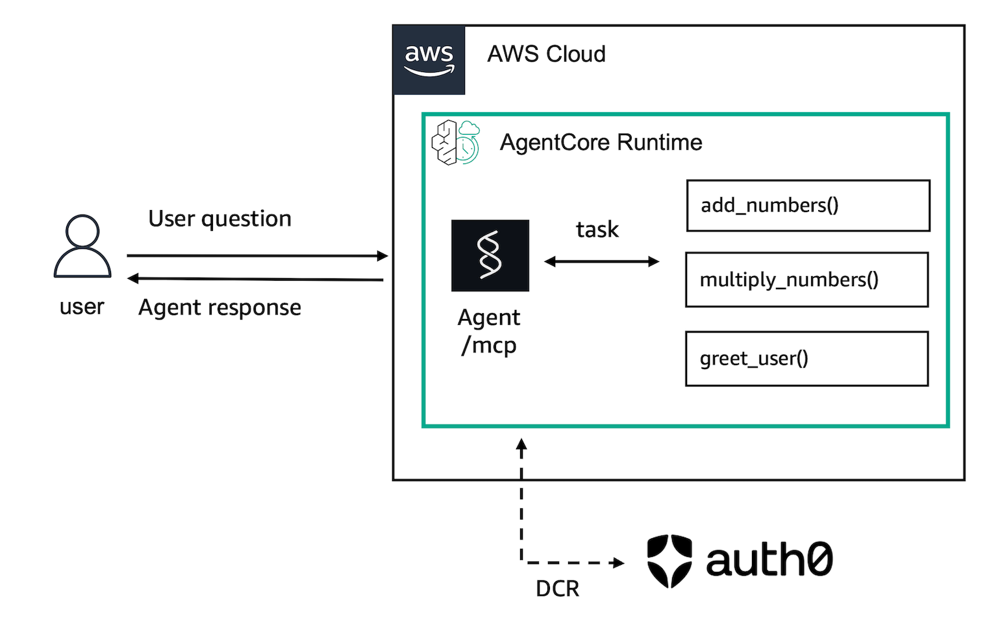

# Dynamic Client Registration with AgentCore Runtime and Auth0

## Overview

In this session, we will discuss how to host MCP tools on Amazon Bedrock AgentCore Runtime. This MCP will be integrated with Auth0's Dynamic Client Registration feature.

We will use the Amazon Bedrock AgentCore Python SDK to wrap the agent's functions as an MCP server compatible with Amazon Bedrock AgentCore. It will handle the MCP server details so you can focus on your agent's core functionality.

The Amazon Bedrock AgentCore Python SDK prepares your agent or tool code to run on AgentCore Runtime.

## Getting Started

To get started with this tutorial, open and follow the step-by-step guide in the Jupyter notebook:

**[📓 deploy_dcr_mcp_agentcore.ipynb](deploy_dcr_mcp_agentcore.ipynb)**

The notebook contains all the code examples, configurations, and detailed instructions needed to complete this tutorial.

## What You'll Learn

In this tutorial, you will learn:

* How to create an MCP server with tools
* How to test your server locally
* How to configure your Auth0 tenant to support DCR and add an API and an app
* How to deploy your server to AWS, integrated with DCR on Auth0
* How to invoke your deployed server

### Tutorial Details

| Information         | Details                                                   |
|:--------------------|:----------------------------------------------------------|
| Tutorial type       | Hosting Tools + DCR on Auth0                             |
| Tool type           | MCP server                                                |
| Tutorial components | Hosting tool on AgentCore Runtime, Creating an MCP server |
| Tutorial vertical   | Cross-vertical                                            |
| Example complexity  | Medium                                                    |
| SDK used            | Amazon BedrockAgentCore Python SDK and MCP Client        |

### Tutorial Architecture

In this tutorial, we will describe how to deploy this example to AgentCore Runtime.

For demonstration purposes, we will use a very simple MCP server with 3 tools: `add_numbers`, `multiply_numbers`, and `greet_users`.

### Tutorial Key Features

* Hosting MCP Server
* Dynamic Client Registration (DCR)
* Auth0
