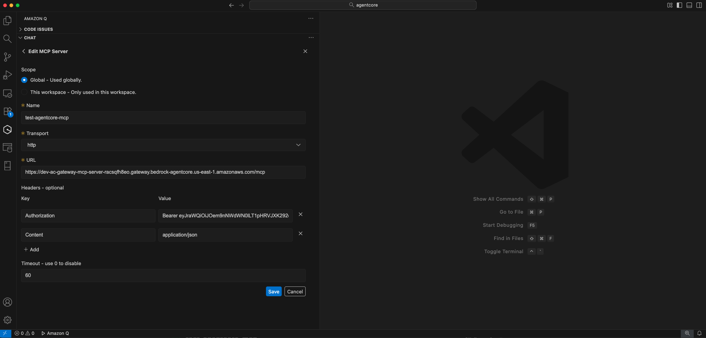
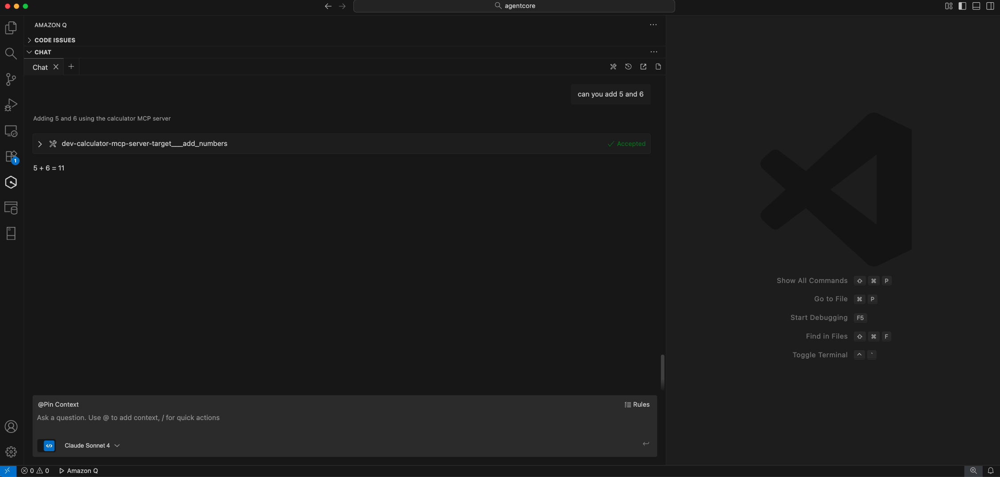
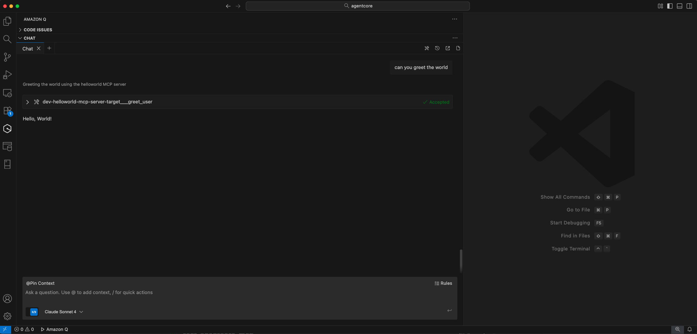
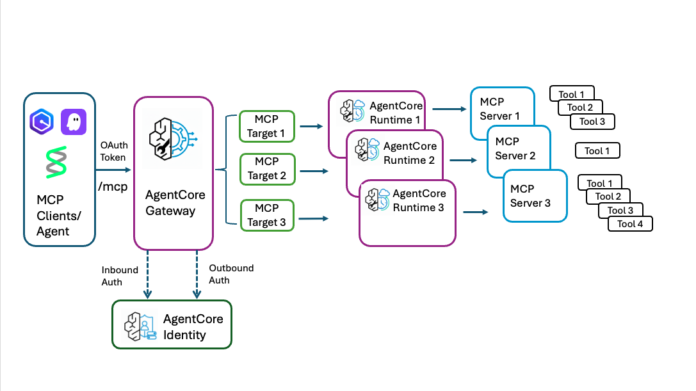

# AgentCore Runtime and Gateway MCP Server Toolkit

A configurable toolkit for quickly setting up Custom MCP Server in AgentCore runtime and gateway infrastructure.

Built on top of the [bedrock-agentcore-starter-toolkit](https://github.com/aws/bedrock-agentcore-starter-toolkit/) to provide a streamlined experience for deploying MCP servers.

## Overview

- Do you want to quickly deploy your custom MCP server to AgentCore without writing any code? 
- Do you want to consolidate your multiple custom MCP servers/tools to one URL that exposes all the tools from various MCP Servers? 
- Do you want secured access to your MCP Servers? 

This toolkit helps you to do all these with simple command line arguments. It automates the creation of:

- Cognito User Pools for authentication
- AgentCore Runtime environment for each MCP Server
- AgentCore Gateway with MCP protocol support
- Gateway MCP Server targets with OAuth2 authentication

The toolkit creates a complete MCP gateway and enables multiple MCP servers (Example: calculator and helloworld) to be accessed through a single gateway endpoint with proper authentication and routing.

## Prerequisites

1. AWS credentials configured
2. Python 3.8+ installed
3. (Optional) `.env` file for Cognito user configuration

## Installation

### From PyPI (when published)
```bash
pip install agentcore-runtime-gw-mcp-toolkit
```

### From Source
```bash
git clone <repository-url>
cd agentcore-runtime-gw-mcp-tool-kit
pip install -e .
```

## Configuration

### Environment Variables (Optional)

You can customize Cognito user credentials by creating a `.env` file in the project directory:

```bash
# .env file
COGNITO_USERNAME=your_username
COGNITO_TEMP_PASSWORD=your_temp_password
COGNITO_PASSWORD=your_permanent_password
```

**Default values** (used if `.env` file is not provided):
- `COGNITO_USERNAME`: `testuser`
- `COGNITO_TEMP_PASSWORD`: `Temp123!`
- `COGNITO_PASSWORD`: `MyPassword123!`

**Note**: The toolkit automatically creates Cognito users with these credentials for testing purposes.

## Usage

### Getting Started

1. **Clone the Repository**
   ```bash
   git clone <repository-url>
   cd agentcore-runtime-gw-mcp-tool-kit
   ```

2. **Install the Package**
   ```bash
   pip install -e .
   ```

3. **Prepare Your MCP Server Code**
   - Your MCP server files can be located anywhere on your system
   - Ensure each server has its own `server.py` and `requirements.txt`
   - Note the full paths to these files for the runtime configuration

   
   **Example structure (can be anywhere):**
   ```
   /path/to/my-servers/
   ├── calculator/
   │   ├── server.py
   │   └── requirements.txt
   ├── helloworld/
   │   ├── server.py
   │   └── requirements.txt
   └── my-custom-server/
       ├── server.py
       └── requirements.txt
   ```

4. **Deploy with Command Line Arguments**
   ```bash
   agentcore-mcp-toolkit \
     --gateway-name "my-gateway" \
     --runtime-configs '[
       {
         "name": "my-custom-runtime",
         "description": "My Custom MCP Server",
         "entrypoint": "/path/to/my-servers/my-custom-server/server.py",
         "requirements_file": "/path/to/my-servers/my-custom-server/requirements.txt"
       }
     ]'
   ```
   **Note:** The agentcore-mcp-toolkit has to be invoked from the MCP Server project root. Example: The utility has 
   to be invoked from /path/to for the above example.

### Basic Usage

```bash
# Deploy with minimal arguments
agentcore-mcp-toolkit \
  --gateway-name "my-gateway" \
  --runtime-configs '[{"name":"runtime1","description":"My Runtime","entrypoint":"/path/to/myserver/server.py","requirements_file":"/path/to/myserver/requirements.txt"}]'

# Deploy with all options
agentcore-mcp-toolkit \
  --region us-east-1 \
  --gateway-name "my-gateway-mcp-server" \
  --gateway-description "My AgentCore Gateway" \
  --runtime-configs '[
    {
      "name": "my-calculator-runtime",
      "description": "Calculator MCP Server", 
      "entrypoint": "/path/to/calculator/server.py",
      "requirements_file": "/path/to/calculator/requirements.txt"
    }
  ]'
```

### Command Line Options

- `--region`: AWS region (default: us-east-1)
- `--gateway-name`: Gateway name (required)
- `--gateway-description`: Gateway description (optional)
- `--runtime-configs`: JSON array of runtime configurations (required)

### Runtime Configuration Format

Each runtime configuration in the `--runtime-configs` JSON array should include:

```json
{
  "name": "runtime-name",
  "description": "Runtime description",
  "entrypoint": "path/to/server.py",
  "requirements_file": "path/to/requirements.txt",
  "auto_create_execution_role": true,
  "auto_create_ecr": true
}
```

**Required fields:**
- `name`: Unique runtime name
- `entrypoint`: Full path to MCP server Python file
- `requirements_file`: Full path to requirements.txt file

**Optional fields:**
- `description`: Runtime description
- `auto_create_execution_role`: Auto-create IAM role (default: true)
- `auto_create_ecr`: Auto-create ECR repository (default: true)

### Auto-Derived Names

The toolkit automatically derives resource names from the `gateway-name` and runtime `name` fields:

**Gateway Resources** (from `--gateway-name`):
- IAM Role: `{gateway-name}-role`
- User Pool: `{gateway-name}-pool`
- Resource Server ID: `{gateway-name}-id`
- Resource Server Name: `{gateway-name}-name`
- Client Name: `{gateway-name}-client`

**Runtime Resources** (from runtime `name`):
- User Pool: `{runtime-name}-pool`
- Resource Server ID: `{runtime-name}-id`
- Resource Server Name: `{runtime-name}-name`
- Client Name: `{runtime-name}-client`
- Agent Name: `{runtime-name}` (with dashes converted to underscores)

**Target Resources** (auto-generated):
- Target Name: `{runtime-name}-target`
- Identity Provider: `{runtime-name}-identity`

## Testing the Gateway

Once deployed, the toolkit automatically provides all the connection information needed to test and use your MCP gateway.

### Gateway Connection Information

The toolkit automatically displays connection details and **securely saves credentials to a file** after successful deployment:

#### **Secure Credential Storage**

For security, sensitive credentials are saved to a secure file instead of being displayed in console logs:

- **File Location**: `.agentcore-credentials-{gateway-name}.json`
- **File Permissions**: Owner-only access (600)
- **Console Output**: Shows `<redacted>` for sensitive values
- **Access Method**: Use `cat .agentcore-credentials-{gateway-name}.json`

**Example Output:**
```
============================================================
GATEWAY CONNECTION INFORMATION
============================================================
Gateway URL: https://my-gateway-mcp-server-123456789.gateway.bedrock-agentcore.us-east-1.amazonaws.com/mcp
User Pool ID: us-east-1_bt4yEZFOx
Client ID: <redacted>
Client Secret: <redacted>
Access Token: <redacted>
Credentials saved to: .agentcore-credentials-my-gateway.json
File permissions set to owner-only access (600)
Use: cat .agentcore-credentials-my-gateway.json
============================================================

✅ Setup completed successfully!
Gateway ID: my-gateway-mcp-server-123456789
Runtime 1 Agent ARN: arn:aws:bedrock-agentcore:us-east-1:123456789:runtime/my_calculator_runtime-123456789
```

### Configuring QDev Plugin with Access Token

To use the MCP gateway in QDev plugin, configure it as shown below:



**Steps to configure QDev:**
1. **Get credentials** from the secure file:
   ```bash
   cat .agentcore-credentials-{gateway-name}.json
   ```
2. Copy the **access_token** value from the JSON file
3. In QDev plugin settings, add a new MCP server with:
   - **Server URL**: Use the `gateway_url` from the credentials file
   - **Authentication**: Bearer Token
   - **Token**: Paste the access token from step 2
4. Save the configuration and test the connection

**Security Note**: Never share or commit the credentials file to version control.

### Live Demo Examples

Once configured, you can use the MCP tools directly in QDev:

**Calculator MCP Server Demo:**


**Hello World MCP Server Demo:**


## Architecture



### Architecture Components

The toolkit creates:
1. **Single Gateway**: One AgentCore Gateway with multiple MCP Server targets that routes requests
2. **Multiple Runtimes**: Each MCP server runs in its own AgentCore Runtime
3. **Authentication**: Separate Cognito resources for gateway and each runtime
4. **Targets**: Gateway MCP Server targets that connect the gateway to each runtime

### Authentication Flow

**Inbound Authorization (Client → Gateway):**
- MCP Client (QDev) sends requests with Bearer token
- Gateway JWT Authorizer validates token against Gateway Cognito User Pool
- Authorized requests are routed to appropriate targets

**Outbound Authorization (Gateway → Runtime):**
- Each target has its own OAuth2 credential provider
- Gateway obtains OAuth tokens from respective Runtime Cognito User Pools
- Authenticated requests are sent to individual MCP server runtimes

## Authorization Support

### Current Implementation
This toolkit currently supports **Amazon Cognito OAuth2** for both inbound and outbound authorization:
- **Inbound Authorization**: Gateway uses Cognito JWT tokens for client authentication
- **Outbound Authorization**: Gateway authenticates to runtime using Cognito OAuth2 credentials

### Roadmap
- **IAM Role-based Authorization**: Support for IAM roles and policies for both inbound and outbound authentication (TO DO - planned for next release)

## Security Features

### **Secure Credential Management**
- **File-based storage**: Credentials saved to secure files with restricted permissions
- **Console masking**: Sensitive values shown as `<redacted>` in logs
- **File permissions**: Automatic setting of owner-only access (600)
- **Fallback protection**: Graceful handling if file operations fail

### **Input Validation**
- **Path traversal protection**: Prevents `..` in file paths
- **File extension validation**: Ensures `.py` and `.txt` extensions
- **JSON structure validation**: Validates runtime configuration format
- **Required field checks**: Ensures all mandatory fields are present

### **Error Handling**
- **Specific exception handling**: Uses appropriate exception types
- **Sanitized error messages**: Prevents information disclosure
- **Graceful degradation**: Continues operation when possible
- **Proper exit codes**: Returns appropriate status for automation

## Cleanup

### Removing Resources

To clean up all resources created by the toolkit, use the cleanup script:

```bash
# Clean up specific gateway and runtimes
python -m cleanup \
  --gateway-name "my-gateway" \
  --runtime-names '["runtime1", "runtime2"]' \
  --region us-east-1

# Skip confirmation prompt
python -m cleanup \
  --gateway-name "my-gateway" \
  --runtime-names '["runtime1", "runtime2"]' \
  --confirm
```

### Cleanup Options

- `--gateway-name`: Name of the gateway to clean up (required)
- `--runtime-names`: JSON array of runtime names to clean up (required)
- `--region`: AWS region (default: us-east-1)
- `--confirm`: Skip confirmation prompt

### Resources Cleaned Up

The cleanup script removes:
- AgentCore Gateway and all targets
- AgentCore Runtime instances
- Cognito User Pools and domains
- IAM roles and policies
- OAuth2 credential providers

**Note**: The cleanup script does not remove local credential files. To remove them:
```bash
# Remove credential files manually
rm .agentcore-credentials-*.json
```

**Warning**: This action cannot be undone. Always confirm the resources before proceeding.

## Troubleshooting

1. Ensure AWS credentials are properly configured
2. Verify required MCP server files exist in their respective directories
3. Check AWS region permissions
4. Review CloudWatch logs for detailed error information
5. Ensure gateway URL is correctly formatted when testing
6. Verify Cognito user pools and clients are created successfully
7. **Access Token Issues**: If the access token expires, re-run the toolkit to get a fresh token
8. **QDev Connection Issues**: Ensure the gateway URL ends with `/mcp` and the bearer token is correctly copied
9. **Tool Discovery**: Use different query terms if tools are not found (try "calculator", "greet", or "tools")
10. **Authorization Issues**: Currently only Cognito OAuth2 is supported - ensure all authentication uses Cognito tokens
11. **Cognito User Issues**: If you encounter user creation errors, check your `.env` file configuration or use the default credentials
12. **Cleanup Issues**: If cleanup fails, manually verify resources in AWS console and retry with specific resource names
13. **Credential File Issues**: If credentials file cannot be created, check directory permissions and disk space
14. **File Permission Issues**: On Windows, file permissions may not be set correctly - manually secure the credentials file
15. **Path Validation Errors**: Ensure file paths don't contain `..` and have correct extensions (`.py`, `.txt`)
16. **JSON Validation Errors**: Verify runtime-configs is a valid JSON array with required fields

## Example MCP Servers

The toolkit includes example MCP servers:
- **Calculator**: Provides add and multiply functions
- **HelloWorld**: Provides greeting functionality

Both servers demonstrate the MCP protocol implementation and can be used as templates for creating custom MCP servers.
