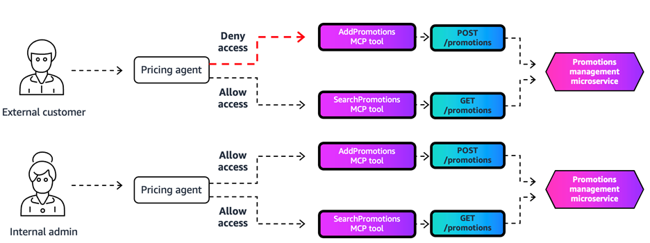

# Fine-Grained Access Control with AgentCore Gateway Interceptors using JWT scopes.

## Overview
Modern enterprise agent systems often expose multiple tools—search, retrieval, order systems, analytics, document pipelines, and more. Not all users should be allowed to access every tool, and different roles (Analyst, Manager, Auditor, Contractor, etc.) may require different levels of access. Fine-Grained Access Control (FGAC) in AgentCore Gateway addresses this challenge through Gateway Interceptors, which are custom Lambda functions that process requests at two critical points: before reaching the target destination (Request Interceptor) and before returning the result to the calling agent (Response Interceptor).

### Implementing Fine-Grained Access Control for Invoking Tools
The Gateway interceptor handles tool invocation control by utilizing JWT scopes to validate user permissions, implementing authorization checks before tool execution, and supporting both full target access and tool-specific permissions. When unauthorized access is attempted, the lambda blocks requests before they reach the target and returns structured MCP errors. This ensures secure access management across all tool interactions.

### Dynamic Tools Filtering
For tool discovery and filtering, the Gateway interceptor manages access through two primary methods: List Tools and Semantic Search. When processing tools/list operations, the response interceptor filters the available tools based on user JWT scopes, ensuring that only authorized tools are returned to the requesting agent. Similarly, for semantic search operations, the response interceptor processes search results before returning them to agents, removing any unauthorized tools and applying the same permission logic as list operations. This approach maintains dynamic permission updates without caching and ensures consistent access control across all discovery methods.

This comprehensive approach to access control delivers several key benefits, including secure tool access based on user roles and permissions, dynamic filtering without permission state caching, consistent authorization across all tool discovery methods, simplified integration with existing authentication systems, and reduced security risks through early request validation. The implementation ensures that users can only discover and access tools appropriate for their role while maintaining a secure and scalable enterprise environment.

### Tutorial Details

| Information          | Details                                                                         |
|:---------------------|:-----------------------------------------------------------------------         |
| Tutorial type        | Interactive                                                                     |
| AgentCore components | AgentCore Gateway, AgentCore Identity, AgentCore Runtime, Gateway Interceptors  |
| Agentic Framework    | Strands Agents                                                                  |
| Gateway Target Type  | MCP Server                                                                      |
| Inbound Auth IdP     | Amazon Cognito, but can use others                                              |
| Outbound Auth        | Amazon Cognito, but can use others                                              |
| Tutorial components  | Fine-Grained Access Control through AgentCore Gateway Interceptors              |
| Tutorial vertical    | Cross-vertical                                                                  |
| Example complexity   | Easy-intermediate                                                               |
| SDK used             | boto3                                                                           |

## Tutorial Key Features

* Fine-Grained Access Control with AgentCore Gateway Interceptors using custom scopes for key MCP actions.

## Tutorial Overview

In these tutorials we will cover the following functionality:

- [Fine-Grained Access Control with AgentCore Gateway Interceptors using custom scopes](01-fine-grained-access-control-using-custom-scopes.ipynb).

