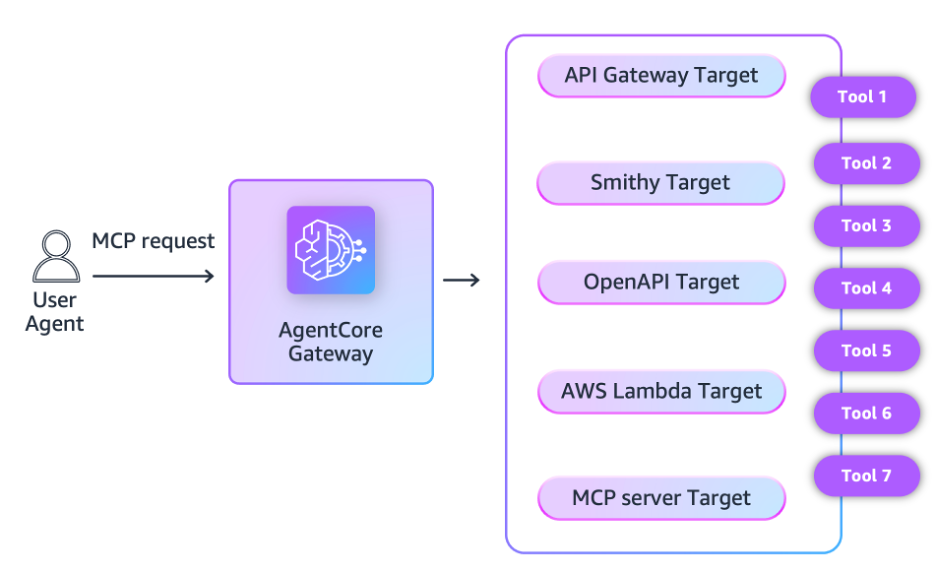
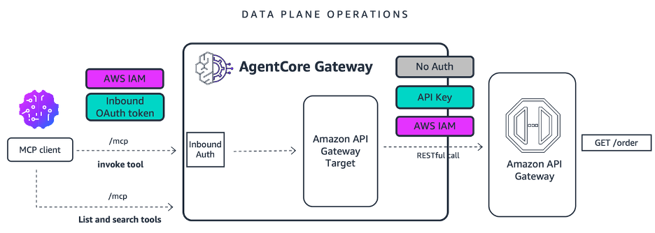

# Integrate your API Gateway as an AgentCore Gateway Target

## Overview

As organizations explore the possibilities of agentic applications, they continue to navigate challenges of using enterprise data as context in invocation requests to large language models (LLMs) in a manner that is secure and aligned with enterprise policies. To help standardize and secure those interactions, many organizations are using the Model Context Protocol (MCP) specification, which defines how agentic applications can securely connect to data sources and tools.

While MCP has been advantageous for net new use cases, organizations also navigate challenges with bringing their existing API estate into the agentic era. MCP can certainly wrap existing APIs, but it requires additional work, translating requests from MCP to RESTful APIs, making sure security is maintained through the entire request flow, and applying the standard observability required for production deployments.

[Amazon Bedrock AgentCore Gateway](https://docs.aws.amazon.com/bedrock-agentcore/latest/devguide/gateway.html) now supports [Amazon API Gateway](https://aws.amazon.com/api-gateway/) as a target, translating MCP requests to AgentCore Gateway (ACGW) into RESTful requests to API Gateway (APIGW). You can now expose both new and existing API endpoints from APIGW to agentic applications via MCP, with built-in security and observability. This notebook covers this new capability and shows how to implement them.

## What's new

AgentCore Gateway already supports multiple target types, e.g., Lambda functions, OpenAPI schemas, Smithy models, MCP servers, and now supports API Gateway.

**Our customers have successfully built extensive API ecosystems using API Gateway, connecting backends across numerous applications.** As enterprises advance toward next-generation agentic applications, the natural evolution is to expose these existing APIs and backend tools to AI-powered systems, enabling seamless integration between established infrastructure and modern intelligent agents.

Today, customers follow a manual workflow where they export their APIGW APIs as OpenAPI 3 specification and then add it to ACGW as an OpenAPI target. This integration aims to streamline this process by automating the connection between APIGW and ACGW.

With this integration, customers will no longer have to manage this export/import process themselves. A new API_GATEWAY target type will be added to ACGW. REST API owners can add their API as an ACGW target with a few console clicks or a single CLI command, thus exposing their existing REST API methods as MCP tools via ACGW. API consumers can then connect AI agents with these REST APIs through the Model Context Protocol (MCP) and power their workflows with AI integration. Your agentic applications can now connect to your new or existing APIGW API. Today, this integration between ACGW and APIGW supports IAM authorization and API key authorization.

### Tutorial Details

| Information          | Details                                                   |
|:---------------------|:----------------------------------------------------------|
| Tutorial type        | Interactive                                               |
| AgentCore components | AgentCore Gateway, AgentCore Identity                     |
| Agentic Framework    | Strands Agents                                            |
| Gateway Target type  | API Gateway                                               |
| Agent                | Strands                                                   |
| Inbound Auth IdP     | Amazon Cognito, but can use others                        |
| Outbound Auth        | IAM Authorization and API Key                             |
| LLM model            | Anthropic Claude Sonnet 4                                 |
| Tutorial components  |Invoking API Gateway via AgentCore Gateway target          |
| Tutorial vertical    | Cross-vertical                                            |
| Example complexity   | Easy                                                      |
| SDK used             | boto3                                                     |

## Tutorial architecture

This tutorial serves as a practical example of the broader enterprise challenge: **How to integrate   API Gateway API into a centralized Gateway architecture for your next generation agentic applications.**
Start the [tutorial here](01-api-gateway-target.ipynb).