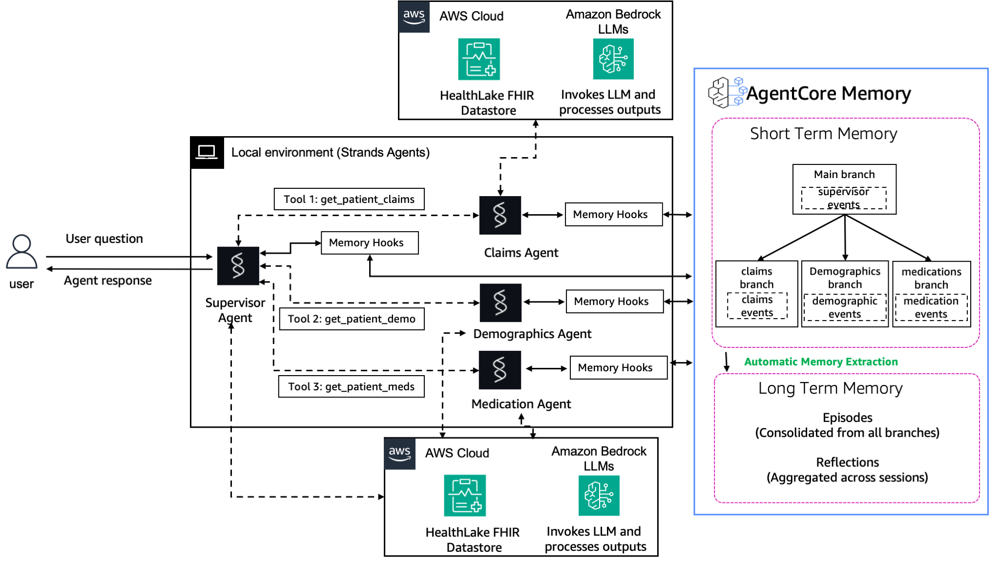

# Multi-Agent Healthcare System with Episodic Memory

Episodic memory captures meaningful interaction slices, identifying important moments and summarizing them into compact, organized records for focused retrieval without noise.

Reflections analyze episodes to surface insights, patterns, and conclusions—helping the system understand why events matter and how they should influence future behavior, turning experience into actionable guidance.

A comprehensive example demonstrating **multi-agent coordination with episodic memory** using Amazon Bedrock AgentCore Memory. This tutorial shows how AI agents can learn from past interactions and improve decision-making over time.

## Overview

This tutorial showcases a healthcare assistant system with:
- **Supervisor Agent**: Routes patient questions to specialized agents
- **Claims Agent**: Handles insurance claims and billing queries
- **Demographics Agent**: Manages patient demographic information
- **Medication Agent**: Handles medication and prescription queries

Each agent maintains isolated short-term memory through **memory branching**, while sharing long-term insights through **episodic memory strategies**.

## Architecture
<div style="text-align:left">
    
</div>

## Memory Strategy

### Episodic 

The system uses a episodic memory strategy with:

**Extraction**: Converts conversation events into structured episodes
- Prompt: "Extract patient interactions with healthcare agents"
- Namespace: `healthcare/{actorId}/{sessionId}`

**Consolidation**: Merges related episodes
- Prompt: "Consolidate healthcare conversations"

**Reflection**: Generates cross-session insights
- Prompt: "Generate insights from patient care patterns"
- Namespace: `healthcare/{actorId}` (exact namespace prefix)

### Memory Branching

Each agent operates on its own memory branch:
- `main`: Supervisor agent routing decisions
- `claims_agent`: Insurance and billing conversations
- `demographics_agent`: Patient information updates
- `medication_agent`: Prescription discussions

**Benefits:**
- Agents don't see each other's conversations
- Clean separation of concerns
- All agents contribute to shared long-term memory
- Patient-level insights span all interactions

## Prerequisites

### AWS Services
- **Amazon Bedrock**: Access to Claude Sonnet 4 model 
- **Amazon Bedrock AgentCore Memory**: For episodic memory strategy
- **Amazon HealthLake** (optional): FHIR datastore with patient data
  - Can create new datastore with Synthea data during setup
  - Or use existing datastore

### IAM Permissions
```json
{
  "Version": "2012-10-17",
  "Statement": [
    {
      "Effect": "Allow",
      "Action": [
        "bedrock:InvokeModel",
        "bedrock:InvokeModelWithResponseStream"
      ],
      "Resource": "*"
    },
    {
      "Effect": "Allow",
      "Action": [
        "healthlake:DescribeFHIRDatastore",
        "healthlake:CreateFHIRDatastore",
        "healthlake:ReadResource",
        "healthlake:SearchWithGet"
      ],
      "Resource": "*"
    }
  ]
}
```

### Python Environment
- Python 3.10+
- Jupyter Notebook or JupyterLab

## Installation

1. Install dependencies:
```bash
pip install -r requirements.txt
```

2. Configure AWS credentials:
```bash
aws configure
```

## Usage

### Quick Start

1. Open the notebook:
```bash
jupyter notebook healthcare-data-assistant.ipynb
```

2. Run cells sequentially:
   - **Step 1**: Environment Setup
   - **Step 2**: Configure HealthLake Datastore
   - **Step 3**: Create Memory as tool for Long-term memory with Episodic Strategy
   - **Step 4**: Create Memory Hook Provider with Branch Support for Short-term memory
   - **Step 5**: Create Multi-Agent Healthcare Architecture with Memory Branching
   - **Step 6**: Test with interactive chat
   - **Step 7**: Inspect healthcare memory branches
   - **Step 8**: Validate long-term memory (episodes and reflections)

### Interactive Inputs

The notebook prompts for:
- **HealthLake datastore ID**: Existing datastore or create new with Synthea data ( no real patient information is used)
- **HealthLake region**: AWS region for HealthLake

### Testing the System

The interactive chat (Step 7) allows you to:
- Ask about insurance claims
- Request demographic information
- Query medications and prescriptions
- See supervisor routing in action
- Observe memory branching

Example questions:
```
You: What's the status of my insurance claim?
You: Can you tell me about my medications?
You: What's my current address on file?
```

Type `quit`, `exit`, or `q` to end the chat session.

## Memory Browser Integration

After running the notebook, you can visualize the memory using the memory browser:

1. Note the Memory ID from the configuration summary
2. Open - [Memory Browser](https://github.com/awslabs/amazon-bedrock-agentcore-samples/tree/main/01-tutorials/04-AgentCore-memory/03-advanced-patterns/04-memory-browser) - Visualize and explore memory events, episodes, and reflections at `http://localhost:8000`
3. Enter the Memory ID to explore:
   - **Short-term memory**: Events by branch
   - **Episodes**: Session-level consolidated memories
   - **Reflections**: Patient-level insights

**⏱️ Note**: Episode and reflection generation takes 10-15 minutes after conversations. Check back later if no episodes/reflections appear immediately.

## Key Concepts Demonstrated

### 1. Multi-Agent Coordination
- Supervisor pattern for routing
- Specialized agents with domain expertise
- Dynamic tool usage for real-time data

### 2. Memory Branching
- Isolated conversations per agent
- Branch-specific event storage
- Shared session context

### 3. Episodic Memory
- extraction, consolidation, and reflection prompts
- Session-level episodes
- Patient-level reflections

### 4. HealthLake Integration
- Dynamic FHIR queries
- Real-time patient data access
- All data is synthetic (generated by Synthea) - no real patient information is used

## Customization

### Adding New Agents

```python
@tool
def get_patient_allergies(patient_id: str = PATIENT_ID) -> dict:
    """Get patient allergies from HealthLake"""
    return query_healthlake('AllergyIntolerance', {'patient': patient_id})

allergy_agent = Agent(
    model="global.anthropic.claude-sonnet-4-20250514-v1:0",
    system_prompt="You handle patient allergies. Use get_patient_allergies tool.",
    tools=[get_patient_allergies]
)
```

### Using Different Models

Change the `model` parameter in agent creation:
```python
Agent(
    model="anthropic.claude-3-5-sonnet-20241022-v2:0",  # Different model
    system_prompt="...",
    tools=[...]
)
```
## Additional Resources

- [Episodic Memory Best Practices](https://docs.aws.amazon.com/bedrock-agentcore/latest/devguide/episodic-memory-strategy.html#memory-episodic-retrieve-episodes) - Learn how to retrieve episodes to improve agentic performance


## Troubleshooting

### Branch Creation Errors
If you see "Branch rootEventId is required when creating a branch":
- **Restart the Jupyter kernel** (Kernel → Restart)
- **Re-run all cells** from the beginning to reload the corrected `HealthcareMemoryHooks` class
- The fix ensures the main branch has an initial event before forking specialized agent branches

### Memory Hook Errors
If you see "MemorySession.add_turns() got an unexpected keyword argument 'branch_name'":
- This indicates the notebook is using cached/old code
- **Restart the kernel** and re-run all cells to pick up the API fixes
- The corrected code uses `branch={"name": branch_name}` format

### Model Not Available
If you see "serviceUnavailableException", ensure:
- Using global inference profile: `global.anthropic.claude-sonnet-4-20250514-v1:0`
- Or region-specific profile for your region

### HealthLake Access Denied
Verify IAM permissions include:
- `healthlake:DescribeFHIRDatastore`
- `healthlake:ReadResource`
- `healthlake:SearchWithGet`

### Memory Creation Failed
Check that:
- IAM role has Bedrock invoke permissions


## Cleanup

After completing the tutorial, you can clean up resources to avoid ongoing charges:

1. Run the **Cleanup** cell at the end of the notebook
2. You'll be prompted to delete:
   - **Memory**: AgentCore Memory instance
   - **HealthLake Datastore**: FHIR datastore (optional)

Each resource can be deleted independently based on your needs.

### Manual Cleanup

If needed, you can also delete resources manually:

```bash
# Delete memory
aws bedrock-agentcore-cp delete-memory --memory-id <MEMORY_ID> --region us-east-1

# Delete HealthLake datastore
aws healthlake delete-fhir-datastore --datastore-id <DATASTORE_ID> --region <REGION>
```

## Learn More

- [AgentCore Memory Documentation](https://docs.aws.amazon.com/bedrock/latest/userguide/agentcore-memory.html)
- [Strands Agents Guide](https://strandsagents.com)
- [HealthLake FHIR API](https://docs.aws.amazon.com/healthlake/latest/devguide/working-with-FHIR-healthlake.html)
- [Memory Branching Patterns](https://docs.aws.amazon.com/bedrock/latest/userguide/agentcore-memory-branching.html)


