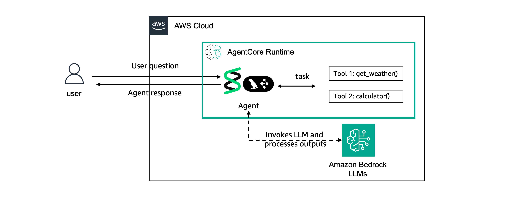

# Prerequisites: Creating sample Agents

## Overview

Before we can evaluate agents, we need an agent to evaluate. This tutorial sets up two sample agents that we'll use throughout the remaining evaluation tutorials: one using [Strands Agents SDK](https://strandsagents.com/) and the other one using [LangGraph](https://www.langchain.com/langgraph).

## The Agents
The agents created are essentially the same just using two different frameworks to show case the "any framework" proposition of AgentCore.

The agents created have two key capabilities:

**Code Execution**
- Uses AgentCore Code Interpreter to run Python code
- Handles math calculations and data analysis

**Memory**
- Stores user facts and preferences
- Retrieves relevant context for personalized responses

Both agents uses Anthropic Claude Haiku 4.5 from Amazon Bedrock as the LLM model but with AgentCore you cam use any model of your preference.

The architecture looks as following:

## Pre-requisites
Before deploying the agent you need:
* Python 3.10+
* AWS access

## What's Next
Now that you have all the required pre-requisites, let's go through the individual evaluation tutorials:

- **[Tutorial 01](../01-creating-custom-evaluators)**: Create custom evaluators
- **[Tutorial 02](../02-running-evaluations)**: Run on-demand and online evaluations
- **[Tutorial 03](../03-advanced)**: Advanced techniques and dashboards