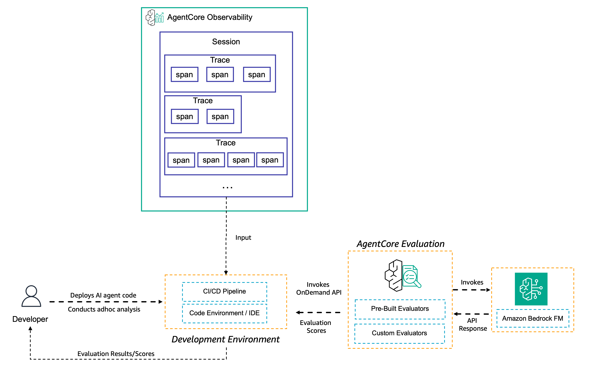
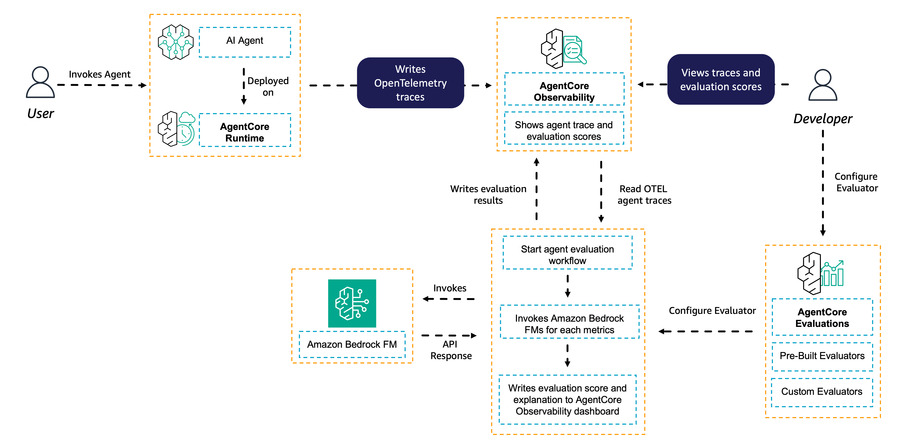
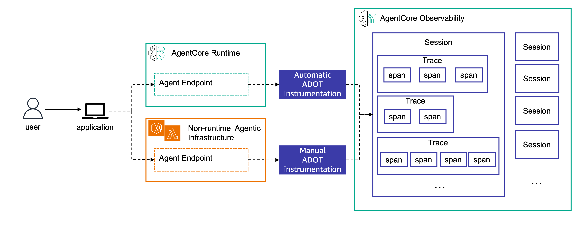

# Running Evaluations

## Overview

In this tutorial you will learn how to use AgentCore Evaluations to assess your agent's performance using both on-demand and online evaluation approaches. You'll apply built-in and custom evaluators to analyze agent interactions and monitor quality at scale.

## What You'll Learn

- Running on-demand evaluations for targeted assessment of specific interactions
- Setting up online evaluations for continuous production monitoring
- Analyzing evaluation results to improve agent quality
- Using AgentCore Observability traces as inputs for evaluations

## Prerequisites

Before starting this tutorial, you should have:
- Completed [Tutorial 00: Prerequisites](../00-prereqs) - Created sample agents (Strands and/or LangGraph)
- Completed [Tutorial 01: Creating Custom Evaluators](../01-creating-custom-evaluators) - Created a custom evaluator
- Your agent deployed on AgentCore Runtime with observability enabled
- Generated at least one session with traces in AgentCore Observability

## Evaluation Types

### On-demand Evaluations

On-demand evaluation provides a flexible way to evaluate specific agent interactions by directly analyzing a chosen set of spans, traces, or sessions.

**Key Characteristics:**
- **Targeted assessment**: Evaluate specific interactions by providing span, trace, or session IDs
- **Synchronous execution**: Get immediate results for your evaluation requests
- **Flexible scope**: Evaluate single spans, complete traces, or entire sessions
- **Investigation tool**: Perfect for analyzing specific customer interactions or validating fixes

**When to Use On-demand Evaluations:**
- Investigating specific customer interactions or reported issues
- Validating fixes for identified problems
- Analyzing historical data for quality improvements
- Testing evaluators before deploying them in production
- Performing deep-dive analysis on edge cases

**How It Works:**

1. Your agent generates traces in AgentCore Observability
2. Traces are mapped to sessions and stored in CloudWatch Log groups
3. You select specific sessions or traces to evaluate
4. You specify which evaluators (built-in or custom) to apply
5. AgentCore Evaluations processes the selected traces and returns detailed results

### Online Evaluations

Online evaluation enables continuous quality monitoring of deployed agents in production environments based on real-time traffic.

**Key Characteristics:**
- **Continuous monitoring**: Automatically evaluates agent performance as interactions occur
- **Sampling-based**: Configure percentage-based sampling or conditional filters
- **Real-time insights**: Track quality trends and catch regressions early
- **Production-ready**: Designed for scale with minimal performance impact

**When to Use Online Evaluations:**
- Monitoring production agent performance continuously
- Catching quality regressions before they impact users
- Identifying patterns in user interactions at scale
- Maintaining consistent agent performance over time
- A/B testing different agent configurations

**How It Works:**

1. Your agent generates traces in AgentCore Observability
2. You create an online evaluation configuration specifying:
   - Data source (CloudWatch log group or AgentCore Runtime endpoint)
   - Sampling rate (e.g., evaluate 10% of all sessions)
   - Evaluators to apply (built-in and/or custom)
3. AgentCore Evaluations continuously processes incoming traces based on your rules
4. Results are output to CloudWatch for dashboard visualization and analysis
5. You monitor aggregated scores, track trends, and investigate low-scoring sessions

## AgentCore Observability Integration

Both evaluation types rely on **AgentCore Observability** to capture agent behavior through OpenTelemetry (OTEL) traces.

**How Observability Works:**

AgentCore relies on **AWS Distro for OpenTelemetry (ADOT)** to instrument different types of OTEL traces across various agent frameworks:

**For AgentCore Runtime-hosted agents** (like the agents in these tutorials):
- Instrumentation is automatic with minimal configuration
- Simply include `aws-opentelemetry-distro` in your `requirements.txt`
- AgentCore Runtime handles OTEL configuration automatically
- Traces appear in CloudWatch GenAI Observability Dashboard

**For non-Runtime agents:**
- Configure environment variables to direct telemetry to CloudWatch
- Run your agent with OpenTelemetry instrumentation
- See [AgentCore Observability documentation](../../06-AgentCore-observability) for details

## Tutorial Structure

This tutorial provides examples for both **Strands Agents** and **LangGraph** frameworks to demonstrate AgentCore's framework-agnostic capabilities:

### [01-strands](01-strands/)
Examples using Strands Agents SDK:
- **01-on-demand-eval.ipynb**: Run targeted evaluations on specific traces
- **02-online-eval.ipynb**: Set up continuous production monitoring

### [02-langgraph](02-langgraph/)
Examples using LangGraph framework:
- **01-on-demand-eval.ipynb**: Run targeted evaluations on specific traces
- **02-online-eval.ipynb**: Set up continuous production monitoring

Both implementations demonstrate the same evaluation concepts and produce equivalent results, showcasing how AgentCore Evaluations works consistently across different agent frameworks.

## What's Next

After completing this tutorial:
- Proceed to [Tutorial 03: Advanced](../03-advanced) to explore advanced capabilities including:
  - Using boto3 SDK to query CloudWatch logs for on-demand evaluation
  - Creating local dashboards to visualize experiments with different agent configurations
  - Advanced filtering and sampling strategies for online evaluations
