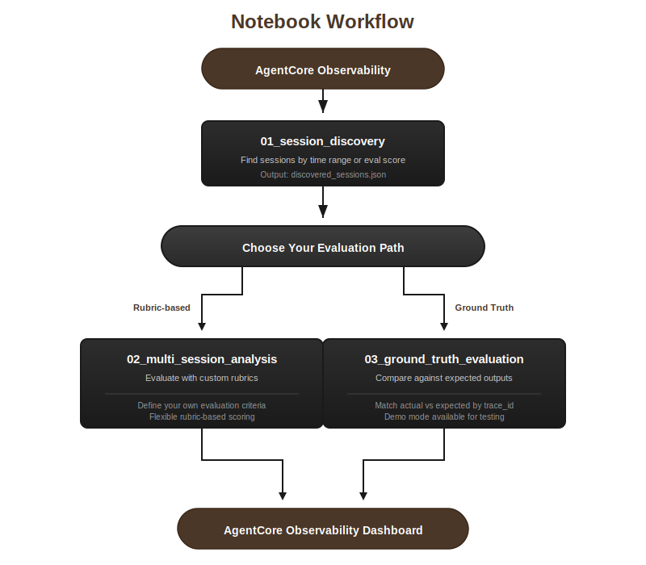
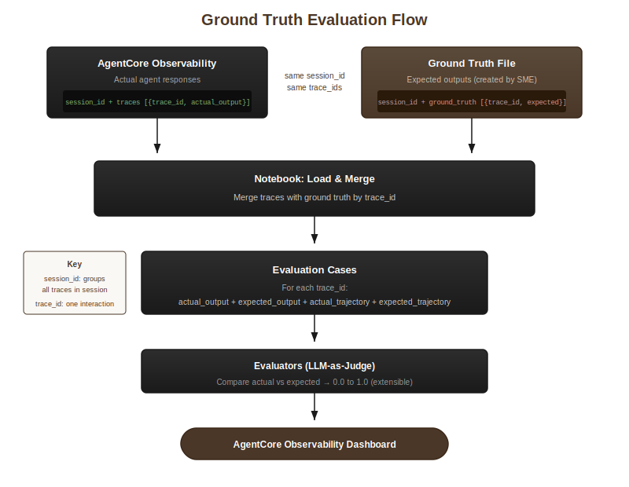
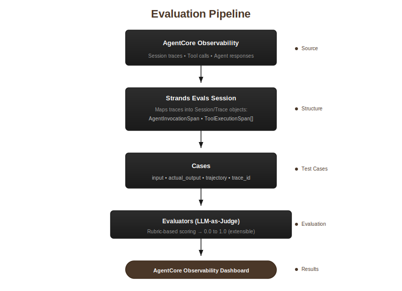

# Offline Multi-Session Evaluation

Evaluate deployed AI agent sessions using historical traces from AgentCore Observability. This tool fetches traces from your agent's observability logs, converts them to Strands Evals format, runs evaluations, and logs results back to AgentCore Observability with original trace IDs for dashboard correlation.

## Use Case

When you have an AI agent deployed with AgentCore Observability instrumentation, this tool allows you to:

- Run offline evaluations on historical agent interactions
- Re-evaluate sessions that scored poorly with updated rubrics
- Test new evaluator configurations against existing traces
- Compare agent outputs against ground truth (expected responses from SMEs)
- Perform regression testing to ensure agent changes don't break known-good behavior
- Correlate evaluation results with original traces in the AgentCore Observability dashboard

## How It Works

1. **Session Discovery**: Query AgentCore Observability to find agent sessions by time range or by existing evaluation scores
2. **Trace Fetching**: Retrieve spans for each session using CloudWatch Logs Insights
3. **Format Conversion**: Map AgentCore Observability spans to Strands Evals Session format (tool calls, agent responses, trajectories)
4. **Evaluation**: Run evaluators using one of two approaches:
   - **Rubric-based**: Score against criteria you define (flexible, qualitative)
   - **Ground Truth**: Compare against expected outputs (reference-based, regression testing)
5. **Result Logging**: Send evaluation results in EMF format with original trace IDs for dashboard correlation

## Notebook Workflow



## Understanding Agent Evaluation

Agent evaluation goes beyond traditional software testing. While unit tests verify deterministic outputs, agents produce variable responses that require qualitative assessment. Systematic evaluation helps identify failure patterns, measure improvement over time, and ensure consistent quality as you iterate on prompts and tools.

### Two Complementary Approaches

**AgentCore Evaluations** and **Strands Evals** work together seamlessly to provide comprehensive agent quality management:

| | AgentCore Evaluations | Strands Evals |
|---|---|---|
| **Purpose** | Continuous, real-time quality monitoring | Offline batch evaluation and experimentation |
| **Use Case** | Production monitoring, alerting on quality drops | Testing, regression analysis, rubric development |
| **Execution** | Fully managed, samples live interactions | On-demand, runs on historical traces |
| **Built-in Evaluators** | Correctness, helpfulness, tool selection accuracy, safety, goal success rate, context relevance | Output, trajectory, helpfulness, faithfulness, goal success rate, tool accuracy |
| **Custom Evaluators** | Model-based scoring with custom prompts | Any code-based or LLM-based evaluator |

**AgentCore Evaluations** is a fully managed service that continuously monitors agent performance based on real-world behavior. It samples live interactions, scores them against built-in or custom evaluators, and visualizes results in CloudWatch alongside observability insights. Set up alerts when quality metrics drop below thresholds—such as satisfaction declining or politeness scores dropping—to detect and address issues faster.

**Strands Evals** is a comprehensive evaluation framework providing multiple evaluation types, dynamic simulators for multi-turn conversations, trace-based evaluation via OpenTelemetry, automated experiment generation, and an extensible architecture supporting custom evaluators from any library. See the [Strands Evals documentation](https://strandsagents.com/latest/documentation/docs/user-guide/evals-sdk/quickstart/) for full capabilities.

### This Project

This project uses **Strands Evals for offline evaluation** of traces collected by **AgentCore Observability**, demonstrating two common patterns:

- **Output Quality**: Does the agent's response correctly and completely address the user's request? Evaluates the final answer regardless of how it was produced.

- **Trajectory Quality**: Did the agent use its tools effectively? Evaluates whether the agent selected appropriate tools, used them efficiently, and followed a logical sequence.

Results are logged back to AgentCore Observability with original trace IDs, enabling correlation in the dashboard alongside your AgentCore Evaluations results.

## Strands Evals Concepts

This tool uses [Strands Evals](https://github.com/strands-agents/strands-evals), a general-purpose evaluation framework for AI agents. Strands Evals uses LLMs as judges to score agent behavior against human-defined criteria. The framework handles the inherent variability in agent responses by quantifying quality on a 0.0 to 1.0 scale with explanations.

**Key insight**: Agents don't produce "correct" or "incorrect" answers—they produce better or worse responses. Strands Evals turns subjective quality assessment into measurable, consistent metrics.

Understanding its core concepts helps you customize evaluations effectively.

**Session**: Represents a complete user conversation, potentially containing multiple back-and-forth exchanges. In AgentCore Observability, a session groups related interactions by `session.id`.

**Trace**: A single user request and the agent's complete response, including all tool calls made to fulfill that request. Each trace has a unique `trace_id` that correlates with AgentCore Observability.

**Case**: A test case for evaluation containing the input (user prompt), the actual output (agent response), and metadata (trace_id, tool trajectory). Cases are what evaluators score.

**Experiment**: A collection of cases paired with one or more evaluators. Running an experiment produces scores and explanations for each case.

## Evaluation Approaches

Strands Evals is an extensible LLM-based evaluation framework that supports multiple evaluation approaches. Rather than exact string matching, it uses LLMs as judges to score agent outputs. The framework is designed for flexibility—you can implement virtually any evaluation type.

**Two fundamental evaluation approaches:**

| Approach | Description | Use When |
|----------|-------------|----------|
| **Rubric-based** | LLM judges against criteria you define | You want flexible, qualitative assessment |
| **Ground Truth** | Compare against known-correct answers | You have expected outputs to measure against |

This project demonstrates both approaches in separate notebooks.

### Rubric-based Evaluation (Notebook 02)

Define evaluation criteria in a rubric, and the LLM judges each response against your criteria. This approach is ideal when responses can vary but still be "good" in different ways.

**OutputEvaluator**: Evaluates the quality of the agent's response. You provide a rubric describing what makes a good response (relevance, accuracy, completeness), and the evaluator uses an LLM to score the output from 0.0 to 1.0 with an explanation.

**TrajectoryEvaluator**: Evaluates how the agent used its tools. You provide a rubric describing good tool usage patterns (appropriate selection, efficiency, logical sequence), and the evaluator scores the tool trajectory from 0.0 to 1.0.

### Ground Truth Evaluation (Notebook 03)

Compare actual agent outputs against predefined expected responses. This approach is ideal for regression testing, benchmarking, and cases where you have known-correct answers.

The evaluator compares actual vs expected and scores how well the agent's output matches what a Subject Matter Expert (SME) defined as the correct response. See the [Ground Truth Evaluation](#ground-truth-evaluation) section for details.

### Extensibility

The Strands Evals framework supports custom evaluators beyond what this project demonstrates. Any evaluation that can be expressed as scoring criteria—factual accuracy, safety, domain-specific quality checks, compliance requirements—can be implemented using the LLM-as-judge approach.

**How rubrics work**: Your rubric is sent to an LLM along with the agent's output. The LLM acts as a judge, applying your criteria to produce a score and explanation. Well-written rubrics with clear scoring guidance produce more consistent evaluations.

## Ground Truth Evaluation

Ground truth evaluation compares agent outputs against predefined expected responses. This is useful when you have known-correct answers for specific queries and want to measure how closely your agent matches them.



**Key concepts:**
- **session_id**: Groups all traces from a single user session
- **trace_id**: Identifies each individual interaction (user prompt + agent response) within a session

**Two-file approach**: The ground truth notebook uses two files that share the same `session_id`:

1. **Traces file** (`demo_traces.json`): Contains actual agent outputs from CloudWatch
   ```json
   {
     "session_id": "5B467129-E54A-4F70-908D-CB31818004B5",
     "traces": [
       {
         "trace_id": "693cb6c4e931",
         "user_prompt": "What is the best route for a NZ road trip?",
         "actual_output": "Based on the search results...",
         "actual_trajectory": ["web_search"]
       },
       {
         "trace_id": "693cb6fa87aa",
         "user_prompt": "Should I visit North or South Island?",
         "actual_output": "Here's how the islands compare...",
         "actual_trajectory": ["web_search"]
       }
     ]
   }
   ```

2. **Ground truth file** (`demo_ground_truth.json`): SME-created expected outputs
   ```json
   {
     "session_id": "5B467129-E54A-4F70-908D-CB31818004B5",
     "ground_truth": [
       {
         "trace_id": "693cb6c4e931",
         "expected_output": "Response should mention Milford Road, Southern Scenic Route...",
         "expected_trajectory": ["web_search"]
       },
       {
         "trace_id": "693cb6fa87aa",
         "expected_output": "Response should compare both islands...",
         "expected_trajectory": ["web_search"]
       }
     ]
   }
   ```

**How it works:**
1. Notebook fetches traces from CloudWatch (or loads demo file)
2. SME creates ground truth file with expected outputs for each `trace_id`
3. Notebook merges by `trace_id`, pairing actual vs expected
4. Evaluators score each pair

**Demo mode**: Run with `USE_DEMO_MODE = True` to test using the provided example files before connecting to your own CloudWatch data.

## Data Flow

The evaluation pipeline transforms AgentCore Observability traces into scored results:



## Project Structure

```
01_session_discovery.ipynb        - Notebook 1: Discover sessions
02_multi_session_analysis.ipynb   - Notebook 2: Evaluate with custom rubrics
03_ground_truth_evaluation.ipynb  - Notebook 3: Evaluate against ground truth
demo_traces.json                  - Example trace data (for demo mode)
demo_ground_truth.json            - Example ground truth expectations (for demo mode)
config.py                         - Centralized configuration
requirements.txt                  - Python dependencies
utils/
  __init__.py                     - Module exports
  cloudwatch_client.py            - CloudWatch Logs Insights query client
  constants.py                    - Constants and evaluator configurations
  evaluation_cloudwatch_logger.py - EMF logger preserving original trace IDs
  models.py                       - Data models (Span, TraceData, SessionInfo)
  session_mapper.py               - AgentCore Observability span to Strands Evals Session mapper
```

## Quick Start

### 1. Configure

Edit `config.py` with your AWS settings:

```python
AWS_REGION = "us-east-1"
AWS_ACCOUNT_ID = "123456789012"
SOURCE_LOG_GROUP = "your-agent-log-group"
EVAL_RESULTS_LOG_GROUP = "your-eval-log-group"
EVALUATION_CONFIG_ID = "your-evaluation-config-id"
SERVICE_NAME = "your-service-name"
```

### 2. Discover Sessions

Run `01_session_discovery.ipynb`:
- Choose time-based discovery (all sessions in time window) or score-based discovery (sessions by evaluation score)
- Preview discovered sessions
- Save to JSON for the evaluation notebooks

### 3. Evaluate Sessions (Choose One Path)

**Option A: Custom Rubrics** - Run `02_multi_session_analysis.ipynb`:
- Load discovered sessions (or provide custom session IDs)
- Customize evaluator rubrics for your use case
- Run evaluations and view results
- Results are logged to AgentCore Observability with original trace IDs

**Option B: Ground Truth** - Run `03_ground_truth_evaluation.ipynb`:
- Compare agent outputs against predefined expected responses
- Useful when you have known-correct answers to evaluate against
- Supports demo mode with example files (`demo_traces.json`, `demo_ground_truth.json`)
- Merge your traces with ground truth by `trace_id`

## Configuration Reference

All settings are in `config.py`. Edit the values directly.

| Variable | Description |
|----------|-------------|
| `AWS_REGION` | AWS region (e.g., us-east-1) |
| `AWS_ACCOUNT_ID` | Your AWS account ID |
| `SOURCE_LOG_GROUP` | AgentCore Observability log group name |
| `EVAL_RESULTS_LOG_GROUP` | Evaluation results log group name |
| `EVALUATION_CONFIG_ID` | AgentCore Observability evaluation config ID |
| `SERVICE_NAME` | Service name for CloudWatch logging |
| `EVALUATOR_NAME` | Evaluator name for score-based discovery |
| `LOOKBACK_HOURS` | Hours to look back for sessions (default: 72) |
| `MAX_SESSIONS` | Maximum sessions to discover (default: 100) |
| `MIN_SCORE` / `MAX_SCORE` | Score filters for score-based discovery |
| `MAX_CASES_PER_SESSION` | Max traces to evaluate per session (default: 10) |

## Customization

### Evaluator Rubrics

In the analysis notebook, customize the rubrics to match your evaluation criteria:

```python
output_rubric = """
Evaluate the agent's response based on:
1. Relevance: Does it address the user's question?
2. Accuracy: Is the information correct?
...
"""
```

### Evaluator Names

Set custom evaluator names for CloudWatch metrics:

```python
OUTPUT_EVALUATOR_NAME = "Custom.YourOutputEvaluator"
TRAJECTORY_EVALUATOR_NAME = "Custom.YourTrajectoryEvaluator"
```

### Evaluation Config ID

Set the evaluation config ID in `config.py` to match your AgentCore Observability evaluation configuration:

```python
EVALUATION_CONFIG_ID = "your-evaluation-config-id"
```

## Requirements

- Python 3.9+
- AWS credentials with CloudWatch Logs access
- `strands-evals` package
- `boto3`
