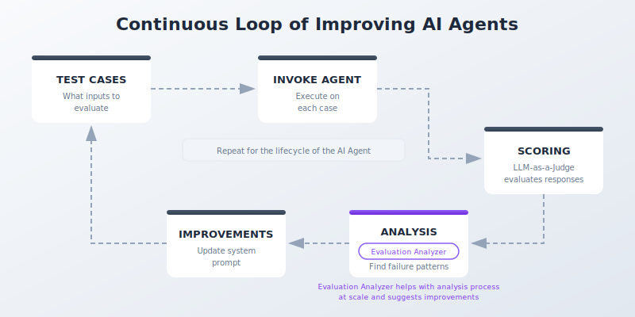

# Evaluation Analyzer

**Scale your AI agent evaluation analysis from days/weeks to minutes.**

<p align="center">
  
</p>

## The Problem

When you evaluate an AI agent at scale, you get hundreds of LLM-as-a-Judge explanations. Each one contains detailed reasoning about why a score was given. No human can read through all of them to find patterns.

## What It Does

1. **Loads** your evaluation JSON files
2. **Filters** low-scoring evaluations (configurable threshold)
3. **Analyzes** failure patterns using AI
4. **Generates** specific system prompt fixes

## What You Get

- **Top 3 problems** with evidence quotes from the LLM judge
- **Before/after table** showing exact prompt changes
- **Complete updated system prompt** ready to copy-paste

See [`example_agent_output.md`](example_agent_output.md) for a sample report.

## Quick Start

```bash
# 1. Install dependencies
pip install -r requirements.txt

# 2. Add your data
#    - Place evaluation JSONs in eval_data/
#    - Edit system_prompt.txt with your agent's prompt

# 3. Run the notebook
jupyter notebook evaluation_analyzer.ipynb
```

## Requirements

- Python 3.9+
- AWS credentials configured for Amazon Bedrock
- Evaluation data from [Strands Evals](https://github.com/strands-agents/strands-evals) or [AWS AgentCore](https://docs.aws.amazon.com/agentcore/)

---

**[Open the notebook](evaluation_analyzer.ipynb) for the full walkthrough and documentation.**
