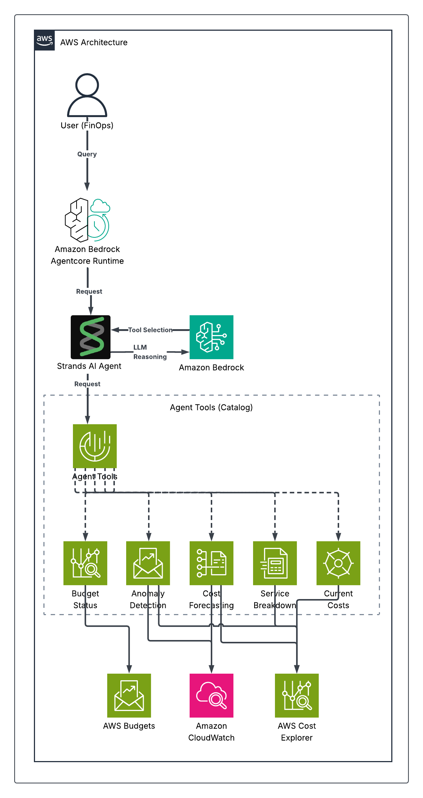

# Cost Optimization Agent

An intelligent AWS cost optimization agent powered by Amazon Bedrock AgentCore and Claude 3.5 Sonnet. This AI agent provides real-time cost monitoring, anomaly detection, and actionable recommendations to help reduce your AWS spending through natural language conversations.

## Overview

The Cost Optimization Agent combines the power of large language models with AWS cost management APIs to deliver intelligent financial insights. Simply ask questions like "Are my costs higher than usual?" or "How can I reduce my Lambda spending?" and receive detailed analysis with specific recommendations.

**Key Capabilities:**
- **Intelligent Analysis**: Uses Claude 3.5 Sonnet to understand complex cost patterns and provide contextual recommendations
- **Natural Language Interface**: Ask cost questions in plain English and get detailed, actionable responses
- **Real-time Monitoring**: Continuously tracks AWS spending across all services and regions
- **Proactive Alerts**: Automatically detects cost anomalies and budget overruns
- **Optimization Recommendations**: Suggests specific actions to reduce costs while maintaining performance

## Architecture



**Single-agent design using:**
- **AgentCore Runtime**: Production hosting platform with auto-scaling and monitoring
- **Strands Agent**: LLM orchestration framework managing tool selection and responses
- **Claude 3.5 Sonnet**: Advanced language model for natural language understanding and analysis
- **Tool Functions**: 5 specialized cost analysis functions for different AWS APIs
- **AWS Cost APIs**: Direct integration with Cost Explorer, Budgets, and CloudWatch

For detailed architecture and design decisions, see [ARCHITECTURE.md](ARCHITECTURE.md).

## Features

- **Cost Anomaly Detection**: Automatically identifies unusual spending patterns and cost spikes
- **Budget Monitoring**: Tracks budget utilization and forecasts potential overruns
- **Cost Forecasting**: Predicts future spending based on historical patterns and trends
- **Service Breakdown**: Detailed cost analysis by AWS service, region, and resource tags
- **Current Spending**: Real-time visibility into month-to-date and daily costs

## Example Queries

- "Are my costs higher than usual?"
- "Show me my top 3 most expensive services"
- "How much am I spending on Amazon Bedrock?"
- "I need to cut my AWS bill by 20%. What should I do?"
- "Which region is costing me the most?"
- "Forecast my spending for next month"

## Quick Start

### Prerequisites

**AWS Requirements:**
- AWS CLI configured with administrator access (or specific permissions listed below)
- AWS account with Amazon Bedrock enabled in **us-east-1** region
- **Claude 3.5 Sonnet model access enabled** in Amazon Bedrock (go to Bedrock Console → Model Access)
- AWS Cost Explorer enabled in your account (may take 24 hours after first enabling)

**Development Environment:**
- Python 3.10 or higher
- Git (to clone the repository)

**Required AWS Permissions:**
Your AWS credentials need the following permissions:
- `bedrock:InvokeModel` (for Claude 3.5 Sonnet)
- `ce:*` (Cost Explorer access)
- `budgets:*` (Budget management)
- `iam:*` (for creating execution roles)
- `bedrock-agentcore:*` (for AgentCore operations)
- `ecr:*` (for container registry)
- `codebuild:*` (for building containers)

### Installation

1. **Clone the repository and navigate to the project:**
   ```bash
   git clone https://github.com/awslabs/amazon-bedrock-agentcore-samples.git
   cd amazon-bedrock-agentcore-samples/02-use-cases/cost-optimization-agent
   ```

2. **Install dependencies:**
   
   **Option A: Using pip (standard)**
   ```bash
   pip install -r requirements.txt
   ```
   
   **Option B: Using uv (recommended for faster installs)**
   ```bash
   # Install uv first if you don't have it
   pip install uv
   
   # Install dependencies
   uv sync
   ```

### Usage

**Step 1: Local Testing (Optional but Recommended)**
```bash
python test_local.py
```
*This runs a comprehensive test suite with 6 different scenarios demonstrating the agent's natural language understanding and intelligent tool selection*

**What You'll See:**
- With valid AWS credentials: Detailed cost analysis and recommendations for each test query
- Without valid credentials: Credential errors but demonstrates the agent's structure and capabilities

**Step 2: Deploy to AgentCore**
```bash
python deploy.py
```
*This creates AWS resources and deploys the agent to AgentCore Runtime (takes 3-5 minutes)*

**Step 3: Test Deployed Agent**
```bash
python test_agentcore_runtime.py
```
*This tests the deployed agent running on AWS with real cost data and intelligent responses*

### Troubleshooting

**Common Issues:**

1. **"The security token included in the request is invalid"**
   - **Cause**: AWS credentials are expired, invalid, or not configured
   - **Solution**: 
     ```bash
     aws configure
     # OR refresh your AWS SSO session
     aws sso login --profile your-profile
     ```

2. **"Cost Explorer access denied"** 
   - **Cause**: Cost Explorer not enabled or insufficient permissions
   - **Solution**: Enable Cost Explorer in AWS Console → Billing → Cost Explorer (may take 24 hours)

3. **"Bedrock access denied"** 
   - **Cause**: Claude 3.5 Sonnet model not enabled
   - **Solution**: Go to Bedrock Console → Model Access → Enable Claude 3.5 Sonnet

4. **"Region not supported"** 
   - **Cause**: Using wrong region for Bedrock
   - **Solution**: Ensure you're using us-east-1 region

5. **"No matching distribution found for bedrock-agentcore>=1.0.0 or bedrock-agentcore-starter-toolkit>=1.0.0"**
   - **Cause**: Version mismatch in requirements (latest available version is 0.2.5)
   - **Solution**: ✅ **FIXED** - Both requirements.txt and pyproject.toml now use >=0.2.0 for compatibility

6. **"Import errors"** 
   - **Cause**: Not in correct directory or dependencies not installed
   - **Solution**: Ensure you're in `02-use-cases/cost-optimization-agent` and run `pip install -r requirements.txt`

**Testing Without Valid AWS Credentials:**
The local test (`python test_local.py`) will show credential errors but still demonstrates the agent's functionality:
- ✅ Dependencies load correctly
- ✅ Agent initializes and processes queries  
- ✅ Natural language understanding works
- ✅ Tool selection logic functions
- ✅ Comprehensive test suite runs (6 different scenarios)
- ❌ AWS API calls fail (expected without valid credentials)

**Testing With Valid AWS Credentials:**
With proper AWS credentials, you'll see:
- ✅ Complete cost analysis with real data for all 6 test scenarios
- ✅ Intelligent recommendations based on your actual usage
- ✅ Successful integration with Cost Explorer, Budgets, and CloudWatch APIs
- ✅ Natural language responses with specific cost optimization suggestions
- ✅ Demonstration of superior LLM-based tool selection vs keyword matching

For comprehensive deployment instructions, monitoring, and troubleshooting, see [DEPLOYMENT.md](DEPLOYMENT.md).

## AI/GenAI Usage Disclosure

This solution uses Amazon Bedrock with Claude 3.5 Sonnet to provide intelligent cost optimization recommendations. Please note:

1. **AI-Generated Recommendations**: All cost optimization suggestions are generated by AI and should be reviewed by qualified personnel before implementation
2. **Suggestions, Not Guarantees**: The agent provides suggestions based on data analysis, not guaranteed outcomes or definitive financial advice
3. **Human Oversight Required**: Users maintain full responsibility for cost optimization decisions and should validate all recommendations
4. **Data Processing**: The AI processes your AWS cost and usage data to generate insights, but does not store or share this data outside your AWS environment

## Bias and Fairness Considerations

This AI-powered cost optimization agent is designed with the following considerations:

1. **Balanced Recommendations**: The agent analyzes all AWS services equally and does not favor specific services or vendors in its recommendations
2. **Performance Safeguards**: Recommendations include safeguards against over-aggressive cost cutting that could negatively impact system performance or reliability
3. **Multi-Account Fairness**: In multi-account scenarios, the agent provides equitable analysis across all accounts without bias toward larger or smaller usage patterns
4. **Transparency**: All recommendations include clear explanations of the analysis methodology and data sources used
5. **Human Review Requirements**: Critical cost optimization decisions require human oversight, especially for changes that could impact production systems or exceed predefined thresholds

## Contributing

We welcome contributions to improve the Cost Optimization Agent! Please follow these guidelines:

### Contributor License Agreement
By contributing to this project, you agree that your contributions will be licensed under the same Apache License 2.0 that covers this project. This ensures that the project remains open source and that all contributors' work is properly protected.

### How to Contribute
1. Fork the repository
2. Create a feature branch
3. Make your changes
4. Add tests for new functionality
5. Submit a pull request

### Contribution Guidelines
- Follow existing code style and patterns
- Include comprehensive tests for new features
- Update documentation as needed
- Ensure all security best practices are followed

## License

This project is licensed under the Apache License 2.0 - see the [LICENSE](../../LICENSE) file for details.
