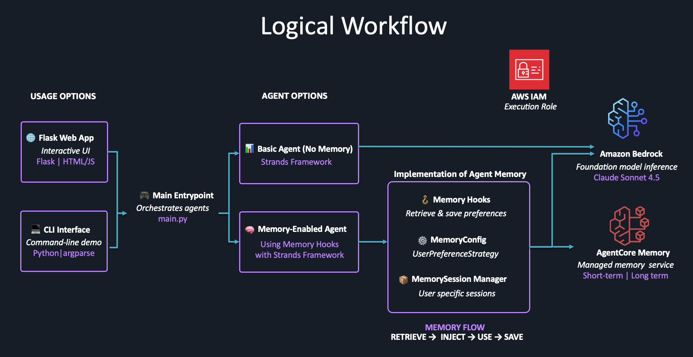

# 🧠 Slide Deck Agent Demo - The Importance of Agent Memory

This comprehensive demo showcases the transformative power of **Agent Memory** by comparing two slide deck generation systems:

- **🤖 Basic Agent**: Creates presentations without learning or memory
- **🧠 Memory-Enhanced Agent**: Learns user preferences and creates increasingly personalized presentations

## ✨ Key Demonstration Points

| Feature                   | Basic Agent                            | Memory-Enhanced Agent                                   |
| ------------------------- | -------------------------------------- | ------------------------------------------------------- |
| **Style Learning**        | ❌ No learning                         | ✅ Remembers color, font, theme preferences             |
| **Context Awareness**     | ❌ Generic responses                   | ✅ Adapts to presentation type (tech/business/academic) |
| **Personalization**       | ❌ Same output for everyone            | ✅ Tailored to individual user preferences              |
| **Efficiency**            | ❌ Manual style specification required | ✅ Automatic application of learned preferences         |
| **Improvement Over Time** | ❌ Static capabilities                 | ✅ Gets better with each interaction                    |

## 🏗️ Architecture Overview



End to end technical workflow is described here.

```
┌─────────────────┐    ┌──────────────────┐    ┌─────────────────┐
│   Basic Agent   │    │  Memory-Enhanced │    │   AgentCore     │
│   (No Memory)   │    │     Agent        │◄──►│    Memory       │
│                 │    │                  │    │   (User Prefs)  │
└─────────────────┘    └──────────────────┘    └─────────────────┘
         │                        │                       │
         │                        │                       │
         ▼                        ▼                       ▼
┌─────────────────┐    ┌──────────────────┐    ┌─────────────────┐
│ HTML Generator  │    │  CSS Generator   │    │  PPT Converter  │
│ (Basic Themes)  │    │ (Advanced Style) │    │ (Multi-format)  │
└─────────────────┘    └──────────────────┘    └─────────────────┘
         │                        │                       │
         └────────────────────────┼───────────────────────┘
                                  ▼
                        ┌─────────────────┐
                        │   Web Interface │
                        │ (Comparison UI) │
                        └─────────────────┘
```

## 📋 Prerequisites

### Required Software

- **Python 3.10+**
- **AWS CLI** configured with credentials
- **Bedrock AgentCore Memory** permissions

### AWS Permissions Required

Your AWS credentials must have permissions for:

```json
{
  "Version": "2012-10-17",
  "Statement": [
    {
      "Effect": "Allow",
      "Action": [
        "bedrock-agentcore:*",
        "bedrock:InvokeModel",
        "iam:CreateRole",
        "iam:PutRolePolicy",
        "iam:GetRole"
      ],
      "Resource": "*"
    }
  ]
}
```

## 🚀 Quick Start

### 1. Installation

```bash
# Clone or navigate to the demo directory
cd slide-deck-memory-demo

# Install Python dependencies
pip install -r requirements.txt

# Verify AWS configuration
aws sts get-caller-identity
```

### 2. Run the Demo

```bash
# Start web interface (recommended)
python main.py

# Or choose specific mode
python main.py --mode web      # Web interface
python main.py --mode cli      # Command line demo
python main.py --mode demo     # Automated demo
python main.py --mode compare  # Direct comparison
```

### 3. Access the Demo

- **Web Interface**: Open `http://localhost:5000`
- **CLI Mode**: Follow interactive prompts
- **Automated**: Watch the learning progression

## 🎯 Demo Modes Explained

### 🌐 Web Interface Mode (Default)

```bash
python main.py
```

- **Best for**: Interactive exploration and presentations
- **Features**: Beautiful UI, side-by-side comparison, file downloads
- **URL**: `http://localhost:5000`

### 💻 CLI Interactive Mode

```bash
python main.py --mode cli
```

- **Best for**: Technical users and debugging
- **Features**: Command-line interface, direct agent testing
- **Options**: Test individual agents or compare side-by-side

### 🤖 Automated Demo Mode

```bash
python main.py --mode demo
```

- **Best for**: Presentations and quick demonstrations
- **Features**: Scripted scenarios showing learning progression
- **Flow**: Watch the agent learn preferences over time

### ⚖️ Direct Comparison Mode

```bash
python main.py --mode compare
```

- **Best for**: Quick A/B testing
- **Features**: Single request tested on both agents
- **Output**: Side-by-side results comparison

## 📖 Usage Examples

### Example 1: Learning Color Preferences

```
Request 1: "Create a tech presentation about AI. I prefer blue themes for technical content."
Result: Memory agent learns blue preference for tech topics

Request 2: "Create another tech presentation about machine learning."
Result: Memory agent automatically applies blue theme, basic agent uses default
```

### Example 2: Context-Aware Styling

```
Business Request: "Create executive presentation on quarterly results"
Memory Agent: Applies learned professional, corporate styling

Creative Request: "Create design showcase presentation"
Memory Agent: Adapts to creative, bold styling while maintaining user color preferences
```

## 🔧 Configuration

### Environment Variables

```bash
# Optional: Override default settings
export AWS_REGION=us-east-1
export DEMO_USER_ID=your-user-id
export OUTPUT_DIR=./custom-output

# Security: Set a secure secret key for production
export FLASK_SECRET_KEY=your-random-secret-key-here
```

### Configuration File (`config.py`)

```python
# AWS Configuration
AWS_REGION = "us-east-1"
BEDROCK_MODEL_ID = "us.anthropic.claude-3-7-sonnet-20250219-v1:0"

# Memory Configuration
MEMORY_NAME = "SlideDeckAgentMemory"
MEMORY_EXPIRY_DAYS = 30

# Web UI Configuration
FLASK_HOST = "127.0.0.1"
FLASK_PORT = 5000
```

## 📁 Project Structure

```
slide-deck-memory-demo/
├── ⚙️ config.py                    # Configuration settings (AWS region, model ID, paths)
├── 🧠 memory_setup.py              # Memory initialization (AgentCore Memory setup)
├── 📄 main.py                      # CLI demo (optional alternative to web UI)
├── 📦 requirements.txt             # Python dependencies
├── 📚 README.md                    # This documentation
│
├── 🌐 web/                        # Flask web application (main demo interface)
│   └── app.py                     # Web server, API endpoints, and route handlers
│
├── 🤖 agents/                      # Basic and memory-enabled agents
│   ├── basic_agent.py             # Agent without memory capabilities
│   └── memory_agent.py            # Memory-enabled agent (learns user preferences)
│
├── 🎨 generators/                  # HTML and CSS generators
│   ├── html_generator.py          # HTML slide generation (markdown parsing)
│   └── css_generator.py           # CSS generation (dynamic styling based on preferences)
│
├── 🔗 memory_hooks/                # Memory integration hooks
│   └── slide_hooks.py             # Auto preference learning and memory event handling
│
├── 📋 templates/                   # HTML templates for web UI
│   ├── base.html                  # Base template with common styling
│   ├── index.html                 # Landing page
│   ├── create_basic.html          # Basic agent interface
│   ├── create_memory.html         # Memory agent interface
│   ├── compare.html               # Side-by-side comparison interface
│   └── error.html                 # Error handling template
│
├── 🎨 static/                     # CSS/JS for web UI
│   └── (CSS, JavaScript, images)
│
├── 🔄 converters/                  # Format conversion utilities (optional)
│   └── ppt_converter.py           # HTML to PowerPoint conversion
│
└── 📁 output/                     # Generated presentations (HTML files)
```

## 🎯 Key Features Demonstrated

### 🧠 Memory Learning Capabilities

- **Style Preferences**: Colors, themes, fonts, spacing
- **Context Awareness**: Presentation type (tech, business, academic, creative)
- **Audience Adaptation**: Professional, technical, creative styling
- **Continuous Improvement**: Better results with each interaction

### 🎨 Advanced Styling Features

- **Dynamic CSS Generation**: Based on learned user preferences
- **Presentation Types**: Tech, business, academic, creative with appropriate styling
- **Font Systems**: Modern, classic, technical, creative font combinations
- **Responsive Design**: Works on different screen sizes
- **Interactive Navigation**: Keyboard shortcuts and smooth transitions

### 📊 Output Formats

- **HTML Presentations**: Interactive, web-ready slide decks
- **PowerPoint Files**: Professional PPTX format for sharing
- **Preview Capability**: In-browser presentation viewing
- **Download Management**: Easy file access and organization

## 🔍 Troubleshooting

### Common Issues

#### ❌ AWS Credentials Error

```
Error: Unable to locate credentials
```

**Solution**: Configure AWS credentials

```bash
aws configure
# Or set environment variables:
export AWS_ACCESS_KEY_ID=your-key
export AWS_SECRET_ACCESS_KEY=your-secret
export AWS_DEFAULT_REGION=us-east-1
```

#### ❌ Memory Creation Failed

```
Error: Memory creation failed: Access denied
```

**Solution**: Ensure IAM permissions for Bedrock AgentCore Memory

- Check the AWS permissions section above
- Verify account access to Bedrock services

#### ❌ Module Import Errors

```
ModuleNotFoundError: No module named 'strands'
```

**Solution**: Install dependencies

```bash
pip install -r requirements.txt
```

#### ❌ Web Interface Not Starting

```
Error: Address already in use
```

**Solution**: Change port or kill existing process

```bash
# Use different port
python main.py --mode web --port 5001

# Or kill existing process
lsof -ti:5000 | xargs kill -9
```

### Debug Mode

Enable detailed logging for troubleshooting:

```python
# In config.py
import logging
logging.basicConfig(level=logging.DEBUG)
```

## 🧪 Testing the Demo

### Quick Functionality Test

```bash
# Test basic components
python -c "from agents.basic_agent import BasicSlideDeckAgent; print('✅ Basic agent OK')"
python -c "from memory_setup import setup_slide_deck_memory; print('✅ Memory setup OK')"
```

### Memory Learning Test

1. **First Interaction**: Specify color preference explicitly
2. **Second Interaction**: Omit color preference, see if agent remembers
3. **Check Learned Preferences**: Use preference viewing tool

### Comparison Test

Use identical requests on both agents to see differences:

```
Request: "Create presentation about data science for analysts"
Basic Agent: Uses default blue theme
Memory Agent: Applies learned preferences + context awareness
```

## 🎓 Learning Objectives

After completing this demo, you will understand:

1. **Memory's Impact on AI Interactions**

   - How memory transforms generic AI into personalized assistants
   - The difference between stateless and stateful AI agents

2. **User Experience Enhancement**

   - Reduced need for repetitive preference specification
   - Improved relevance and personalization over time

3. **Technical Implementation**

   - AgentCore Memory integration with Strands agents
   - Memory hooks for automatic learning and retrieval
   - User preference strategies and consolidation

4. **Business Value**
   - Increased user satisfaction through personalization
   - Improved efficiency by reducing manual configuration
   - Enhanced user engagement through adaptive experiences

## 📞 Support

For issues or questions:

1. Check the troubleshooting section above
2. Verify AWS credentials and permissions
3. Ensure all dependencies are installed correctly
4. Check the output logs for detailed error information

## 🏷️ Version Information

- **Demo Version**: 1.0
- **AgentCore Memory**: Latest compatible version
- **Strands Framework**: Latest compatible version
- **Python**: 3.10+ required
