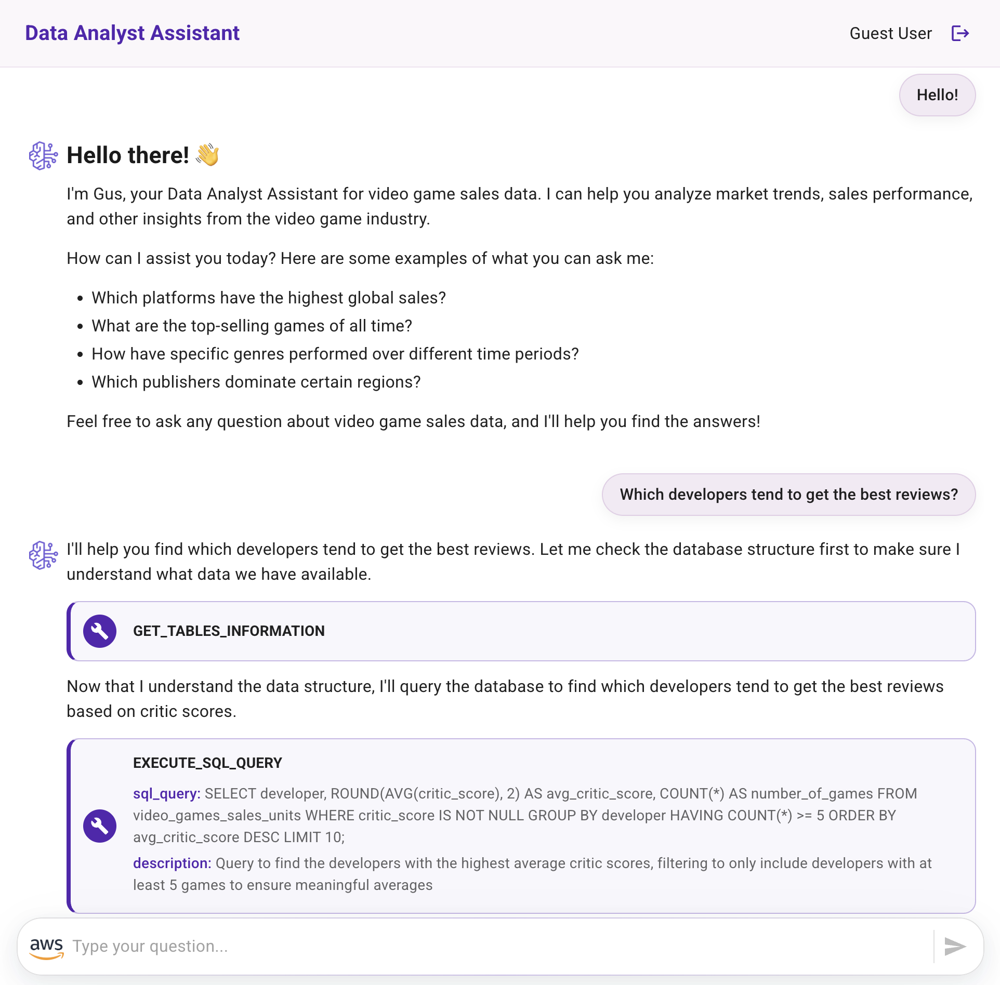

# Front-End Implementation - Integrating AgentCore with a Ready-to-Use Data Analyst Assistant Application

This tutorial guides you through setting up a React Web application that integrates with your **[Amazon Bedrock AgentCore](https://aws.amazon.com/bedrock/agentcore/)** deployment, creating a Data Analyst Assistant for Video Game Sales.

> [!NOTE]
> **Working Directory**: Make sure you are in the `amplify-video-games-sales-assistant-agentcore-strands/` folder before starting this tutorial. All commands in this guide should be executed from this directory.

## Overview

By the end of this tutorial, you'll have a fully functional Generative AI web application that allows users to interact with a Data Analyst Assistant interface powered by Amazon Bedrock AgentCore.

The application consists of two main components:

- **React Web Application**: Provides the user interface and handles user interactions
- **Amazon Bedrock AgentCore Integration:**:
    - Uses your AgentCore deployment for data analysis and natural language processing
    - The application invokes the Amazon Bedrock AgentCore for interacting with the assistant
    - Directly invokes Claude 3.7 Sonnet model for chart generation and visualization

> [!IMPORTANT]
> This sample application is for demonstration purposes only and is not production-ready. Please validate the code against your organization's security best practices.

## Prerequisites

Before you begin, ensure you have:

- [Node.js version 18+](https://nodejs.org/en/download/package-manager)

## Set Up the Front-End Application

### Install Dependencies

Navigate to the React application folder (amplify-video-games-sales-assistant-agentcore-strands/) and install the dependencies:

``` bash
npm install
```

### Install Amplify CLI

Install the Amplify CLI globally:

``` bash
npm install -g @aws-amplify/cli
```

### Initialize Amplify Project

Initialize the Amplify project:

``` bash
amplify init
```

- Do you want to continue with Amplify Gen 1? **`yes`**
- Why would you like to use Amplify Gen 1? **`Prefer not to answer`**

Use the following configuration:

- ? Enter a name for the project: **`daabedrockagentcore`**

Use the following default configuration:
- Name: **daabedrockagentcore**
- Environment: dev
- Default editor: Visual Studio Code
- App type: javascript
- Javascript framework: react
- Source Directory Path: src
- Distribution Directory Path: build
- Build Command: npm run-script build
- Start Command: npm run-script start

- ? Initialize the project with the above configuration? **`Yes`**
- ? Select the authentication method you want to use: **`AWS profile`**

### Add Authentication

Add Amazon Cognito authentication to enable user sign-in:

``` bash
amplify add auth
```

Use the following configuration:

- Do you want to use the default authentication and security configuration?: **`Default configuration`**
- How do you want users to be able to sign in?: **`Email`**
- Do you want to configure advanced settings?: **`No, I am done`**

### Deploy Backend Resources

Deploy the authentication resources to AWS:

``` bash
amplify push
```

- ? Are you sure you want to continue? **`Yes`**

> [!NOTE]
> This creates a Cognito User Pool and Identity Pool in your AWS account for user authentication. AWS credentials for the Front-End Application are automatically managed through Cognito.

## Configure AuthRole Permissions

After authentication deployment, you need to grant your authenticated users permission to access AWS services.

1. **Find your AuthRole**: Go to AWS Console → IAM → Roles → Search for amplify-daabedrockagentcore-dev-*-authRole

2. **Get the DynamoDB Table ARN**: From your CDK project outputs, get the `QuestionAnswersTableName` value:

``` bash
# Set the stack name environment variable
export STACK_NAME=CdkAgentcoreStrandsDataAnalystAssistantStack

# Get the DynamoDB table name and construct the ARN
export QUESTION_ANSWERS_TABLE_NAME=$(aws cloudformation describe-stacks --stack-name "$STACK_NAME" --query "Stacks[0].Outputs[?OutputKey=='QuestionAnswersTableName'].OutputValue" --output text)
export QUESTION_ANSWERS_TABLE_ARN="arn:aws:dynamodb:$(aws configure get region):$(aws sts get-caller-identity --query Account --output text):table/$QUESTION_ANSWERS_TABLE_NAME"
echo "Table ARN: $QUESTION_ANSWERS_TABLE_ARN"
```

3. **Add this policy** (replace `<account_id>` with your AWS account ID, `<question_answers_table_arn>` with the ARN from step 2, and `<agent_arn>` with your AgentCore runtime ARN):

> [!NOTE]
> The AgentCore runtime ARN has been pre-configured based on your current deployment. If you're using a different AgentCore runtime, update the ARN in the BedrockAgentCorePermissions section accordingly.

``` json
{
    "Version": "2012-10-17",
    "Statement": [
        {
            "Sid": "InvokeBedrockModel",
            "Effect": "Allow",
            "Action": [
                "bedrock:InvokeModel"
            ],
            "Resource": [
                "arn:aws:bedrock:*:<account_id>:inference-profile/global.anthropic.claude-haiku-4-5-20251001-v1:0",
                "arn:aws:bedrock:us-east-2::foundation-model/anthropic.claude-haiku-4-5-20251001-v1:0",
                "arn:aws:bedrock:us-east-1::foundation-model/anthropic.claude-haiku-4-5-20251001-v1:0",
                "arn:aws:bedrock:us-west-2::foundation-model/anthropic.claude-haiku-4-5-20251001-v1:0"
            ]
        },
        {
            "Sid": "DynamoDB",
            "Effect": "Allow",
            "Action": [
                "dynamodb:Query"
            ],
            "Resource": "<question_answers_table_arn>"
        },
        {
            "Sid": "BedrockAgentCorePermissions",
            "Effect": "Allow",
            "Action": "bedrock-agentcore:InvokeAgentRuntime",
            "Resource": [
                "<agent_arn>",
                "<agent_arn>/runtime-endpoint/*"
            ]
        }
    ]
}
```

## Configure Environment Variables

Rename the file **src/sample.env.js** to **src/env.js**:

``` bash
mv src/sample.env.js src/env.js
```

### Get CDK Output Values

First, get the required values from your CDK project outputs:

``` bash
# Set the stack name environment variable
export STACK_NAME=CdkAgentcoreStrandsDataAnalystAssistantStack

# Get the DynamoDB table name and AgentCore Role ARN from CDK outputs
export QUESTION_ANSWERS_TABLE_NAME=$(aws cloudformation describe-stacks --stack-name "$STACK_NAME" --query "Stacks[0].Outputs[?OutputKey=='QuestionAnswersTableName'].OutputValue" --output text)
echo "Table Name: $QUESTION_ANSWERS_TABLE_NAME"
```

### Update Environment Variables

In your **src/env.js** update the following environment variables:

- **QUESTION_ANSWERS_TABLE_NAME**: Use the value from the command above
- **AGENT_RUNTIME_ARN**: Your AgentCore runtime ARN (format: "arn:aws:bedrock-agentcore:region:account:runtime/runtime-name")
- **AGENT_ENDPOINT_NAME**: Usually "DEFAULT" for the default endpoint
- **LAST_K_TURNS**: AgentCore Memory value to retrieve the last K conversation turns for context memory (default: 10)

Also, you can update the general application description:
- **APP_NAME**: "Data Analyst Assistant"
- **APP_SUBJECT**: "Video Games Sales"
- **WELCOME_MESSAGE**: Your custom welcome message
  

## Test Your Data Analyst Assistant

Start the application locally:

``` bash
npm start
```

The application will open in your browser at http://localhost:3000.

First-Time access:
1. **Create Account**: Click "Create Account" and use your email address
2. **Verify Email**: Check your email for a verification code
3. **Sign In**: Use your email and password to sign in

Try these sample questions to test the assistant:

```
Hello!
```

```
How can you help me?
```

```
What is the structure of the data?
```

```
Which developers tend to get the best reviews?
```

```
What were the total sales for each region between 2000 and 2010? Give me the data in percentages.
```

```
What were the best-selling games in the last 10 years?
```

```
What are the best-selling video game genres?
```

```
Give me the top 3 game publishers.
```

```
Give me the top 3 video games with the best reviews and the best sales.
```

```
Which is the year with the highest number of games released?
```

```
Which are the most popular consoles and why?
```

```
Give me a short summary and conclusion of our conversation.
```

## Deploy your Application with Amplify Hosting

To deploy your application yu can use AWS Amplify Hosting:

### Add Hosting

Add hosting to your Amplify project:

``` bash
amplify add hosting
```

Use the following configuration:
- Select the plugin module: `Hosting with Amplify Console`
- Type: `Manual deployment`

### Publish Application

Build and deploy your application:

``` bash
amplify publish
```

This will build your React application and deploy it to AWS Amplify Hosting. You'll receive a URL where your application is accessible.

## Application Features

Congratulations! Your Data Analyst Assistant can provide you with the following conversational experience:


- **Conversational interface with an agent responding to user questions**



- **Raw query results displayed in tabular format**


- **Chart visualization generated from the agent's answer and the data query results (created using [Apexcharts](https://apexcharts.com/))**.


- **Summary and conclusion derived from the data analysis conversation**


## Thank You

## License

This project is licensed under the Apache-2.0 License.