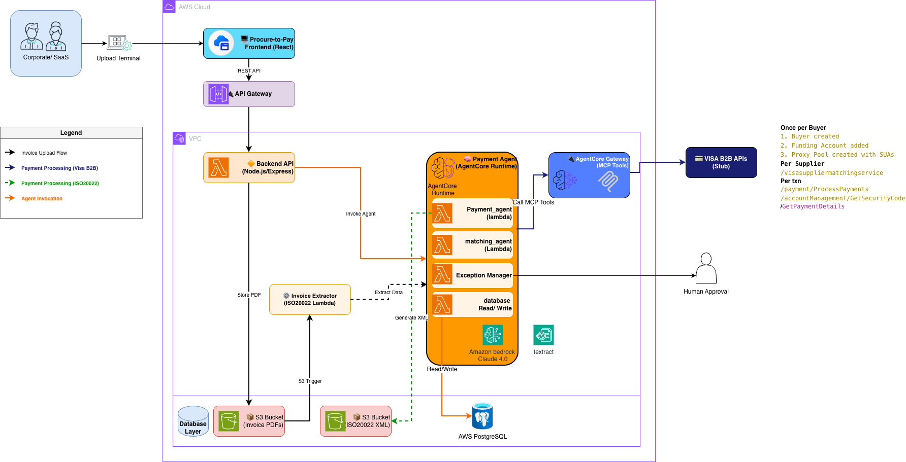

# Procure-to-Pay: Automated Accounts Payable with AWS Bedrock AgentCore

## Overview

**Problem:** Manual accounts payable processes are slow, error-prone, and lack real-time visibility into invoice status, payment generation, and goods receipt matching.

**Solution:** An automated procure-to-pay system that uses AWS Bedrock AI to extract invoice data, matches invoices with purchase orders and goods receipts, and generates ISO 20022 payment files for bank submission.

## Architecture

- **Frontend:** React + TypeScript + Material-UI
- **Backend:** Node.js + Express + TypeScript + PostgreSQL
- **Infrastructure:** AWS (Lambda, RDS, S3, API Gateway, Bedrock AI)
- **Deployment:** AWS CDK (Infrastructure as Code)

### System Architecture

**System Components & Integration:**



The system uses a multi-agent architecture:
- **Supervisor Agent** - Orchestrates the entire AP workflow
- **IDP Agent** - Invoice data extraction using Textract
- **Match Agent** - PO-GR-Invoice matching using Bedrock
- **Exception Management** - Handles approval workflows
- **Payment Agent** - Processes payments via Visa B2B APIs

**Procure-to-Pay Workflow:**


The workflow covers the complete AP cycle from supplier onboarding through payment reconciliation, with Visa B2B integration for virtual card payments.

## Prerequisites

- AWS Account with admin access
- AWS CLI configured (`aws configure`)
- Node.js 18+ installed
- Docker installed and running
- Python 3 with boto3: `pip3 install boto3`
- Bedrock AgentCore SDK: `pip3 install bedrock-agentcore-starter-toolkit`
- Git

## Quick Start

**For detailed deployment instructions, see [DEPLOYMENT-QUICK-START.md](DEPLOYMENT-QUICK-START.md)**

### Access the Application

**Buyer Portal** (Main Application):
- URL: `http://localhost:5173` (dev) or `https://your-domain.com` (prod)
- Features: Invoice management, payment processing, virtual card display

**Supplier Portal** (External Access):
- URL: `https://your-domain.com/supplier/login` or `http://localhost:5173/supplier/login` (dev)
- Login: Use Payment ID or Tracking Number from processed payment
- Features: View virtual card details, copy card information for payment processing

## Project Structure

```
.
├── rtp-overlay/              # React frontend application
├── backend/                  # Node.js Express API
├── infrastructure/           # AWS CDK infrastructure code
│   ├── lib/                 # CDK stack definitions
│   ├── bin/                 # CDK app entry points
│   ├── lambda/              # Lambda function code
│   │   ├── visa-stubs/      # Visa B2B stub APIs
│   │   └── payment-agent/   # Payment orchestration agent
│   ├── scripts/             # Deployment and setup scripts
│   ├── deploy.sh            # Infrastructure deployment
│   ├── deploy-lambda.sh     # Lambda deployment
│   ├── deploy-agentcore-gateway.sh  # AgentCore Gateway deployment
│   ├── deploy-visa-stubs.sh # Visa stub APIs deployment
│   └── run-migrations.sh    # Database migrations
├── python/                   # Lambda functions (Python)
│   ├── lambda_iso20022.py   # ISO 20022 payment generation
│   └── lambda_goods_receipt.py  # Goods receipt extraction
├── visa-b2b-spec/           # Visa B2B integration specifications
│   ├── gateway/             # Gateway OpenAPI specs
│   └── *.json               # API examples and schemas
└── invoices-and-receipt/    # Test data generators
```

## Key Features

### Two-Portal Architecture

The system provides separate portals for buyers and suppliers:

**Buyer Portal** (Internal AP Users):
- Full invoice and payment management
- Process payments with AI-powered decision making
- View virtual card details (masked by default)
- Track payment status and history
- Complete procure-to-pay workflow

**Supplier Portal** (External Suppliers):
- Simple login with Payment ID or Tracking Number
- Retrieve virtual card details for payment processing
- View invoice and payment information
- No complex user management required
- Clean, minimal interface for easy card retrieval

### Invoice Management

- AI-powered invoice data extraction (AWS Bedrock)
- Automatic PO and goods receipt matching
- Variance detection and approval workflows
- ISO 20022 payment file generation

### Purchase Orders

- Create and manage purchase orders
- Track order status and fulfillment
- Link to invoices and goods receipts

### Goods Receipts

- Upload delivery documents (PDF, images)
- AI extraction of BOL, quantities, dates
- Automatic PO matching
- Quality inspection tracking

### Payment Processing

- AI-powered payment method selection (Visa B2B or ISO20022)
- Virtual card generation via Visa B2B APIs
- Generate ISO 20022 XML payment files for bank transfers
- Payment status tracking across both portals
- Batch payment generation
- Secure card encryption and access logging

### Visa B2B Payment Integration (NEW)

- AI-powered payment orchestration using AWS Bedrock Agents
- Multi-agent architecture (Supervisor, Payment, Card Requisition agents)
- Integration with Visa B2B APIs via AgentCore Gateway
- Real-time payment processing and virtual card requisition
- Automated payment status tracking and reconciliation
- **Buyer Portal** - AP users process payments and view virtual card details
- **Supplier Portal** - Suppliers retrieve virtual card details for payment processing

**For detailed payment integration flow and architecture, see [VISA-B2B-PAYMENT-INTEGRATION.md](VISA-B2B-PAYMENT-INTEGRATION.md)**

## Environment Variables

The CDK deployment automatically configures all required environment variables. No manual configuration needed.

Key variables set by CDK:

- `DB_HOST`, `DB_PORT`, `DB_DATABASE` - Database connection
- `DB_SECRET_ARN` - Secrets Manager ARN for credentials
- `S3_INPUT_BUCKET` - Invoice upload bucket
- `S3_GR_INPUT_BUCKET` - Goods receipt upload bucket
- `ISO20022_BUCKET_NAME` - Payment file output bucket
- `RECEIPTS_BUCKET` - Receipt document storage

## Deployment Scripts

| Script | Purpose | When to Run |
|--------|---------|-------------|
| `deploy.sh` | Deploy infrastructure (VPC, RDS, S3) | Once initially, then when infrastructure changes |
| `rebuild-lambda-layer.sh` | Build Lambda dependencies layer | When backend dependencies change |
| `deploy-lambda.sh` | Deploy Lambda functions and API | After every backend code change |
| `run-migrations.sh` | Run database migrations | After deploying new migrations |
| `deploy-visa-stub.sh` | Deploy Visa stub APIs | Once for Visa B2B integration |
| `deploy-agentcore-gateway.sh` | Deploy AgentCore Gateway | Once for Visa B2B integration |
| `deploy-invoice-processing.sh` | Deploy invoice AI processing | Once before Payment Agent |
| `deploy-payment-agent.sh` | Deploy Payment Agent | Once after Gateway |
| `deploy-gr-processing.sh` | Deploy GR AI processing | Once for goods receipt feature |
| `configure-s3-notifications.sh` | Configure S3 event triggers | Once after processing stacks |
| `get-db-info.sh` | Get database credentials | For debugging |

## Updating the Application

### Backend Code Changes

```bash
cd infrastructure
./deploy-lambda.sh
```

### Database Schema Changes

```bash
# Add migration in backend/src/migrations/
cd infrastructure
./run-migrations.sh
```

### Infrastructure Changes

```bash
cd infrastructure
npm run build
cdk diff  # Preview changes
./deploy.sh
```

## Accessing Resources

### Database Credentials

```bash
cd infrastructure
./get-db-info.sh
```

### API Gateway URL

```bash
aws cloudformation describe-stacks \
  --stack-name RtpOverlayLambdaStack \
  --query 'Stacks[0].Outputs[?OutputKey==`ApiUrl`].OutputValue' \
  --output text
```

### Lambda Logs

```bash
# API Lambda
aws logs tail /aws/lambda/RtpOverlayLambdaStack-ApiLambda --follow

# Invoice Processing Lambda
aws logs tail /aws/lambda/InvoiceProcessingLambda --follow
```

## Cost Estimate

Monthly AWS costs (approximate):

- RDS db.t3.micro: ~$15
- Lambda: Free tier covers most dev usage
- API Gateway: ~$3.50 per million requests
- S3: ~$0.023 per GB
- Bedrock AI: Pay per use (~$0.003 per 1K tokens)

**Total: ~$20-30/month for development**

## Troubleshooting

### Lambda Package Too Large

```bash
cd infrastructure
./rebuild-lambda-layer.sh
./deploy-lambda.sh
```

### Database Connection Issues

Check Lambda is in VPC and security groups allow Lambda → RDS on port 5432.

### API Gateway 404 Errors

Verify Lambda integration and API Gateway deployment stage.

### Invoice Processing Not Working

Ensure Bedrock model access is enabled in your AWS account (Claude Sonnet 4.0).

## Security

- Database in private subnet (no internet access)
- Lambda functions in VPC with security groups
- Database credentials in AWS Secrets Manager
- S3 buckets block public access
- All data encrypted at rest
- JWT-based API authentication
- Role-based access control (RBAC)

## Documentation

- [Deployment Quick Start](DEPLOYMENT-QUICK-START.md) - Fast deployment guide
- [Complete Deployment Guide](DEPLOYMENT-GUIDE.md) - Detailed deployment instructions
- [Visa B2B Payment Integration](VISA-B2B-PAYMENT-INTEGRATION.md) - Payment flow and architecture
- [Infrastructure README](infrastructure/README.md) - CDK architecture details
- [API Documentation](backend/README.md) - Backend API reference

## Support

For issues or questions, create an issue in this repository.

## Contributing

We welcome contributions to improve the Visa B2B Payment Integration project! Here's how you can help:

### How to Contribute

1. **Fork the Repository**
   - Click the "Fork" button at the top right of this repository
   - Clone your fork locally: `git clone https://github.com/YOUR-USERNAME/visa-b2b-payment-integration.git`

2. **Create a Feature Branch**
   ```bash
   git checkout -b feature/your-feature-name
   ```

3. **Make Your Changes**
   - Write clean, maintainable code
   - Follow existing code style and conventions
   - Add tests for new features
   - Update documentation as needed

4. **Test Your Changes**
   ```bash
   # Backend tests
   cd backend && npm test
   
   # Frontend tests
   cd rtp-overlay && npm test
   
   # Build verification
   npm run build
   ```

5. **Commit Your Changes**
   ```bash
   git add .
   git commit -m "feat: add your feature description"
   ```
   
   Use conventional commit messages:
   - `feat:` - New feature
   - `fix:` - Bug fix
   - `docs:` - Documentation changes
   - `refactor:` - Code refactoring
   - `test:` - Adding tests
   - `chore:` - Maintenance tasks

6. **Push to Your Fork**
   ```bash
   git push origin feature/your-feature-name
   ```

7. **Submit a Pull Request**
   - Go to the original repository
   - Click "New Pull Request"
   - Select your fork and branch
   - Provide a clear description of your changes
   - Link any related issues

### Code Style Guidelines

**TypeScript/JavaScript:**
- Use TypeScript for type safety
- Follow ESLint and Prettier configurations
- Use meaningful variable and function names
- Add JSDoc comments for public APIs

**Python:**
- Follow PEP 8 style guide
- Use type hints where applicable
- Add docstrings for functions and classes

**React Components:**
- Use functional components with hooks
- Keep components small and focused
- Use TypeScript interfaces for props
- Follow Material-UI best practices

### Pull Request Guidelines

- **Keep PRs focused** - One feature or fix per PR
- **Write clear descriptions** - Explain what and why
- **Update documentation** - Keep docs in sync with code
- **Add tests** - Ensure new code is tested
- **Pass all checks** - Linting, tests, and builds must pass
- **Respond to feedback** - Address review comments promptly

### Reporting Issues

Found a bug or have a feature request?

1. **Check existing issues** - Avoid duplicates
2. **Use issue templates** - Provide required information
3. **Be specific** - Include steps to reproduce bugs
4. **Add context** - Screenshots, logs, or error messages help

### Development Setup

1. **Prerequisites**
   - Node.js 18+
   - Python 3.9+
   - AWS CLI configured
   - AWS CDK installed

2. **Install Dependencies**
   ```bash
   # Backend
   cd backend && npm install
   
   # Frontend
   cd rtp-overlay && npm install
   
   # Infrastructure
   cd infrastructure && npm install
   ```

3. **Configure Environment**
   ```bash
   # Copy environment templates
   cp .env.example .env
   cp backend/.env.example backend/.env
   cp infrastructure/.env.example infrastructure/.env
   
   # Edit .env files with your configuration
   ```

4. **Run Locally**
   ```bash
   # Backend
   cd backend && npm run dev
   
   # Frontend
   cd rtp-overlay && npm run dev
   ```

### Areas for Contribution

We especially welcome contributions in these areas:

- **Testing** - Unit tests, integration tests, E2E tests
- **Documentation** - Tutorials, examples, API docs
- **Features** - New payment methods, reporting, analytics
- **Performance** - Optimization, caching, efficiency
- **Security** - Vulnerability fixes, security enhancements
- **UI/UX** - Design improvements, accessibility
- **Internationalization** - Multi-language support

### Code of Conduct

- Be respectful and inclusive
- Welcome newcomers and help them learn
- Focus on constructive feedback
- Respect differing viewpoints and experiences
- Accept responsibility for mistakes

### Questions?

- **General Questions** - Open a GitHub Discussion
- **Bug Reports** - Create an Issue
- **Security Issues** - Email security@yourcompany.com (do not create public issues)

### Recognition

Contributors will be recognized in:
- CHANGELOG.md for each release
- GitHub contributors page
- Project documentation

Thank you for contributing to make this project better! 🎉

---

## License

MIT License - see [LICENSE](LICENSE) file for details
