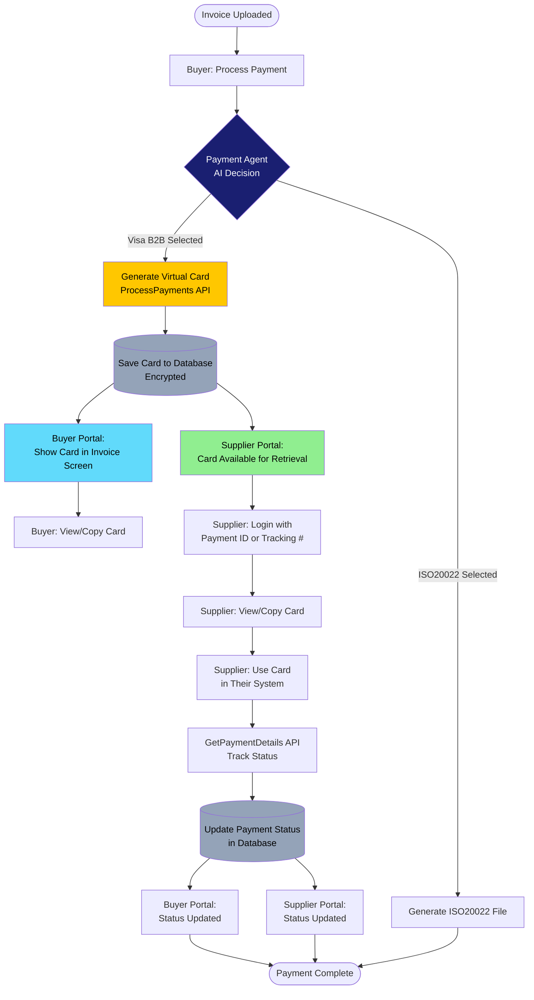
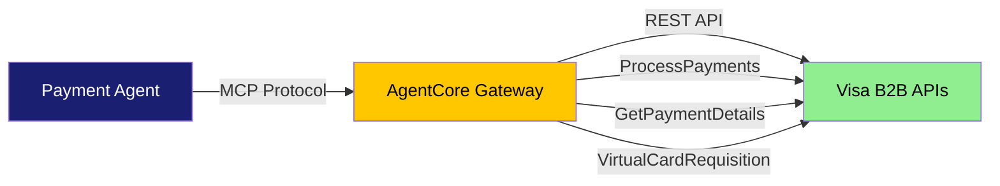
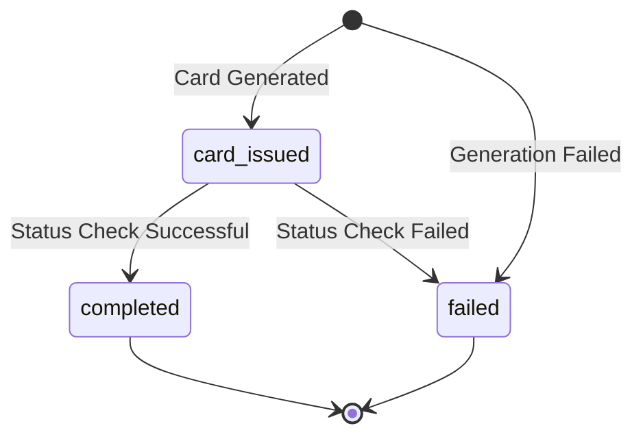
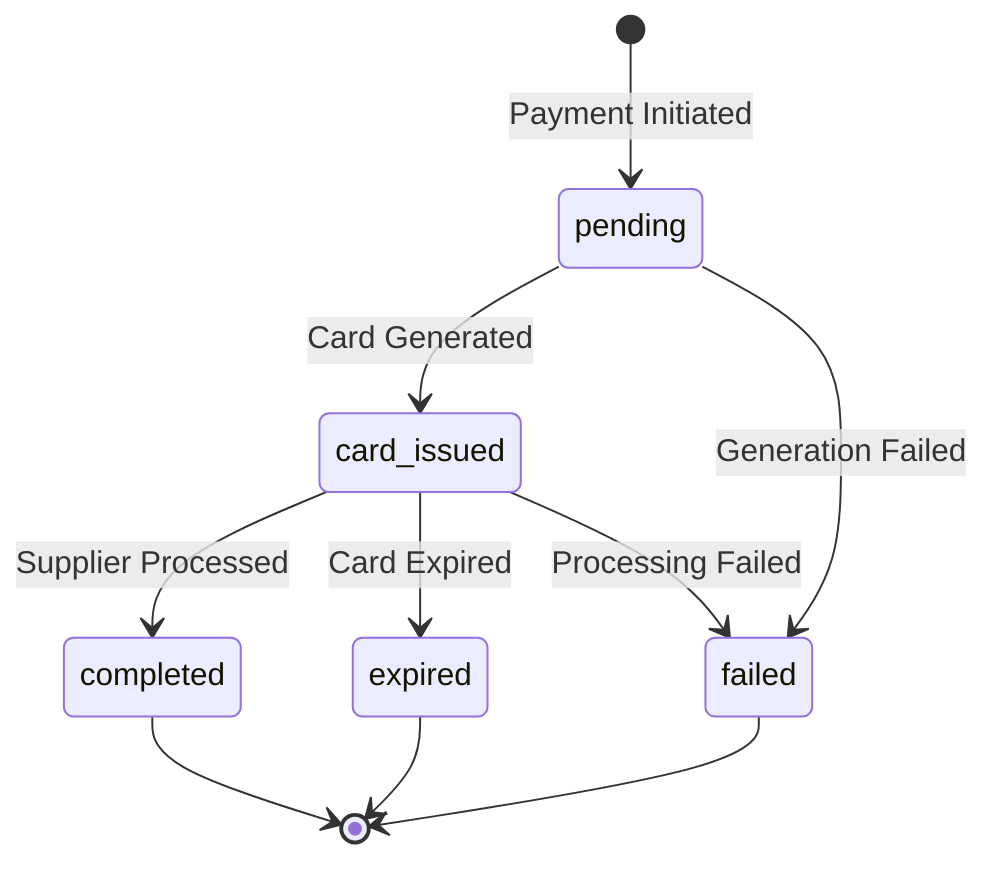

# Visa B2B Payment Integration - Overview

## Introduction

This document describes how the Visa B2B Virtual Account Payment integration works within the Procure-to-Pay system. It provides a high-level overview of the payment flow, architecture, and key integration points.

### Production vs POC/Demo Modes

**Production Mode (Visa B2B Standard):**
- Virtual card details delivered to suppliers via **secure email with unique URL**
- Supplier correctly answers authentication questions to retrieve card details
- Industry-standard approach used by Visa B2B customers
- No custom supplier portal infrastructure required

**POC/Demo Mode (Testing):**
- **Supplier portal** simulates secure email delivery for demonstration
- Allows testing complete flow without email infrastructure
- Suppliers login with Payment ID to retrieve card details
- Useful for demos, development, and testing
- **Not intended for production deployment**

This document covers both modes, with clear indicators where they differ.

For detailed sequence diagrams, see the [main README](README.md).

---

## Payment Integration Architecture

### Core Components

**1. Payment Agent (AI-Powered Decision Engine)**

- Uses Amazon Bedrock (Claude) to make intelligent payment decisions
- Decides between Visa B2B virtual cards or ISO20022 bank transfers
- Considers: payment amount, supplier preferences, urgency, payment terms
- Executes payments through appropriate channels
- Logs all decisions and reasoning for audit trail

**2. AgentCore Gateway (API-to-MCP Bridge)**

- Converts Visa B2B REST APIs into Model Context Protocol (MCP) tools
- Provides unified interface for Payment Agent to access Visa services
- Handles authentication and request/response transformation
- Four core tools: ProcessPayments, GetSecurityCode, GetPaymentDetails, RequestVirtualAccount

**3. Buyer Portal**

- **Primary Interface**: Internal AP users manage invoices and process payments
- **Production Approach**: Virtual card details delivered to supplier via secure email (Visa B2B standard)
- **POC/Demo Mode**: Optional supplier portal for testing (see note below)

---

## Two Payment Flows: Process Payment vs Request Virtual Account

Visa B2B supports two distinct payment workflows. Understanding the difference is critical for proper implementation.

### Process Payment (PP) - Batch Payment Flow

**Use Case:** Traditional batch payment processing similar to ACH/Wire/RTP

**How It Works:**

1. Send full payment payload including invoice and PO information
2. Visa handles the processing and card generation
3. Visa delivers virtual card to supplier (via email or STP)
4. Buyer can optionally retrieve card details via API to deliver themselves
5. Card limits set to exact invoice amount
6. Payment status tracked through VisaNet
7. Reconciliation handled by Visa using invoice/PO data

**Key Characteristics:**

- **Full payment context**: Invoice numbers, PO numbers, line items
- **Visa-managed delivery**: Supplier receives card via secure email
- **Exact match controls**: Card limited to specific invoice amount
- **Automatic reconciliation**: Visa tracks payment to invoice
- **Status tracking**: Real-time payment acknowledgment via VisaNet

**API Used:** `ProcessPayments`

**Documentation Reference:**

- Primary: [Visa B2B Virtual Account Payment Method - How to Use](https://developer.visa.com/capabilities/vpa/docs-how-to)
- Section: "Processing Payment Instructions and Requisitions using Virtual Cards or Pseudo Accounts"

**When to Use:**

- Paying specific invoices with full context
- Need automatic reconciliation
- Want Visa to handle supplier notification
- Batch payment processing workflows
- Similar to existing ACH/Wire processes

### Request Virtual Account (RVA) - Card Issuance Flow

**Use Case:** Traditional card issuance for cardholder or supplier use

**How It Works:**

1. Request virtual card with client reference data only
2. Receive card credentials (number, CVV, expiry)
3. Provide card to cardholder or supplier directly
4. Set controls on account (single-use or multi-use)
5. Transactions include client reference data for reconciliation
6. Buyer manages reconciliation (Visa only provides transaction data)

**Key Characteristics:**

- **Minimal context**: Only client reference data, no invoice/PO details
- **Buyer-managed delivery**: You deliver card to supplier/cardholder
- **Flexible controls**: Single-use or multi-use accounts
- **Manual reconciliation**: Buyer matches transactions to invoices
- **Transaction data only**: Visa provides auth/settlement data with reference fields

**API Used:** `RequestVirtualCard`

**Documentation Reference:**

- Primary: [Visa B2B Virtual Account Payment Method - How to Use](https://developer.visa.com/capabilities/vpa/docs-how-to)
- Section: "Single Use Account Proxy Pool Maintenance"

**When to Use:**

- Issuing cards to employees/cardholders
- Need flexible multi-use accounts
- Want full control over card delivery
- Manual reconciliation acceptable
- Traditional card program model

### Comparison Table

| Feature | Process Payment (PP) | Request Virtual Account (RVA) |
|---------|---------------------|-------------------------------|
| **Use Case** | Invoice payment (ACH/Wire-like) | Card issuance (traditional card) |
| **Payment Context** | Full invoice/PO data | Client reference only |
| **Card Delivery** | Visa handles (email/STP) | Buyer handles |
| **Reconciliation** | Automatic (Visa) | Manual (Buyer) |
| **Controls** | Exact match to invoice | Flexible spend controls |
| **Status Tracking** | Payment-level via VisaNet | Transaction-level only |
| **Best For** | Batch AP payments | Employee/cardholder programs |

### Our Implementation: Process Payment (PP) Flow

**Why We Chose PP:**

- Aligns with existing AP batch payment workflows
- Automatic reconciliation reduces manual work
- Visa handles secure card delivery to suppliers
- Payment-level tracking matches business needs
- Invoice context enables better reporting

**Implementation Details:**

- Payment Agent calls `ProcessPayments` API with full invoice context
- Visa generates virtual card from SUA proxy pool
- Card limits set to exact invoice amount with exact match controls
- Supplier receives card via secure email (production) or portal (demo)
- System tracks payment status via `GetPaymentDetails` API
- Reconciliation automatic using invoice/PO references

---

## Payment Flow Overview

> **Note on Supplier Portal**: The supplier portal shown in diagrams is a **POC/demo feature** for testing purposes. In production environments, Visa B2B delivers virtual card details (including CVV2) to suppliers via **secure email with a unique URL**. The supplier portal simulates this delivery mechanism for demonstration and testing without requiring email infrastructure.

### Complete Payment Journey



### Detailed Flow

**Step 1: Payment Initiation**
- AP user clicks "Process Payment" in buyer portal
- System retrieves invoice and supplier information
- Payment Agent is invoked with payment context

**Step 2: AI Decision Making**
- Payment Agent analyzes:
  - Payment amount (small amounts → Visa B2B, large → ISO20022)
  - Supplier preferences (accepts virtual cards?)
  - Payment urgency (immediate vs. scheduled)
  - Payment terms and conditions
- Agent logs reasoning for decision
- Decision stored in database for audit

**Step 3: Payment Execution**

**Option A: Visa B2B Virtual Card**

1. Payment Agent calls ProcessPayments API via Gateway
2. Visa pulls SUA from proxy pool and generates virtual card
3. Card details returned (accountNumber, expirationDate, trackingNumber - **NO CVV2**)
4. Payment Agent calls GetSecurityCode API to retrieve CVV2
   - **POC/Demo**: Retrieved via API for testing
   - **Production**: CVV2 sent to supplier via secure email URL (Visa B2B standard)
5. System encrypts and stores complete card details
6. Buyer portal displays card (masked by default, click to reveal)
7. **Production**: Supplier receives secure email with card details
8. **POC/Demo**: Supplier portal simulates email delivery (login with Payment ID)
9. Supplier processes payment in their system
10. System tracks payment status via GetPaymentDetails API

**Option B: ISO20022 Bank Transfer**
1. Payment Agent calls ISO20022 generation service
2. System creates XML payment file
3. File stored in S3 bucket
4. Buyer downloads file for bank submission
5. Payment tracked via bank reconciliation

**Step 4: Status Tracking**
- System periodically calls GetPaymentDetails API
- Checks if supplier has processed the payment
- Updates payment status in both portals
- Notifies relevant parties of completion

---

## Card Delivery Architecture

### Our Implementation: Supplier Portal (Current)

**How It Works:**
1. Buyer processes payment through buyer portal
2. Visa B2B generates virtual card
3. System stores card details in encrypted database
4. **Buyer portal displays card details** (masked, click to reveal)
5. **Supplier portal provides card access**:
   - Supplier logs in with Payment ID or Tracking Number
   - Views complete card details (number, CVV, expiry)
   - Copies card details for payment processing
6. Supplier processes payment in their system

**Benefits:**
- Self-contained demo (no email infrastructure needed)
- Shows complete buyer-to-supplier flow
- Easy to demonstrate both sides
- Full visibility and control for testing
- Simulates real-world card delivery

**Architecture:**

**Buyer Portal:**
- Full invoice and payment management
- Process payments with AI-powered decisions
- View virtual card details (masked for security)
- Track payment status and history
- Complete procure-to-pay workflow

**Supplier Portal:**
- Simple login with Payment ID or Tracking Number
- View virtual card details for payment
- Copy card details functionality
- Payment status visibility
- Clean, focused interface

### Production Approach (Visa B2B Standard - Alternative)

> **Note**: This is the industry-standard approach used by Visa B2B customers in production. Our implementation uses the supplier portal instead for demonstration and testing purposes.

**How It Works:**
1. Buyer processes payment through buyer portal
2. Visa B2B generates virtual card
3. **Visa sends secure email to supplier** with:
   - Unique URL to view card details
   - Card number, CVV2, expiration date
   - Payment amount and invoice reference
4. Supplier clicks URL, views card details
5. Supplier processes payment in their system

**Benefits:**
- Industry-standard secure delivery
- No custom portal infrastructure needed
- Supplier receives notification automatically
- Audit trail via email delivery logs

### Detailed Payment Sequence (All Components)

```mermaid
sequenceDiagram
    participant User as AP User
    participant FE as Frontend
    participant API as Backend API
    participant Agent as Payment Agent<br/>(AI)
    participant GW as AgentCore<br/>Gateway
    participant Visa as Visa B2B APIs
    participant DB as Database
    participant S3 as S3 Bucket
    participant Supplier as Supplier Portal

    rect rgb(240, 240, 240)
        Note over User,S3: PHASE 1: Invoice Processing (Existing)
        User->>FE: Upload invoice
        FE->>API: POST /api/invoices/upload
        API->>S3: Store PDF
        API->>DB: INSERT invoice
        Note over DB: invoice_id, vendor_id,<br/>amount, status
    end

    rect rgb(230, 245, 255)
        Note over User,S3: PHASE 2: Payment Initiation (MVP)
        User->>FE: Click "Process Payment"
        FE->>API: POST /api/payments/process
        Note over API: Key: {invoiceId}
        API->>DB: Get invoice + vendor
        API->>Agent: Invoke agent
        Note over Agent: AI Decision:<br/>Visa B2B or ISO20022?
    end

    rect rgb(255, 250, 240)
        Note over Agent,Visa: PHASE 3: Supplier Matching (PHASE 2 - Optional)
        Note over Agent,Visa: 🔮 Future Enhancement
        Agent->>GW: SupplierMatching
        Note over GW: API: SupplierMatching<br/>Key: supplierName,<br/>address, country
        GW->>Visa: POST /visasuppliermatchingservice/v1/search
        Visa-->>GW: matchConfidence: High/Medium/Low
        GW-->>Agent: Match result
        Agent->>DB: Save match_confidence
        Note over Agent: High = STP enabled<br/>Low/Medium = Manual card
    end

    rect rgb(240, 255, 240)
        Note over Agent,DB: PHASE 4: Virtual Card Generation (MVP)
        Note over Agent,Visa: ⚠️ Prerequisites (One-Time Setup):<br/>1. Buyer created<br/>2. Funding Account added<br/>3. Proxy Pool created with SUAs
        
        Agent->>DB: INSERT payment record
        Note over DB: status='pending'
        
        Agent->>GW: ProcessPayments
        Note over GW: API: ProcessPayments<br/>Key: amount, invoiceNumber,<br/>supplierInfo, exactMatchControl
        GW->>Visa: POST ProcessPayments
        Note over Visa: 1. Pulls SUA from proxy pool (automatic)<br/>2. Sets exact match control<br/>3. Generates virtual card<br/>4. Returns card details
        Visa-->>GW: Virtual card details
        Note over GW: ✅ accountNumber, expirationDate,<br/>trackingNumber<br/>❌ NO CVV2 (not in API response)
        GW-->>Agent: Card details returned
        
        Agent->>GW: GetSecurityCode
        Note over GW: API: GetSecurityCode<br/>Key: accountNumber, expirationDate
        GW->>Visa: POST GetSecurityCode
        Note over Visa: Retrieves CVV2 for demo/POC<br/>(Production: CVV2 sent via email)
        Visa-->>GW: Security code
        Note over GW: cvv2
        GW-->>Agent: CVV2 returned
        
        Agent->>DB: UPDATE payment
        Note over DB: status='card_issued',<br/>virtual_card_number (encrypted),<br/>virtual_card_cvv (encrypted),<br/>virtual_card_expiry,<br/>tracking_number
        Agent->>DB: UPDATE invoice
        Note over DB: payment_id,<br/>payment_method='visa_b2b'
    end

    rect rgb(255, 245, 255)
        Note over Agent,FE: PHASE 5: Display Card to Buyer (MVP)
        Agent-->>API: Payment result + card details
        API-->>FE: Success response
        FE-->>User: Show virtual card in invoice screen
        Note over User,FE: Buyer View:<br/>Card Number: **** 1234<br/>CVV: ***<br/>Expiry: 12/2025<br/>Amount: $1,000.00<br/>Payment ID: PAY-123<br/>Tracking #: TRK-456
    end

    rect rgb(255, 250, 240)
        Note over Supplier,FE: PHASE 6: Supplier Retrieves Card (CURRENT IMPLEMENTATION)
        Note over Supplier,Visa: 📧 PRODUCTION ALTERNATIVE:<br/>Visa sends secure email to supplier<br/>with unique URL to view card details
        Supplier->>FE: Navigate to /supplier/payment
        Supplier->>API: POST /api/supplier/login
        Note over Supplier,API: Login with:<br/>Payment ID or Tracking Number
        API->>DB: Verify payment exists
        API-->>Supplier: Login success
        
        Supplier->>API: GET /api/supplier/payment/:id
        API->>DB: Get payment + card details
        API-->>Supplier: Card details
        FE-->>Supplier: Show virtual card
        Note over Supplier,FE: Supplier View:<br/>Invoice: INV-789<br/>Amount: $1,000.00<br/>Card: **** 1234<br/>CVV: 123<br/>Expiry: 12/2025
        
        Supplier->>Supplier: Copy card details
        Note over Supplier: Supplier uses card<br/>in their own system<br/>(simulated in demo)
    end

    rect rgb(240, 255, 240)
        Note over Agent,Visa: PHASE 7: Payment Status Tracking (MVP)
        Note over Agent: Periodic polling or<br/>user-triggered refresh
        Agent->>GW: GetPaymentDetails
        Note over GW: API: GetPaymentDetails<br/>Key: trackingNumber
        GW->>Visa: POST GetPaymentDetails
        Note over Visa: Check if supplier<br/>actually processed payment
        Visa-->>GW: Payment status
        Note over GW: status: pending/completed/failed
        GW-->>Agent: Status update
        
        Agent->>DB: UPDATE payment
        Note over DB: status='completed'<br/>completed_at=timestamp
        
        Agent->>FE: Status notification
        FE-->>User: Payment completed
    end
```



---

## Payment Modes

### Current Mode: Manual Card Submission (MVP)

**Prerequisites (One-Time Setup):**

- Buyer account created in Visa B2B system
- Funding Account added and linked to buyer
- Proxy Pool created with Single-Use Accounts (SUAs)

**How It Works:**

1. Payment Agent calls ProcessPayments API (automatically pulls SUA from proxy pool)
2. Visa generates virtual card and returns accountNumber, expirationDate, trackingNumber
3. Payment Agent calls GetSecurityCode API to retrieve CVV2 (for demo/POC only)
   - Note: In production, CVV2 is delivered via email to supplier
4. Card details displayed in buyer portal (masked)
5. Card details available in supplier portal (unmasked)
6. Supplier manually enters card in their payment system
7. System tracks payment completion via GetPaymentDetails API

**Benefits:**
- Works for all suppliers (no pre-registration required)
- Full visibility and control for both parties
- Simple implementation
- Secure card delivery through dedicated portal

**User Experience:**
- Buyer: Click button → View card → Share Payment ID with supplier
- Supplier: Login → View card → Copy details → Process payment

### Future Mode: Straight-Through Processing (STP)

**How It Will Work:**
1. System matches supplier using Visa Supplier Matching Service
2. If match confidence is "High":
   - Payment automatically submitted to supplier
   - No manual card entry needed
   - Faster payment processing
3. If match confidence is "Low/Medium":
   - Falls back to Manual Mode
   - User retains control

**Benefits:**
- Fully automated for matched suppliers
- Reduces manual work
- Faster payment processing
- Better user experience for repeat suppliers

---

## Key Integration Points

### 1. Payment Agent ↔ AgentCore Gateway

**Purpose:** Payment Agent accesses Visa B2B APIs through Gateway

**Architecture:**



**Tools Available:**

| Tool | Purpose | Flow Type | Documentation |
|------|---------|-----------|---------------|
| `ProcessPayments` | Generate virtual card for supplier invoice payment (pulls SUA from proxy pool automatically) | **Process Payment (PP)** | [VPA How-To Guide](https://developer.visa.com/capabilities/vpa/docs-how-to) |
| `GetSecurityCode` | Retrieve CVV2 separately after card generation | **Both** | [VPA VANs How-To Guide](https://developer.visa.com/capabilities/vpa/docs-how-to-vpp) |
| `GetPaymentDetails` | Check payment status and completion | **Process Payment (PP)** | [VPA How-To Guide](https://developer.visa.com/capabilities/vpa/docs-how-to) |
| `RequestVirtualAccount` | Request virtual card for cardholder/supplier use | **Request Virtual Account (RVA)** | [VPA How-To Guide](https://developer.visa.com/capabilities/vpa/docs-how-to) |
| `GetProxyPoolDetails` | Monitor SUA proxy pool status (optional) | **Both** | [VPA How-To Guide](https://developer.visa.com/capabilities/vpa/docs-how-to) |

**Important Notes:**

- **Two-Step Card Generation**: ProcessPayments returns card number and expiration, GetSecurityCode retrieves CVV2
- **Security Design**: CVV2 separated from initial card generation for enhanced security
- **Production Delivery**: Visa sends CVV2 to supplier via secure email URL (industry standard)
  - Reference: [VPA How-To Guide](https://developer.visa.com/capabilities/vpa/docs-how-to)
- **POC/Demo Mode**: GetSecurityCode API retrieves CVV2 programmatically for testing
- **SUA Selection**: Single-Use Account automatically pulled from proxy pool
  - Reference: [VPA How-To Guide](https://developer.visa.com/capabilities/vpa/docs-how-to)

**Visa Documentation Resources:**

1. [Visa B2B Virtual Account Payment Method - How to Use](https://developer.visa.com/capabilities/vpa/docs-how-to) - Primary reference for Process Payment flow
2. [Visa B2B Virtual Account Payment Method for Buyers Using VANs](https://developer.visa.com/capabilities/vpa/docs-how-to-vpp) - VAN-specific features
3. [Visa B2B Payment Controls - How to Use](https://developer.visa.com/capabilities/visa-b2b-payment-controls/docs-how-to) - Payment controls and VPC integration
4. [Visa Supplier Matching Service - How to Use](https://developer.visa.com/capabilities/suppliermatchingservice/docs-how-to) - Supplier matching for STP (future)

### 2. Backend API ↔ Payment Agent

**Purpose:** Backend Lambda invokes Payment Agent for payment processing

**Flow:**
```
Backend Lambda → AgentCore Invoker (Python Bridge) → Payment Agent Runtime
```

**Why Bridge Needed:**
- Backend is TypeScript/Node.js
- Payment Agent uses Python-only Bedrock AgentCore SDK
- AgentCore Invoker bridges the two environments

### 3. Frontend ↔ Backend API

**Purpose:** User interfaces trigger and display payment operations

**Buyer Portal Endpoints:**
- `POST /api/payments/process` - Initiate payment
- `GET /api/payments/:id` - Get payment details with decrypted card

**Supplier Portal Endpoints:**
- `POST /api/supplier/login` - Authenticate with Payment ID/Tracking Number
- `GET /api/supplier/payment/:id` - Retrieve card details
- `GET /api/supplier/payment/:id/status` - Check payment status

---

## Payment Decision Logic

### How Payment Agent Decides

The Payment Agent uses AI (Amazon Bedrock Claude) to analyze multiple factors:

**Factors Considered:**
1. **Payment Amount**
   - Small amounts (< $5,000) → Prefer Visa B2B
   - Large amounts (≥ $5,000) → Prefer ISO20022

2. **Supplier Preferences**
   - Accepts virtual cards? → Visa B2B eligible
   - Prefers bank transfer? → ISO20022

3. **Payment Urgency**
   - Immediate payment needed? → Visa B2B (faster)
   - Scheduled payment? → ISO20022 (batch processing)

4. **Payment Terms**
   - Net 30/60/90 → May influence method choice
   - Early payment discount? → Consider faster method

**Decision Output:**
- Selected payment method (visa_b2b or iso20022)
- Reasoning explanation (stored for audit)
- Confidence level in decision

---

## Security & Compliance

### Card Data Protection

**Two-Step Card Generation (Enhanced Security):**
- **Step 1**: ProcessPayments returns card number and expiration
- **Step 2**: GetSecurityCode retrieves CVV2 separately
- **Benefit**: CVV2 never transmitted with initial card data
- **Production**: CVV2 delivered via separate secure email channel

**Encryption:**
- Full card numbers encrypted using AWS KMS
- Only last 4 digits stored unencrypted (for display)
- CVV encrypted separately with additional key
- Encryption keys rotated regularly
- CVV2 retrieved on-demand, not stored long-term

**Access Control:**
- Buyer portal: Card masked by default, click to reveal
- Production: Supplier receives card via secure email URL
- POC/Demo: Supplier portal simulates email delivery
- All card access logged with timestamps
- Supplier access count tracked

**Audit Trail:**
- Every payment decision logged
- Agent reasoning stored
- Card access events recorded
- Payment status changes tracked

### Compliance Considerations

**PCI DSS:**
- Card data encrypted at rest
- Secure transmission (HTTPS/TLS)
- Access logging and monitoring
- Limited card data retention

**SOX Compliance:**
- Complete audit trail
- Segregation of duties (buyer vs. supplier portals)
- Payment approval workflows
- Automated controls and validations

---

## Payment Status Lifecycle

### Current Implementation

**Status Flow:**



**Status Definitions:**

- **card_issued**: Virtual card generated and available
- **completed**: Payment status verified as successful (statusCode '00')
- **failed**: Payment processing failed (card generation or status check failed)

**How It Works:**
1. Payment Agent calls ProcessPayments API to generate card
2. If successful, status set to `card_issued`
3. Payment Agent immediately calls GetPaymentDetails API (one-time check)
4. Status updated to `completed` (statusCode '00') or `failed` (other codes)
5. Status stored in database and displayed in both portals

**Note:** Status is checked once at payment creation time. Supplier must manually process the card in their system.

### Future Enhancement: Continuous Status Tracking

**Planned Status Flow:**



**Additional Statuses (Future):**
- **pending**: Payment initiated, processing started
- **expired**: Virtual card expired before use

**Planned Tracking:**
1. Scheduled Lambda function periodically calls GetPaymentDetails API
2. Checks if supplier has actually charged the virtual card
3. Updates payment status in database automatically
4. Both portals reflect updated status in real-time
5. Notifications sent on status changes

**Planned Tracking Frequency:**
- Initial: Every 5 minutes
- After 1 hour: Every 15 minutes
- After 24 hours: Every hour
- After completion: Stops

---

## Integration Benefits

### For Buyers (AP Teams)

**Efficiency:**
- AI-powered payment decisions reduce manual work
- Automated payment method selection
- Single interface for all payment types

**Visibility:**
- Real-time payment status tracking
- Complete audit trail of decisions
- Payment history and analytics

**Control:**
- Review AI decisions before execution
- Override payment method if needed
- Track supplier payment behavior

### For Suppliers

**Simplicity:**
- Easy card retrieval with Payment ID
- No complex registration process
- Clear payment information

**Speed:**
- Immediate access to payment details
- No waiting for checks or bank transfers
- Process payment on their schedule

**Security:**
- Secure portal access
- Encrypted card transmission
- Single-use virtual cards

---

## Future Enhancements

### Phase 2: Supplier Matching & STP

**Supplier Matching Service:**
- Automatically match suppliers to Visa merchant database
- Determine STP eligibility
- Return match confidence (High/Medium/Low)

**Straight-Through Processing:**
- Automatic payment submission for high-confidence matches
- No manual card entry needed
- Faster payment completion
- Reduced manual work

**Benefits:**
- Fully automated for repeat suppliers
- Improved payment speed
- Better user experience
- Reduced errors

### Additional Enhancements

**Payment Controls:**
- Set spending limits per supplier
- Define allowed merchant categories
- Configure payment expiry dates
- Implement approval workflows

**Analytics & Reporting:**
- Payment method effectiveness
- Supplier payment patterns
- Cost analysis (Visa B2B vs. ISO20022)
- Payment cycle time metrics

**Reconciliation:**
- Automated bank statement matching
- Virtual card transaction reconciliation
- Payment confirmation workflows
- Exception handling automation

---

## Summary

The Visa B2B Payment Integration provides an intelligent, automated payment system that:

1. **Decides Smartly**: AI-powered payment method selection
2. **Executes Efficiently**: Automated payment processing through appropriate channels
3. **Tracks Completely**: Real-time status updates and audit trail
4. **Serves Both Parties**: Separate optimized portals for buyers and suppliers
5. **Secures Properly**: Encrypted card storage and secure access controls

The system bridges traditional bank transfers (ISO20022) with modern virtual card payments (Visa B2B), giving organizations flexibility while maintaining security and compliance.

---

## Visa B2B Documentation Reference Guide

### Official Visa Developer Documentation

All documentation is available on the Visa Developer Portal:

### By Payment Flow

**Process Payment (PP) - Batch Payment Flow:**

- **Primary**: [Visa B2B Virtual Account Payment Method - How to Use](https://developer.visa.com/capabilities/vpa/docs-how-to)
  - Process Payment flow and payment advice notifications
  - GetPaymentDetailURL (secure URL for card delivery)
  - Supplier account management
  - Payment status tracking

**Request Virtual Account (RVA) - Card Issuance Flow:**

- **Primary**: [Visa B2B Virtual Account Payment Method - How to Use](https://developer.visa.com/capabilities/vpa/docs-how-to)
  - Proxy pool creation and management
  - Account requisitioning
  - Pool monitoring and maintenance

### By Feature

**Card Delivery & Security:**

- Email notifications and secure URLs: [VPA How-To Guide](https://developer.visa.com/capabilities/vpa/docs-how-to)
- CVV2 delivery mechanisms: [VPA How-To Guide](https://developer.visa.com/capabilities/vpa/docs-how-to)
- Security code retrieval: [VPA VANs How-To Guide](https://developer.visa.com/capabilities/vpa/docs-how-to-vpp)

**Buyer & Supplier Setup:**

- Creating buyers and suppliers: [VPA How-To Guide](https://developer.visa.com/capabilities/vpa/docs-how-to)
- Funding accounts: [VPA How-To Guide](https://developer.visa.com/capabilities/vpa/docs-how-to)
- Buyer templates: [VPA How-To Guide](https://developer.visa.com/capabilities/vpa/docs-how-to)

**Payment Controls:**

- **Primary**: [Visa B2B Payment Controls - How to Use](https://developer.visa.com/capabilities/visa-b2b-payment-controls/docs-how-to)
  - Account registration and control settings
  - Notification setup and management
  - Transaction history and monitoring

**Supplier Matching (Future - STP):**

- **Primary**: [Visa Supplier Matching Service - How to Use](https://developer.visa.com/capabilities/suppliermatchingservice/docs-how-to)
  - Supplier search and matching algorithms
  - Match confidence levels (High/Medium/Low)
  - STP enablement and configuration

**For detailed technical implementation, see:**

- [Deployment Guide](DEPLOYMENT-GUIDE.md) - Infrastructure setup
- [Payment Agent Architecture](PAYMENT-AGENT-ARCHITECTURE.md) - Agent design details
- [README](README.md) - Complete system overview with sequence diagrams
