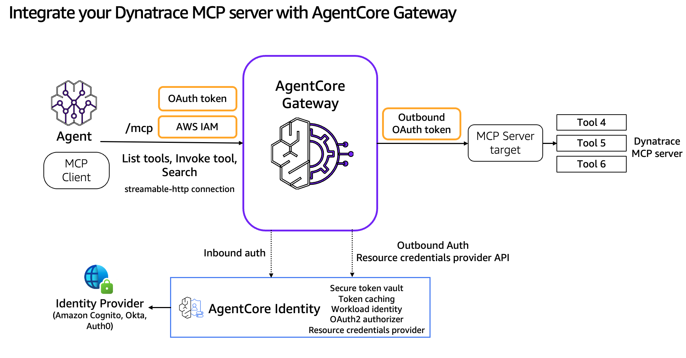

# Integrate Dynatrace MCP Server with AgentCore Gateway

## Overview
This tutorial demonstrates how to integrate Dynatrace's MCP server with Amazon Bedrock AgentCore Gateway, providing centralized access to observability capabilities through a unified interface. The integration eliminates the need for custom client code and addresses key enterprise challenges in scaling observability tools across multiple teams.

## Tutorial Details

| Information          | Details                                                   |
|:---------------------|:----------------------------------------------------------|
| Tutorial type        | Interactive                                               |
| AgentCore components | AgentCore Gateway, AgentCore Identity                     |
| Agentic Framework    | Strands Agents                                            |
| Gateway Target type  | MCP server                                                |
| Agent                | Strands                                                   |
| Inbound Auth IdP     | Amazon Cognito                                            |
| Outbound Auth        | OAuth2                                                    |
| LLM model            | Anthropic Claude Sonnet 4                                 |
| Tutorial components  | Creating AgentCore Gateway and Invoking AgentCore Gateway |
| Tutorial vertical    | Observability                                             |
| Example complexity   | Easy                                                      |
| SDK used             | boto3                                                     |

## Key Features

* Integrate Dynatrace MCP Server with AgentCore Gateway
* Configure OAuth2 authentication for Dynatrace
* Search and invoke observability tools through the Gateway
* Use Strands agents to interact with Dynatrace capabilities

## Tutorial

- [Integrate Dynatrace MCP Server into AgentCore Gateway](01-dynatrace-mcp-server-target.ipynb)
