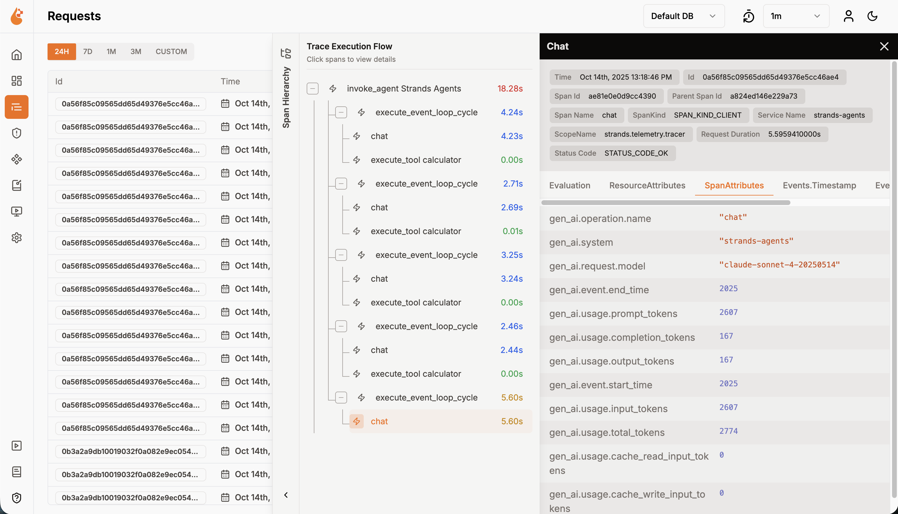

# Amazon Bedrock Agent Integration with OpenLIT

This example contains a demo of a Personal Assistant Agent built on top of [Bedrock AgentCore Agents](https://docs.aws.amazon.com/bedrock-agentcore/latest/devguide/what-is-bedrock-agentcore.html) with [OpenLIT](https://openlit.io) observability.


## Prerequisites

- Python 3.11 or higher
- self-hosted OpenLIT
- AWS Account with appropriate permissions
- Access to the following AWS services:
   - Amazon Bedrock


## OpenLIT Instrumentation

> [!TIP]
> For detailed setup instructions, configuration options, and advanced use cases, please refer to the [OpenLIT Documentation](https://docs.openlit.io/latest/openlit/quickstart-ai-observability).

Bedrock AgentCore comes with [Observability](https://docs.aws.amazon.com/bedrock-agentcore/latest/devguide/observability.html) support out-of-the-box.
Hence, we just need to register an [OpenTelemetry SDK](https://github.com/open-telemetry/opentelemetry-specification/blob/main/specification/overview.md#sdk) for complete LLM and Agent Observability with OpenLIT.

We simplified this process, hiding all the complexity inside [openlit_config.py](./openlit_config.py). 
For sending data to OpenLIT, you can configure the OTEL_ENDPOINT env var with your OpenLIT URL for ingesting OTLP, for example: http://127.0.0.1:4318.

### Configuration Options

Configure the `OTEL_ENDPOINT` environment variable with your OpenLIT OTLP endpoint. **No authentication or OTLP headers are required** as OpenLIT is an open-source self-hosted solution:

```bash
export OTEL_ENDPOINT=http://your-openlit-host:4318
```


## How to use

### Setting your AWS keys

Follow the [Amazon Bedrock AgentCore documentation](https://docs.aws.amazon.com/bedrock-agentcore/latest/devguide/runtime-permissions.html) to configure your AWS Role with the correct policies.
Afterwards, you can set your AWS keys in your environment variables by running the following command in your terminal:

```bash
export AWS_ACCESS_KEY_ID=your_api_key
export AWS_SECRET_ACCESS_KEY=your_secret_key
export AWS_REGION=your_region
```

Ensure your account has access to the model `us.anthropic.claude-3-7-sonnet-20250219-v1:0` used in this example. Please refer to the
[Amazon Bedrock documentation](https://docs.aws.amazon.com/bedrock/latest/userguide/model-access-permissions.html) to see how to enable access to the model.
You can change the model used by configuring the environment variable `BEDROCK_MODEL_ID`.

### Setting up OpenLIT

Before proceeding, you need to deploy OpenLIT to receive telemetry data. Choose one of the following deployment options:

#### Option 1: Docker Deployment (Quickest for Testing)

Deploy OpenLIT using Docker Compose - the simplest approach for getting started:

```bash
# Clone the OpenLIT repository
git clone https://github.com/openlit/openlit.git
cd openlit

# Start OpenLIT services
docker compose up -d
```

This will start OpenLIT with:
- UI accessible at `http://localhost:3000`
- OTEL endpoint at `http://localhost:4318`

For your agent to access OpenLIT, deploy this on a machine that your agent can reach:
1. Deploy on an EC2 instance or container service with a public IP (if needed)
2. Ensure port 4318 is accessible (configure security groups to allow inbound traffic)
3. Use the appropriate endpoint URL in your configuration

#### Option 2: Kubernetes Deployment (Production-Ready)

For production use, deploy OpenLIT on Kubernetes using Helm:

```bash
# Add OpenLIT Helm repository
helm repo add openlit https://openlit.github.io/helm-charts
helm repo update

# Install OpenLIT
helm install openlit openlit/openlit
```

**Default Configuration:**
- By default, OpenLIT creates a LoadBalancer service with a public IP
- OTEL endpoint will be accessible at `http://<load-balancer-ip>:4318`
- UI will be accessible at `http://<load-balancer-ip>:3000`

**VPC/Private Configuration:**

If you prefer to keep OpenLIT private within a VPC (recommended for production):

```bash
# For ClusterIP (internal only)
helm install openlit openlit/openlit \
  --set service.type=ClusterIP

# For AWS internal load balancer
helm install openlit openlit/openlit \
  --set service.annotations."service\.beta\.kubernetes\.io/aws-load-balancer-internal"="true"
```

For VPC deployments, ensure:
- Your agent and OpenLIT can communicate (same VPC, VPC peering, or Transit Gateway)
- Security groups allow traffic between your agent and OpenLIT on port 4318
- Use the internal endpoint (e.g., `http://openlit.default.svc.cluster.local:4318` or internal load balancer DNS)

#### Configure the OTEL Endpoint

Once OpenLIT is deployed, set the environment variable with your endpoint:

```bash
# Examples:
# Docker with public IP:
export OTEL_ENDPOINT=http://<ec2-public-ip>:4318

# Kubernetes with public LoadBalancer:
export OTEL_ENDPOINT=http://<load-balancer-ip>:4318

# Kubernetes with VPC/internal:
export OTEL_ENDPOINT=http://<internal-dns-or-ip>:4318
```

> **Note**: OpenLIT is an open-source self-hosted solution and requires no authentication or API keys by default to send telemetry but can be configured. Only the OTLP endpoint is needed.

For detailed deployment instructions, refer to the [OpenLIT Installation Guide](https://docs.openlit.io/latest/openlit/installation).

### Optional Configuration

You can customize the application name and environment:

```bash
export OTEL_SERVICE_NAME=bedrock-agentcore-agent
export OTEL_DEPLOYMENT_ENVIRONMENT=production
```

### Run the app

You can start the example with the following command:

```bash
uv run main.py
```

This will create an HTTP server that listens on port `8080` that implements the required `/invocations` endpoint for processing the agent's requirements.

The Agent is now ready to be deployed. The best practice is to package code as a container and push to ECR using CI/CD pipelines and IaC.
You can follow the guide
[here](https://github.com/awslabs/amazon-bedrock-agentcore-samples/blob/main/01-tutorials/01-AgentCore-runtime/01-hosting-agent/01-strands-with-bedrock-model/runtime_with_strands_and_bedrock_models.ipynb)
to have a full step-by-step tutorial.

You can interact with your agent with the following command:

```bash
curl -X POST http://127.0.0.1:8080/invocations --data '{"prompt": "What is the weather now?"}'
```



