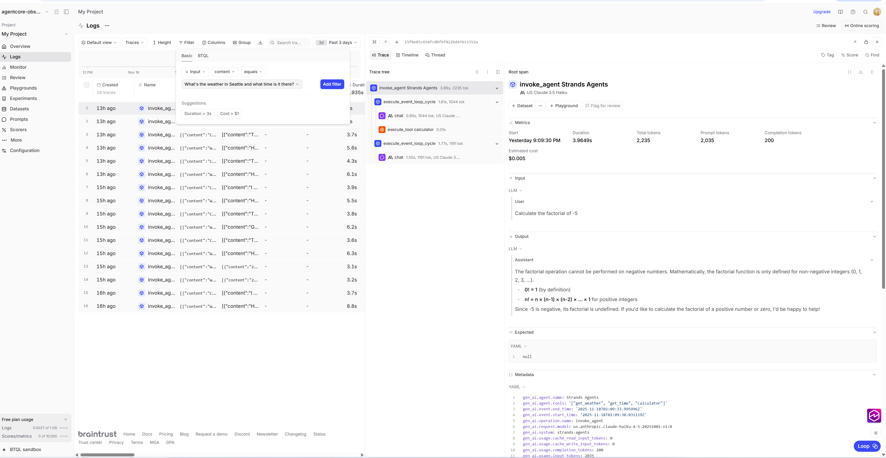

# Braintrust Setup Guide

## Overview

This guide provides instructions for configuring Braintrust integration for the Simple Dual Observability Tutorial. Braintrust receives OpenTelemetry traces natively and provides a dashboard for exploring agent execution data.

For comprehensive information about Braintrust features, visit the [Braintrust documentation](https://docs.braintrust.dev).

## Prerequisites

Before setting up Braintrust:

1. Email address for account creation
2. Browser access to Braintrust web UI
3. OTEL collector configuration (included in tutorial)

## Account Creation

### Step 1: Sign Up for Free Account

1. Navigate to https://www.braintrust.dev/signup
2. Sign up using:
   - Email and password
   - Google account (SSO)
   - GitHub account (SSO)
3. Verify your email address (if using email signup)

### Step 2: Access Dashboard

After signup:

1. Log in to https://www.braintrust.dev/app
2. You will see the main dashboard
3. Click "Create Project" to get started

## API Key Management

### Generate API Key

1. Navigate to Settings: https://www.braintrust.dev/app/settings/api
2. Click "Create API Key"
3. Provide a name: "AgentCore-Observability-Demo"
4. Select permissions:
   - Read/Write access to traces
   - Read access to projects
5. Click "Generate"
6. **Copy and save the API key immediately** (shown only once)

**API Key Format**: `bt-xxxxxxxxxxxxxxxxxxxxxxxxxxxxxxxx`

### Store API Key Securely

**Option 1: Environment Variable**

```bash
# Add to .env file
echo "BRAINTRUST_API_KEY=bt-xxxxx" >> .env

# Or export directly
export BRAINTRUST_API_KEY=bt-xxxxx
```

**Option 2: Automatic Configuration**

When the agent is deployed with `BRAINTRUST_API_KEY` set, the Strands telemetry library automatically configures OTLP export to Braintrust's endpoint (https://api.braintrust.dev/otel) using the API key from the environment variable.

**Security Best Practices**:
- Never commit API keys to git
- Use environment variables or secrets management
- Rotate keys periodically
- Use separate keys for dev/prod

### Revoke API Key

If key is compromised:

1. Go to Settings > API Keys
2. Find the key by name or partial value
3. Click "Revoke"
4. Generate new key and update configuration

## Project Setup

### Create Project

1. From dashboard, click "Create Project"
2. Project name: `agentcore-observability-demo`
3. Description: "Simple dual observability tutorial for Amazon Bedrock AgentCore"
4. Click "Create"

### Configure Project Settings

1. Navigate to project settings (gear icon)
2. Configure retention:
   - Free tier: 7 days (default)
   - Paid tier: 30+ days (optional upgrade)
3. Set project metadata:
   - Environment: development
   - Owner: your email
   - Tags: agentcore, tutorial, observability

### Enable Features

Enable optional features for enhanced observability:

1. **Evaluations**: Automated quality checks
2. **Datasets**: Store test data for comparisons
3. **Experiments**: A/B testing for prompts
4. **Monitoring**: Real-time alerting (paid feature)

## Telemetry Configuration

### Automatic OTEL Export

The agent uses the Strands telemetry library which automatically configures OTLP export settings:

```python
# In weather_time_agent.py
strands_telemetry = StrandsTelemetry()
strands_telemetry.setup_otlp_exporter()
```

The OTLP exporter is automatically configured with:
- **Endpoint**: `https://api.braintrust.dev/otel` (when BRAINTRUST_API_KEY is set)
- **Authentication**: Uses BRAINTRUST_API_KEY from environment
- **Retries**: Automatic retry with exponential backoff
- **Compression**: gzip compression for efficiency
- **Batching**: Automatic span batching for better performance

No static YAML configuration file is needed. All configuration is environment-variable driven.

### Verify Configuration

Test OTEL export to Braintrust by running the agent and checking the dashboard:

```bash
# Set API key (format: bt-xxxxxxxxxxxxxxxxxxxxxxxxxxxxxxxx)
export BRAINTRUST_API_KEY=bt-xxxxx

# Run agent test to generate traces
# The agent automatically configures OTLP export to Braintrust when BRAINTRUST_API_KEY is set
uv run python scripts/tests/test_agent.py --test weather

# Check that traces appear in Braintrust dashboard
# Navigate to https://www.braintrust.dev/app
# Traces should appear within 1-2 minutes
```

For more information on verifying the connection, refer to the [Braintrust API documentation](https://docs.braintrust.dev/reference/api).

## Dashboard Configuration

### Access Project Dashboard

1. Navigate to https://www.braintrust.dev/app
2. Select your project: `agentcore-observability-demo`
3. You will see multiple tabs and views:
   - **Logs**: View all invocations with cost and duration
   - **Traces**: Detailed trace tree view with span hierarchy and timing

### Understanding the Dashboard

**Traces Tab**:
- Lists all received traces
- Search by trace ID, session ID, or attributes
- Filter by time range, status, or custom fields
- Sort by latency, cost, or timestamp

**Key Metrics Displayed**:
- Total traces received
- Average latency
- Token usage (input/output)
- Estimated costs
- Error rate

### Viewing Traces

After running the demo, traces appear automatically:

1. Go to Traces tab
2. Find trace by ID (printed by demo script)
3. Click trace to open detail view

**Trace Detail View Shows**:
- Timeline visualization
- Span hierarchy
- Token consumption per span
- Cost breakdown
- Custom attributes
- Error details (if any)

### Search and Filter

**Search by Trace ID**:
```
trace_id = "1-67891011-abcdef1234567890"
```

**Search by Session**:
```
session_id = "demo_session_abc123"
```

**Search by Model**:
```
model_id CONTAINS "haiku"
```

**Filter by Time Range**:
- Last 5 minutes
- Last hour
- Last 24 hours
- Custom range

**Filter by Status**:
- Successful only
- Errors only
- All statuses

### Custom Views

Create custom views for specific use cases:

1. Click "Create View"
2. Name: "High Latency Traces"
3. Filter: `latency_ms > 2000`
4. Save view
5. Share with team (optional)

## Trace Visualization

### Timeline View

The timeline shows:
- Horizontal bars for span duration with relative timing
- Span hierarchy showing parent-child relationships:
  - Root span: `invoke_agent` (Strands Agents)
  - Child spans: `execute_event_loop_cycle`, tool executions, etc.
  - Leaf spans: Individual operations (e.g., `calculator`, `get_weather`)
- Color coding and icons indicate span type
- Timing information showing start time and duration
- Click on any span to see detailed attributes and timing

**Example Dashboard**:



The screenshot shows:
- Left panel: Invoke logs listing with metrics (cost, duration, tokens)
- Center: Trace search and filtering interface
- Right: Trace tree view showing span hierarchy and execution timeline
- Metrics panel: Token counts, cost estimates, and performance metrics

### Token Usage View

View token consumption:
- Input tokens per span
- Output tokens per span
- Total tokens for trace
- Token usage over time (dashboard)

For information about cost analysis and other Braintrust features, refer to the [Braintrust documentation](https://docs.braintrust.dev).

## Integration with Tutorial

### Automated Setup

The tutorial provides automated Braintrust setup:

```bash
cd scripts
./setup_braintrust.sh --api-key bt-xxxxx
```

This script:
1. Verifies API key
2. Creates project if not exists
3. Configures OTEL collector
4. Tests trace export
5. Generates usage guide

### Manual Integration

If setting up manually:

```bash
# 1. Set API key
export BRAINTRUST_API_KEY=bt-xxxxx

# 2. Deploy agent with the API key
# The agent automatically uses BRAINTRUST_API_KEY from the environment
scripts/deploy_agent.sh

# 3. Run demo
python simple_observability.py --agent-id $AGENTCORE_AGENT_ID --scenario all

# 4. View traces in Braintrust dashboard
# https://www.braintrust.dev/app/projects/agentcore-observability-demo/traces
```

## Troubleshooting

### API Key Issues

**Problem**: 401 Unauthorized error

**Solutions**:
1. Verify API key is correct
2. Check key is not revoked
3. Ensure key has proper permissions
4. Regenerate key if needed

### Traces Not Appearing

**Problem**: No traces in Braintrust dashboard

**Solutions**:
1. Verify API key is set and correct format: `echo $BRAINTRUST_API_KEY` (should start with `bt-`)
2. Verify project name in Braintrust matches: `agentcore-observability-demo`
3. Check network connectivity to braintrust.dev: `curl -I https://api.braintrust.dev/otel`
4. Review agent logs for telemetry initialization: `uv run python -m weather_time_agent 2>&1 | grep -i telemetry`
5. Wait 1-2 minutes for traces to appear (batch processing)

### Incomplete Trace Data

**Problem**: Traces missing spans or attributes

**Solutions**:
1. Verify agent code is instrumenting all operations
2. Check attribute size limits (max 1000 characters each)
3. Ensure logging includes span context
4. Review agent logs for any telemetry errors: `grep -i "telemetry\|span" agent.log`

### High Latency

**Problem**: Slow trace export to Braintrust or long agent execution times

**Solutions**:
1. Check network latency to Braintrust API: `curl -w "@curl-format.txt" https://api.braintrust.dev/otel`
2. Verify agent code doesn't have blocking operations
3. Review agent logs for long-running spans
4. Consider sampling or batching at application level if volume is high

## Verification

After setup, verify Braintrust integration:

```bash
# 1. Run agent test to generate traces
uv run python scripts/tests/test_agent.py --test weather

# Expected: Agent executes successfully with no errors
```

Then verify in the Braintrust dashboard:

1. Navigate to https://www.braintrust.dev/app
2. Select your project: `agentcore-observability-demo`
3. Go to the Traces tab
4. Look for recent traces (should appear within 1-2 minutes)
5. Click on a trace to view:
   - Timeline visualization of spans
   - Input/output tokens for each span
   - Agent execution flow

If traces don't appear:
- Verify `BRAINTRUST_API_KEY` is set correctly (format: `bt-xxxxxxx...`)
- Confirm agent was deployed with the API key environment variable
- Check agent logs for telemetry initialization messages
- Refer to the [Troubleshooting Guide](troubleshooting.md) for detailed debugging steps

## Next Steps

After Braintrust setup:

1. Run demo scenarios and explore traces
2. Review [Troubleshooting Guide](troubleshooting.md) for common issues
3. Refer to [Braintrust documentation](https://docs.braintrust.dev) for advanced features and best practices
