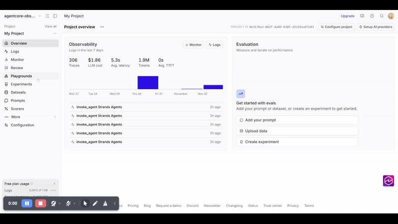
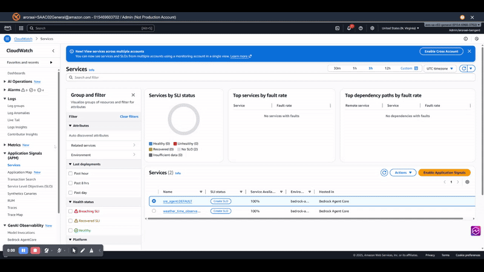

# Observability Options Guide

This guide compares three observability approaches you can use when deploying your AgentCore agent:

1. **CloudWatch Only** - Complete visibility into agent internals, no external dependencies
2. **Braintrust + CloudWatch** - External observability platform with LLM-specific insights and cost tracking
3. **CloudWatch APM** - Built-in agent dashboards and performance monitoring

Each option provides different capabilities. This guide explains what you can see and do with each approach to help you choose the right one for your needs.

## Option 1: CloudWatch Only (No Braintrust)

Deploy your agent **without** Braintrust credentials to see full observability in CloudWatch.

### How to Deploy

```bash
# Ensure Braintrust credentials are commented out or empty in .env
# (Lines 13-14 in .env.example)
# BRAINTRUST_API_KEY=your-api-key-here
# BRAINTRUST_PROJECT_ID=your-project-id-here

# Deploy with CloudWatch observability
./scripts/deploy_agent.sh
```

### What You Can See

#### Agent-Level Metrics

CloudWatch displays agent invocation metrics:

- **Invocation Count**: Total number of times the agent was called
- **Success Rate**: Percentage of successful invocations
- **Average Duration**: How long each invocation takes
- **Error Rate**: Percentage of failed invocations


#### Agent Sessions

View conversation history and session context:

- **Session ID**: Unique identifier for each conversation
- **Messages**: Full conversation history
- **Memory**: Agent's short-term memory state
- **Context**: What information the agent has access to


#### Full Traces with All Details

See complete trace of everything that happens inside an invocation:

- **LLM Calls**: Each call to the language model
  - Prompt sent
  - Response received
  - Token count
  - Latency

- **Tool Invocations**: Each tool the agent calls
  - Tool name and parameters
  - Tool output
  - Execution time

- **Agent Decision Points**: Where the agent decides what to do next
  - Reasoning
  - Next action selected

- **Span Timing**: Exact timing for each operation


#### Detailed Trajectory View

See the step-by-step trajectory of the agent's thinking:

- Step 1: Agent receives query
- Step 2: Agent calls LLM to decide action
- Step 3: Agent calls tool
- Step 4: Agent processes tool result
- Step 5: Agent calls LLM again
- Step 6: Agent provides final response

Each step shows:
- Operation type (LLM call, tool call, etc.)
- Input and output
- Timing information
- Error details (if any)


#### Live Log Examples

When you view CloudWatch logs for a CloudWatch-only deployment, you see both runtime and OTEL logs:

**Runtime Logs** (human-readable):
```
2025-11-02T20:02:42.861000+00:00 2025/11/02/[runtime-logs]3f6d959d-9b0a-4f1b-8894-ad142233fc6e 2025-11-02 20:02:42,861,p1,{weather_time_agent.py:105},INFO,Initializing Strands agent with model: us.anthropic.claude-haiku-4-5-20251001-v1:0
```

**OTEL Logs** (structured JSON):
```json
{
  "resource": {
    "attributes": {
      "service.name": "weather_time_observability_agent.DEFAULT",
      "cloud.region": "us-east-1",
      "cloud.platform": "aws_bedrock_agentcore",
      "cloud.resource_id": "arn:aws:bedrock-agentcore:us-east-1:015469603702:runtime/weather_time_observability_agent-dWTPGP46D4/..."
    }
  },
  "scope": {"name": "__main__"},
  "timeUnixNano": 1762113762861725952,
  "severityText": "INFO",
  "body": "Initializing Strands agent with model: us.anthropic.claude-haiku-4-5-20251001-v1:0",
  "attributes": {
    "code.file.path": "/app/agent/weather_time_agent.py",
    "code.function.name": "<module>",
    "code.line.number": 105,
    "otelTraceID": "68fe3f82667cdc015abcd1d779d96d56",
    "otelSpanID": "49dbfa0650a0f03d"
  }
}
```

**The same log message appears in both formats**:
- Runtime logs are easy to read
- OTEL logs have structured metadata for correlation and automated analysis
- Both include trace IDs to link logs with traces

### Advantages

✅ See everything happening inside your agent
✅ No external dependencies or API keys needed
✅ Free (CloudWatch costs are minimal)
✅ AWS native integration
✅ Easy debugging of agent internals

### Best For

- Development and debugging
- Understanding agent behavior
- Troubleshooting agent issues
- Learning how agents work

---

## Option 2: Braintrust + CloudWatch (Dual Observability)

Deploy your agent **with** Braintrust credentials to get external observability platform insights.

### How to Deploy

```bash
# Add your Braintrust credentials to .env (lines 13-14)
BRAINTRUST_API_KEY=sk-your-actual-api-key
BRAINTRUST_PROJECT_ID=your-actual-project-id

# Deploy with dual observability
./scripts/deploy_agent.sh
```

### What You Can See

#### CloudWatch Agent-Level Metrics (Still Available)

Same as CloudWatch-only:

- **Invocation Count**: Total invocations
- **Success Rate**: Success percentage
- **Average Duration**: Invocation timing
- **Error Rate**: Failure percentage

*Note: Detailed traces are NOT available in CloudWatch when Braintrust is enabled.*

#### CloudWatch Session Information (Still Available)

- Session ID and conversation history
- Agent memory state
- Context available to agent

#### Braintrust: Low-Level Operational Details

Braintrust receives all the detailed OTEL spans and traces that CloudWatch doesn't show:

- **LLM Calls**: Every call to the language model
  - Exact prompts and completions
  - Token usage and costs
  - Latency for each call
  - Model selection and parameters

- **Tool Invocations**: Every tool the agent calls
  - Tool execution timing
  - Input parameters
  - Output results
  - Any errors during execution


- **Full Request Trace**: Complete trace of an invocation
  - Start to finish span tree
  - All nested operations
  - Timing for each span
  - Correlation with logs



#### Example Braintrust Log Entry

Here's what a real Braintrust log entry looks like for an agent invocation:

```json
{
  "__bt_assignments": null,
  "created": "2025-11-14T21:29:10.633Z",
  "expected": null,
  "input": [
    {
      "content": "What's the weather in Paris and what time is it there?",
      "role": "user"
    }
  ],
  "metadata": {
    "gen_ai.agent.name": "Strands Agents",
    "gen_ai.agent.tools": "[\"get_weather\", \"get_time\", \"calculator\"]",
    "gen_ai.event.end_time": "2025-11-14T21:29:14.299184Z",
    "gen_ai.event.start_time": "2025-11-14T21:29:10.633887Z",
    "gen_ai.operation.name": "invoke_agent",
    "gen_ai.request.model": "us.anthropic.claude-haiku-4-5-20251001-v1:0",
    "gen_ai.system": "strands-agents",
    "gen_ai.usage.completion_tokens": 187,
    "gen_ai.usage.input_tokens": 2200,
    "gen_ai.usage.output_tokens": 187,
    "gen_ai.usage.total_tokens": 2387,
    "model": "us.anthropic.claude-haiku-4-5-20251001-v1:0",
    "system_prompt": "You are a helpful assistant with access to weather, time, and calculator tools..."
  },
  "metrics": {
    "completion_tokens": 374,
    "duration": 3.6653401851654053,
    "errors": 0,
    "estimated_cost": 0.005016,
    "llm_calls": 2,
    "llm_duration": 2.1108832359313965,
    "llm_errors": 0,
    "prompt_tokens": 4400,
    "time_to_first_token": null,
    "tool_calls": 2,
    "tool_errors": 0,
    "total_tokens": 4774
  },
  "output": [
    {
      "content": "Here's the current information for Paris:\n\n**Weather:**\n- Temperature: 64°F\n- Conditions: Cloudy\n- Humidity: 70%\n\n**Time:**\n- Current time: 10:29 PM\n- Date: Friday, November 14, 2025\n- Timezone: Europe/Paris (UTC+1)\n\nIt's a cloudy evening in Paris with moderate temperatures and humidity.",
      "role": "assistant"
    }
  ],
  "root_span_id": "240393a48004d6196b59d381bc12dc10",
  "name": "invoke_agent Strands Agents",
  "tags": null
}
```

**What this tells us**:
- **Input**: The user's query ("What's the weather in Paris...")
- **Metadata**: Agent name, available tools, model used, token usage details
- **Metrics**: Duration (3.67 seconds), estimated cost ($0.005016), LLM calls (2), tool calls (2)
- **Output**: The agent's complete response with weather and time information
- **Root Span ID**: For correlating with detailed span traces

#### Braintrust: LLM-Specific Insights

Features unique to Braintrust for AI/LLM workloads:

- **Cost Tracking**: Track API costs across different models and calls
- **Quality Scores**: Rate invocation quality for model improvement
- **Custom Metrics**: Define and track custom observability metrics
- **Model Performance**: Compare performance across different models
- **Feedback Integration**: Record user feedback and ground truth


### Key Trade-Off

**What CloudWatch shows**: ❌ No traces (traces only in Braintrust), only metrics

**What Braintrust shows**: ✅ All low-level operational details

**Result**: When you need detailed trace debugging, you must check Braintrust (not available in CloudWatch)

### Advantages

✅ External observability platform backup
✅ LLM-specific metrics and cost tracking
✅ Quality scoring for model improvement
✅ Custom metric support
✅ Cross-platform consistency (OTEL standard)

### Best For

- Production deployments
- Cost tracking and optimization
- Model performance monitoring
- External audit trails
- Multi-platform observability

### When to Use This Setup

Use Braintrust observability when:

1. You need external observability
2. You want to track LLM API costs in detail
3. You're evaluating model quality
4. You need vendor-independent observability
5. You have SLAs requiring external backup

---

## Option 3: CloudWatch APM (Agent Services)

CloudWatch provides built-in service-level dashboards for quick operational monitoring.

### What You Can See

#### Built-in Agent Dashboards

CloudWatch automatically creates dashboards for your agent:

- **Agent Name**: Your agent's identifier
- **Status**: Running, stopped, or error state
- **Performance Metrics**: Response times and throughput
- **Error Tracking**: Error rates and types
- **Resource Usage**: CPU and memory utilization



#### Agent Performance Over Time

Monitor trends:

- **Invocation Trend**: How many times agent was called (hourly, daily)
- **Latency Trend**: How response times change
- **Error Trend**: Error rate changes
- **Success Rate Trend**: Success rate over time


#### Error Analysis

Built-in error dashboard shows:

- **Error Types**: What kinds of errors occurred
- **Error Frequency**: How often each error happens
- **Error Timeline**: When errors occurred
- **Affected Invocations**: How many invocations were affected


### Advantages

✅ Built-in, no setup needed
✅ Quick operational overview
✅ Automatic dashboards
✅ Real-time monitoring
✅ Integrated with CloudWatch

### Best For

- Operational monitoring
- Quick health checks
- Trend analysis
- Executive dashboards
- Alerting and notifications

### Access APM Dashboards

```bash
# Open AWS Console
# Navigate to: CloudWatch → APM → Services → Agents
# Select your agent to view dashboards
```

---

## Comparison Summary

| Feature | CloudWatch Only | Braintrust | CloudWatch APM |
|---------|-----------------|-----------|----------------|
| **Agent Metrics** | ✅ Full details | ✅ At invocation level | ✅ Aggregated |
| **Trace Details** | ✅ All operations | ✅ In Braintrust only | ❌ No traces |
| **Session/Memory** | ✅ Full history | ✅ Available | ❌ No |
| **LLM Cost Tracking** | ❌ No | ✅ Yes | ❌ No |
| **Troubleshooting** | ✅ Best | ⚠️ Limited in CW | ❌ Limited |
| **Operational Monitoring** | ✅ Good | ✅ Good | ✅ Best |
| **Setup Complexity** | ✅ Simple | ⚠️ Moderate | ✅ Automatic |
| **External Backup** | ❌ AWS only | ✅ Yes | ❌ AWS only |

---

## CloudWatch Logs: What Actually Gets Recorded

Understanding what appears in CloudWatch logs is key to choosing your observability approach.

### Option 1: CloudWatch Only - Both Runtime and OTEL Logs

When Braintrust is **NOT** configured, CloudWatch captures **both types of logs**:

#### Runtime Logs (Human-Readable)
Plain text application logs from your agent code:

```
2025-11-14T21:14:27.242000+00:00 2025/11/14/[runtime-logs]ff54a177-6721-40a0-abf6-5c47e2a265c5 2025-11-14 21:14:27,242,p1,{weather_time_agent.py:172},INFO,Agent invoked with prompt: What's the weather in Paris and what time is it there?
2025-11-14T21:14:27.243000+00:00 2025/11/14/[runtime-logs]ff54a177-6721-40a0-abf6-5c47e2a265c5 2025-11-14 21:14:27,243,p1,{weather_time_agent.py:128},INFO,Braintrust observability not configured (CloudWatch only)
2025-11-14T21:14:27.244000+00:00 2025/11/14/[runtime-logs]ff54a177-6721-40a0-abf6-5c47e2a265c5 2025-11-14 21:14:27,244,p1,{weather_time_agent.py:145},INFO,Agent initialized with tools: get_weather, get_time, calculator
2025-11-14T21:14:28.303000+00:00 2025/11/14/[runtime-logs]ff54a177-6721-40a0-abf6-5c47e2a265c5 2025-11-14 21:14:28,303,p1,{weather_tool.py:91},INFO,Weather for Paris: 64°F, Cloudy
```

**What runtime logs show**:
- Agent initialization and configuration
- Tool execution start/completion
- Business logic output
- Errors and warnings from your code
- Easy to read and understand

#### OTEL Logs (Structured JSON) - Additional Infrastructure Telemetry

**In addition to runtime logs**, CloudWatch receives structured OTEL JSON logs with rich metadata:

```json
{
  "resource": {
    "attributes": {
      "deployment.environment.name": "bedrock-agentcore:default",
      "aws.local.service": "weather_time_observability_agent.DEFAULT",
      "service.name": "weather_time_observability_agent.DEFAULT",
      "cloud.region": "us-east-1",
      "aws.log.stream.names": "otel-rt-logs",
      "telemetry.sdk.name": "opentelemetry",
      "aws.service.type": "gen_ai_agent",
      "telemetry.sdk.language": "python",
      "cloud.provider": "aws",
      "cloud.resource_id": "arn:aws:bedrock-agentcore:us-east-1:015469603702:runtime/weather_time_observability_agent-wFRAfL58PN/runtime-endpoint/DEFAULT:DEFAULT",
      "aws.log.group.names": "/aws/bedrock-agentcore/runtimes/weather_time_observability_agent-wFRAfL58PN-DEFAULT",
      "telemetry.sdk.version": "1.33.1",
      "cloud.platform": "aws_bedrock_agentcore",
      "telemetry.auto.version": "0.12.2-aws"
    }
  },
  "scope": {
    "name": "__main__"
  },
  "timeUnixNano": 1763506342567173120,
  "observedTimeUnixNano": 1763506342567458901,
  "severityNumber": 9,
  "severityText": "INFO",
  "body": "Agent invoked with prompt: What's the weather in Seattle and what time is it there?",
  "attributes": {
    "otelTraceSampled": true,
    "code.file.path": "/app/agent/weather_time_agent.py",
    "code.function.name": "strands_agent_bedrock",
    "otelTraceID": "691cf8a657baf2b2608cb3c275537ebf",
    "otelSpanID": "f0db04745985210a",
    "code.line.number": 172,
    "otelServiceName": "weather_time_observability_agent.DEFAULT"
  },
  "flags": 1,
  "traceId": "691cf8a657baf2b2608cb3c275537ebf",
  "spanId": "f0db04745985210a"
}
```

**What OTEL logs provide** (available ONLY when Braintrust is disabled):
- **Resource Context**: AWS service details, region, environment (bedrock-agentcore, service name, cloud region, etc.)
- **Scope Information**: Where the log originated (instrumentation scope like `__main__`)
- **Code Location**: File path, function name, and line number for exact source location
- **Trace Correlation**: `traceId` and `spanId` linking all operations in an agent execution
- **Message Body**: Structured log message content
- **Timing**: Unix nanosecond timestamps for precise timing analysis
- **Telemetry Metadata**: SDK versions and auto-instrumentation details

**Key Point**: Each OTEL log entry includes trace context (`traceId`, `spanId`) that correlates with all other operations in that agent execution. When you have both runtime-logs and otel-rt-logs streams, you get complete observability: human-readable logs plus structured trace data for debugging and monitoring.

---

### Option 2: Braintrust + CloudWatch - Runtime Logs Only

When Braintrust **IS** configured (BRAINTRUST_API_KEY set), CloudWatch behavior changes:

#### Runtime Logs Only (No OTEL Logs)

```
2025-11-14T21:27:47.557000+00:00 2025/11/14/[runtime-logs]44ed2d92-3d5e-42fa-ab34-30050e2c046c 2025-11-14 21:27:47,557,p1,{weather_time_agent.py:172},INFO,Agent invoked with prompt: What's the weather in Paris and what time is it there?
2025-11-14T21:27:47.559000+00:00 2025/11/14/[runtime-logs]44ed2d92-3d5e-42fa-ab34-30050e2c046c 2025-11-14 21:27:47,557,p1,{weather_time_agent.py:117},INFO,Braintrust observability enabled - initializing telemetry
2025-11-14T21:27:47.598000+00:00 2025/11/14/[runtime-logs]44ed2d92-3d5e-42fa-ab34-30050e2c046c 2025-11-14 21:27:47,598,p1,{config.py:164},INFO,OTLP exporter configured
2025-11-14T21:27:47.598000+00:00 2025/11/14/[runtime-logs]44ed2d92-3d5e-42fa-ab34-30050e2c046c 2025-11-14 21:27:47,598,p1,{weather_time_agent.py:123},INFO,Strands telemetry initialized successfully
2025-11-14T21:27:47.599000+00:00 2025/11/14/[runtime-logs]44ed2d92-3d5e-42fa-ab34-30050e2c046c 2025-11-14 21:27:47,599,p1,{weather_time_agent.py:145},INFO,Agent initialized with tools: get_weather, get_time, calculator
2025-11-14T21:27:49.437000+00:00 2025/11/14/[runtime-logs]44ed2d92-3d5e-42fa-ab34-30050e2c046c 2025-11-14 21:27:49,437,p1,{weather_time_agent.py:47},INFO,Getting weather for city: Paris
2025-11-14T21:27:49.437000+00:00 2025/11/14/[runtime-logs]44ed2d92-3d5e-42fa-ab34-30050e2c046c 2025-11-14 21:27:49,437,p1,{weather_tool.py:91},INFO,Weather for Paris: 64°F, Cloudy
2025-11-14T21:27:52.634000+00:00 2025/11/14/[runtime-logs]44ed2d92-3d5e-42fa-ab34-30050e2c046c 2025-11-14 21:27:52,634,p1,{weather_time_agent.py:183},INFO,Agent invocation completed successfully
```

**What changes when Braintrust is enabled**:
- ✅ Runtime logs still appear (application output)
- ❌ **OTEL logs are NOT sent to CloudWatch** (they go to Braintrust instead)
- ✅ Full OTEL trace data goes to Braintrust instead

**Why?** To avoid redundant trace storage and reduce CloudWatch costs when Braintrust is your primary observability platform.

---

## Summary: What Each Option Captures

| Data Type | CloudWatch Only | Braintrust Enabled |
|-----------|-----------------|-------------------|
| **Runtime logs** | ✅ Yes | ✅ Yes |
| **OTEL logs (JSON)** | ✅ Yes | ❌ No (goes to Braintrust) |
| **Structured trace data** | ✅ In CloudWatch Logs | ✅ In Braintrust |
| **Full trace detail** | ✅ Available | ✅ Available |

---

## Next Steps

1. **Try CloudWatch Only first** - Deploy without Braintrust credentials to see runtime + OTEL logs
2. **Explore metrics and traces** - Use the scripts in `scripts/check_*.sh` to view both log types
3. **Compare the logs** - Notice the difference between runtime-logs and otel-rt-logs streams
4. **If needed, add Braintrust** - Edit `.env` with Braintrust credentials and redeploy to see traces in Braintrust instead
