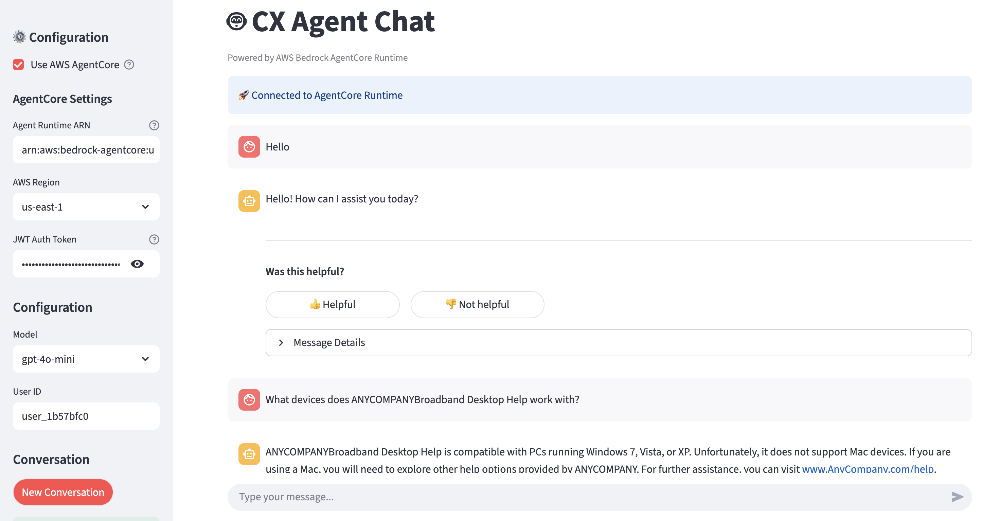
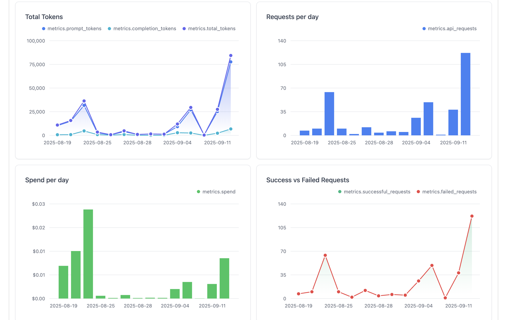
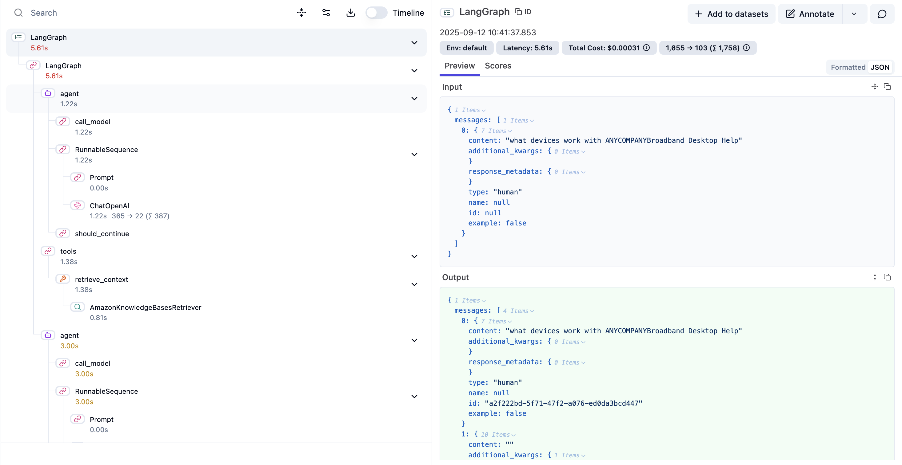
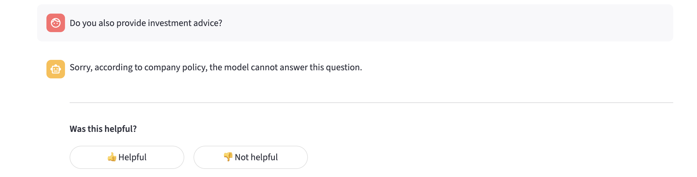
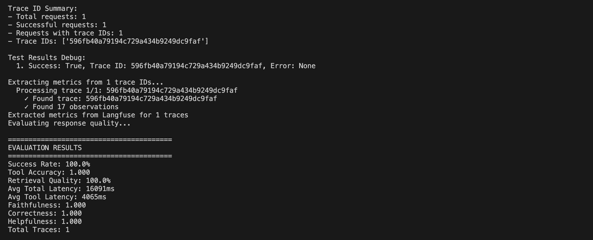

# Agentic AI Foundation - Generative AI Customer Experience Platform

The CX Agent is an intelligent customer experience platform built on **LangGraph** and designed for deployment on **AWS Bedrock AgentCore Runtime**. This agentic AI solution leverages multiple generative AI foundations including LLM Gateway, observability and guardrails to deliver sophisticated customer service capabilities through a conversational interface.




## Table of Contents

1. [Overview](#overview)
1. [Foundational Components](#foundational-components)
1. [Prerequisites](#prerequisites)
1. [Deployment Steps](#deployment-steps)
1. [Deployment Validation](#deployment-validation)
1. [Running the Sample](#running-the-sample)
1. [Next Steps](#next-steps)
    1. [Local Development Workflow](#local-development-workflow)
    1. [Evaluation](#evaluation)
1. [Cleanup](#cleanup)


## High Level Architecture

For many of these AI platform capabilities, there are multiple alternative technologies that could be used. The right choices will depend on your needs, and there are also different ways to handle these choices: From committing to a particular preferred tool, to building (and maintaining) an abstraction layer for easy portability, or finding a balance somewhere in the middle.

In this sample we've tried to choose tools that are popular with our customers, and keep the code simple (avoid introducing extra abstraction layers) - so switching where needed would require some effort but should be reasonably straightforward. The overall architecture is as shown below:

 Streamlit application; Langfuse; Amazon Cognito; Amazon Bedrock AgentCore; Amazon Bedrock Guardrails; Amazon Bedrock Knowledge Base (backed by OpenSearch Serverless, loaded with data from Amazon S3); Amazon Bedrock Foundation Models called via a GenAI Gateway; Amazon CloudWatch for observability; and third-party external services including Tavily and Zendesk.")

**A Sample end-2-end User Interaction Flow**

 which the agent orchestrates via the Bedrock AgentCore Gateway to the relevant provider: Bedrock Knowledge Base, Tavily Web Search, Zendesk API, or AWS Lambda. After tool call(s), the Agent makes another LLM call to the GenAI Gateway to generate the final response.This final response is again checked with Amazon Bedrock Guardrails, and the agent ends the tracing span in Langfuse with metadata and metrics - before finally returning the response to the Streamlit app and thereby the user.")

## Foundational Components

Strong foundational or "platform" capabilities increase the speed and success rate of generative and agentic AI projects. This sample demonstrates a customer service agent integrating several of these capabilities together:

1. **Centralized AI model gateway** to enable cross-project governance like cost tracking, fair usage limits, model access control and discovery.
2. **Guardrails** to detect and prevent risks in real-time like prompt injection attempts, toxic or offensive content, denied topics or hallucinations.
3. **Observability tools** for detailed monitoring of the deployed agent, analysis, and debugging via reasoning "traces".

### Multi-provider Generative AI Gateway
Centralized model management and routing system that provides:
- **Multi-model Support**: Access to numerous large language models (LLMs) through a unified, industry-standard API gateway based on OpenAI API standards
- **Load Balancing**: Intelligent request distribution across model endpoints based on uase, cost and latency
- **Usage and cost** tracking across providers
- **Rate Limiting**: Set model, key, team, user-level budgets for added governance

Refer to the prerequisites section to deploy your Generative AI Gateway on AWS.



### Observability
We combine [Amazon Bedrock AgentCore Observability](https://docs.aws.amazon.com/bedrock-agentcore/latest/devguide/observability-configure.html) together with [Langfuse](https://langfuse.com/) (Open Source Edition deployed on AWS as shown [here](https://github.com/aws-samples/amazon-bedrock-samples/tree/main/evaluation-observe)), to collect and analyze detailed telemetry from the agent as it runs. This integration provides:
- **OpenTelemetry instrumentation**
- **[Langfuse](https://langfuse.com/docs) Integration**: Complete conversation and agent execution tracing including all LLM and non-LLM calls such as retrieval, API calls and more
- **Performance Metrics**: Response times, token usage, and success rates
- **Debug Insights**: Detailed agent reasoning and tool usage tracking
- **User Feedback**: Track user feedback on using your generative AI application

Refer to the prerequisites section to self-host your Langfuse platform.



### Guardrails
We use [Amazon Bedrock Guardrails](https://docs.aws.amazon.com/bedrock/latest/userguide/guardrails.html) to detect and intervene on issues with incoming user messages and outgoing agent responses before they're processed - including:
- **Input Validation**: Content filtering and prompt injection protection
- **Output Screening**: Response safety and appropriateness checks including PII detection
- **Denied Categories**: Industry-specific regulatory adherence by denial of prohibited topics

Configure your own Bedrock guardrail and apply it to your agentic application with this [workshop](https://catalog.workshops.aws/bedrockguard/en-US)




## Prerequisites

### AWS Account Requirements

You'll need access to your target AWS account with broad/administrative permissions - including e.g. to create IAM roles and policies, and to deploy and manage all the types of AWS resource used in the architecture.

### Separately-developed and Third-party tools

This sample connects with multiple separately-developed samples and solutions from AWS, as detailed in the deployment steps below.

There are also integrations with a range of third-party services, but these are all **optional**.

### Development Environment and Operating System

These deployment instructions include shell commands that are optimized for **macOS or Linux**. In general, deployment should also be possible from Windows Subsystem for Linux, but hasn't been thoroughly tested. Proposals are welcome, for documentation or code updates to help with this!

Your development environment will need:
  - The [AWS CLI](https://aws.amazon.com/cli/) installed and [configured](https://docs.aws.amazon.com/cli/latest/userguide/cli-chap-configure.html) with your AWS access credentials
  - [Terraform](https://developer.hashicorp.com/terraform/install) or [OpenTofu](https://opentofu.org/) installed
  - (Recommended) [uv](https://docs.astral.sh/uv/getting-started/installation/) or (alternatively if you're comfortable managing virtual environments yourself) some other [Python](https://www.python.org/downloads/) environment
  - Either [Docker Desktop](https://www.docker.com/products/docker-desktop/) or some other compatible container image build tool, like [Finch](https://runfinch.com/)

> ℹ️ **Note:** We suggest using [mise-en-place](https://mise.jdx.dev/) to manage installation of Terraform and UV in case you need to work across projects using different versions of them (or many other tools). You can find our suggested versions in [mise.toml](./mise.toml).


## Deployment Steps

In these instructions, sub-steps (2a, 2b, 2c, etc.) can generally be performed in parallel.

### Step 1: Configuration

To get started, copy the provided [infra/terraform.tfvars.example](infra/terraform.tfvars.example) skeleton file to [infra/terraform.tfvars](infra/terraform.tfvars). This will be the main place to configure your deployment.

Review the *"core"* configurations and make changes as needed - but the default values should be good for most cases.

For the *"external"* component configurations, see the sections below.

Finally, note that in [infra/terraform.tf](infra/terraform.tf) we have configured Terraform's [backend state storage](https://developer.hashicorp.com/terraform/language/backend) to Amazon S3:

```tf
terraform {
  backend "s3" {
    encrypt = true
    key     = "sample-agentic-ai-foundation.tfstate"
  }
}
```

By default, you'll be prompted to provide an existing Amazon S3 Bucket name when deploying the Terraform solution later. You can [create a bucket](https://docs.aws.amazon.com/AmazonS3/latest/userguide/create-bucket-overview.html) to use for this purpose, or if you prefer to just use Terraform's [local filesystem backend](https://developer.hashicorp.com/terraform/language/backend) then simply delete or comment-out the `backend {...}` block.


### Step 2a: GenAI Model Gateway

You'll need to deploy your AI model gateway for which we recommend using the LiteLLM-based [Guidance for a Multi-Provider Generative AI Gateway on AWS](https://aws.amazon.com/solutions/guidance/multi-provider-generative-ai-gateway-on-aws/).

Once your gateway is deployed, log in to its admin UI and create an API key for the solution to invoke Foundation Models.

In your [infra/terraform.tfvars](infra/terraform.tfvars) file, update:
- `gateway_url` as your Gateway URL (probably something like `https://{...}.cloudfront.net`)
- `gateway_api_key` as your API key (`sk-{...}`)


### Step 2b: (Optional) Langfuse for tracing

If you'd like to self-host Langfuse Open Source Edition, refer to [this sample](https://github.com/awslabs/amazon-bedrock-agent-samples/tree/main/examples/agent_observability/deploy-langfuse-on-ecs-fargate-with-typescript-cdk) for guidance to deploy it on AWS.

Alternatively, you could sign up to Langfuse's own [cloud-based service](https://cloud.langfuse.com/auth/sign-up) instead.

Whether self-hosting or using Langfuse cloud, you'll also need to create a project and associated [API key pair](https://langfuse.com/faq/all/where-are-langfuse-api-keys) to store traces for the agent.

In your [infra/terraform.tfvars](infra/terraform.tfvars) file, update:
- `langfuse_host` for where your Langfuse is hosted (will be like `https://{...}.cloudfront.net` if self-hosting Langfuse based on the above sample)
- `langfuse_public_key` as your public Langfuse API key (`pk-{...}`)
- `langfuse_secret_key` as your secret Langfuse API key (`sk-{...}`)


### Step 2c: (Optional) Tavily for web search

To enable your agent to search the web, you could sign up to [Tavily](https://www.tavily.com/) and add your `tavily_api_key` to [infra/terraform.tfvars](infra/terraform.tfvars).


### Step 2d: (Optional) Zendesk ticketing

If you have a Zendesk environment, you could enable your agent to log and manage tickets by setting up an [API token](https://support.zendesk.com/hc/en-us/articles/4408889192858-Managing-API-token-access-to-the-Zendesk-API). In [infra/terraform.tfvars](infra/terraform.tfvars), configure your `zendesk_domain`, `zendesk_email`, and `zendesk_api_token`.


### Step 3: Deploy the AI Foundation

Once your tfvars configuration is set up and any external components you want to connect configured, you can deploy the core solution from your terminal via Terraform, as follows.

First, open your terminal in the [infra/](./infra) folder:

```sh
cd infra
```

Next, initialize Terraform:

```sh
terraform init
```

> ℹ️ If you're prompted for an S3 Bucket here, refer back to **Step 1: Configuration** for guidance if needed.

Once Terraform is initialized, you should be able to deploy the main solution infrastructure:

```sh
terraform apply
```

The output values shown by Terraform after deployment will include information like the unique IDs of deployed user pool, Bedrock Guardrail, etc. 


### Step 4a: Ingest Knowledge Base Documentation

If you have internal documents your agent should be able to search over to help generate answers for users, You can ingest them into the created Amazon Bedrock Knowledge Base.

First, copy your documents to the Amazon S3 data bucket deployed by the solution (using `terraform output` to look up attributes of the deployed infrastructure):

```bash
aws s3 cp your-documents/ s3://$(terraform output -raw s3_bucket_name)/ --recursive
```

Then once the documents are uploaded to S3, run the following command to sync the updates to your Knowledge Base:

```bash
aws bedrock-agent start-ingestion-job \
  --knowledge-base-id $(terraform output -raw knowledge_base_id) \
  --data-source-id $(terraform output -raw data_source_id)
```

This sync will run asynchronously and may take time to complete, especially for large corpora. You can check the progress of sync jobs via the [Amazon Bedrock Console](https://console.aws.amazon.com/bedrock/home?#/knowledge-bases) or the [GetIngestionJob API](https://docs.aws.amazon.com/bedrock/latest/APIReference/API_agent_GetIngestionJob.html). Once it completes successfully, your documents should be visible to your agent in search results.


### Step 4b: Create a Cognito User

To be able to talk to your deployed agent, you'll need to create a user for yourself in the deployed Amazon Cognito User Pool. You can do this through the [Amazon Cognito Console](https://console.aws.amazon.com/cognito/v2/idp/user-pools), or through the CLI if you prefer.

A basic example CLI script to create yourself a user and set a non-temporary password is provided below. You'll need to set `COGNITO_USERNAME` to your email address, and `COGNITO_PASSWORD` to a conformant password (8+ characters, containing upper- and lower-case characters and numbers and special characters).

> ⚠️ **Note:** These configurations are security-relevant, and the most appropriate settings will depend on your situation (applicable policies, whether you are generating credentials for yourself or somebody else, etc).
>
> In particular, the below commands are **not** recommended for setting up multiple users: Cognito can handle generating temporary credentials for you and sharing them privately to users' email addresses. For more detailed information, see the [Amazon Cognito developer guide](https://docs.aws.amazon.com/cognito/latest/developerguide/how-to-create-user-accounts.html).

```bash
# Edit these parameters:
COGNITO_USERNAME=TODO
COGNITO_PASSWORD=TODO

# The temporary password hard-coded below will be overridden by the next cmd:
aws cognito-idp admin-create-user \
  --user-pool-id $(terraform output -raw user_pool_id) \
  --username $COGNITO_USERNAME \
  --temporary-password 'Day1Agentic!'

# Set the permanent password:
aws cognito-idp admin-set-user-password \
  --user-pool-id $(terraform output -raw user_pool_id) \
  --username $COGNITO_USERNAME \
  --password $COGNITO_PASSWORD \
  --permanent
```


## Deployment Validation

Your Terraform apply in Deployment Step 3 should have completed successfully (usually with a message like "Apply complete!", depending on your CLI version). You can run `terraform apply` again to check this, or `terraform output` to see the deployed output parameters of your infrastructure.


## Running the Sample

You can talk to your deployed agent either through the basic [chat_to_agentcore.ipynb](chat_to_agentcore.ipynb) Python notebook, or running the provided Streamlit UI application for a more fully-featured testing experience.

### Python notebook

To test basic interaction with your agent through Python notebook, you'll first need to install the required libraries in your local Python environment:

```bash
cd cx-agent-backend
uv venv
uv sync --all-extras --frozen
```

Then, you can open [chat_to_agentcore.ipynb](chat_to_agentcore.ipynb) using your installed Python virtual environment (`cx-agent-backend/.venv`) and follow the provided steps.

### Streamlit app

To run the UI app locally, first install the required libraries and then start the Streamlit server:

```bash
cd cx-agent-frontend
uv venv
uv sync --frozen
uv run streamlit run src/app.py --server.port 8501 --server.address 127.0.0.1
```

Once the server is running, you can access the web interface in your preferred browser at http://localhost:8501


## Next Steps

So far we've focussed on the initial deployment and testing of the demo agent, but how would you use this sample to iteratively refine your own agents and evaluate how they're performing?


### Local Development Workflow

You can find more guidance on how to configure and run your agent locally in [cx-agent-backend/README.md](/cx-agent-backend/README.md). The Streamlit UI app is able to run against both local and AgentCore-deployed agents.

Note that as configured by default, re-running `terraform apply` will replace your agent container image/tag in Amazon ECR, but will **not re-deploy** your AgentCore Runtime to consume the new container. You can trigger this re-deployment manually from the AWS Console for AgentCore Runtime via the "Update hosting" button.


### Evaluation

The platform includes comprehensive evaluation capabilities to assess agent performance across multiple dimensions.



#### How Evaluation Works

The evaluation system runs test queries against your agent, collects execution traces, and measures performance:

1. **Load test queries** from `groundtruth.json` with expected tool usage
2. **Send queries to agent** endpoint and capture responses with trace IDs
3. **Wait for traces** to be available in Langfuse observability platform
4. **Extract metrics** from traces including tool calls, retrieval scores, and latencies
5. **Evaluate response quality** using Bedrock LLM to score faithfulness, correctness, and helpfulness
6. **Calculate performance metrics** and save comprehensive results to CSV files

#### Evaluation Setup

The evaluation system consists of:
- **offline_evaluation.py**: Main evaluation script that runs test queries and calculates metrics
- **response_quality_evaluator.py**: Uses Bedrock LLM to evaluate response quality
- **groundtruth.json**: Test queries with expected tool usage (create this file with your test cases)

#### Prerequisites

1. **Environment Variables**: Export Langfuse and AWS credentials:
   ```bash
   export LANGFUSE_SECRET_KEY="your-key"
   export LANGFUSE_PUBLIC_KEY="your-key"
   export LANGFUSE_HOST="your-langfuse-host"
   export AWS_ACCESS_KEY_ID="your-key"
   export AWS_SECRET_ACCESS_KEY="your-key"
   ```
2. **Agent Endpoint**: Have your agent running locally (`http://localhost:8080`) or deployed on Bedrock AgentCore
3. **Test Data**: Create `groundtruth.json` with test queries:

```json
[
  {
    "query": "How do I reset my router hub?",
    "expected_tools": ["retrieve_context"]
  }
]
```

#### Running Evaluation

```bash
# Run offline evaluation
python offline_evaluation.py

# Or evaluate existing trace data
python response_quality_evaluator.py
```

#### Metrics Collected

- **Success Rate**: Percentage of successful agent responses
- **Tool Accuracy**: How well the agent selects expected tools
- **Retrieval Quality**: Relevance scores from knowledge base retrieval
- **Response Quality**: AI-evaluated metrics using Bedrock LLM:
  - **Faithfulness** (0.0-1.0): How well the response sticks to provided context without hallucination
  - **Correctness** (0.0-1.0): How factually accurate and technically correct the response is
  - **Helpfulness** (0.0-1.0): How useful and relevant the response is to answering the user's query
- **Latency Metrics**: Total and per-tool response times

#### Output Files

- **comprehensive_results.csv**: Complete evaluation results with all metrics
- **trace_metrics.csv**: Raw trace data from Langfuse
- **response_quality_scores.csv**: Detailed response quality evaluations

#### Configuration

Set agent endpoint (local or AgentCore):
```bash
# For local agent
export AGENT_ARN="http://localhost:8080"

# For Bedrock AgentCore deployment
export AGENT_ARN="your-agentcore-endpoint"
```

## Cleanup

Once you're finished experimenting, destroy the cloud resources deployed for this solution to avoid incurring ongoing costs.

Tear down the core solution infrastructure deployed by Terraform:

```bash
terraform destroy
```

- You'll **likely** receive an error that your ECR repository can't be deleted because it still contains an image. You can manually delete the image(s) from the relevant repository in the [Amazon ECR Console](https://console.aws.amazon.com/ecr/repositories/), and then re-run `terraform destroy` again.
- You **may** see an error that your S3 bucket(s) for knowledge base (document) storage and access logs storage can't be deleted because they contain data. In this case, find and manually empty the relevant S3 buckets in the [Amazon S3 Console](https://console.aws.amazon.com/s3/home) before re-running `terraform destroy`.

If you created an Amazon S3 bucket to store the Terraform backend state, then after the infrastructure is destroyed remember to also empty and delete that bucket. You can check your Terraform's backend configuration in the auto-generated `infra/backend.hcl` file.

Once the core solution itself is deleted, review and clean up any of the external components you deployed, referring to their own documentation. Including:

- The [GenAI Gateway Guidance](https://aws-solutions-library-samples.github.io/ai-ml/guidance-for-multi-provider-generative-ai-gateway-on-aws.html#uninstall-the-guidance)
- The [self-hosted Langfuse sample](https://github.com/aws-samples/amazon-bedrock-samples/tree/main/evaluation-observe/deploy-langfuse-on-ecs-fargate-with-typescript-cdk) - or if using Langfuse Cloud instead, review their [pricing guidance](https://langfuse.com/pricing) and consider cleaning up any unused resources.
- If you set up Tavily and/or Zendesk, refer to those providers' guidance on pricing and cleaning up or deleting your environment(s).


## Security

See [CONTRIBUTING](CONTRIBUTING.md#security-issue-notifications) for more information.


## License

This library is licensed under the MIT-0 License. See the LICENSE file.
