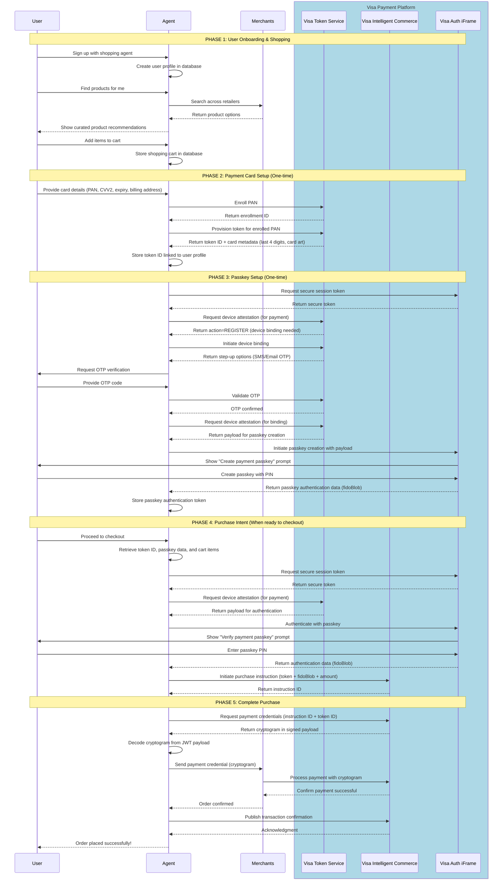

# Visa Shopping Agent Integration - Sequence Diagram

This diagram shows how a shopping agent integrates with Visa's payment system to enable secure, passkey-authenticated payments for online purchases.

## Flow Overview

## Key Points

### One-Time Setup (Phases 2-3)
- User only needs to enroll their card and create a passkey once
- The agent stores the token ID and passkey authentication data
- Future purchases reuse these credentials

### Per-Transaction Flow (Phases 4-5)
- User authenticates with their passkey PIN
- Agent retrieves a fresh cryptogram for each transaction
- Merchants never see the actual card number, only the cryptogram

### Security Benefits

- **Tokenization**: Real card number is replaced with a token via VTS
- **Passkey Authentication**: PIN-based verification via Visa Auth iFrame
- **Cryptogram**: Payment credential generated by VIC for each transaction
- **No Card Storage**: Merchants receive cryptogram, not card details

### Shopping Agent Use Cases
- Personal shopping assistants
- Price comparison and deal finders
- Subscription management services
- Multi-retailer checkout aggregation
- AI-powered product recommendations
