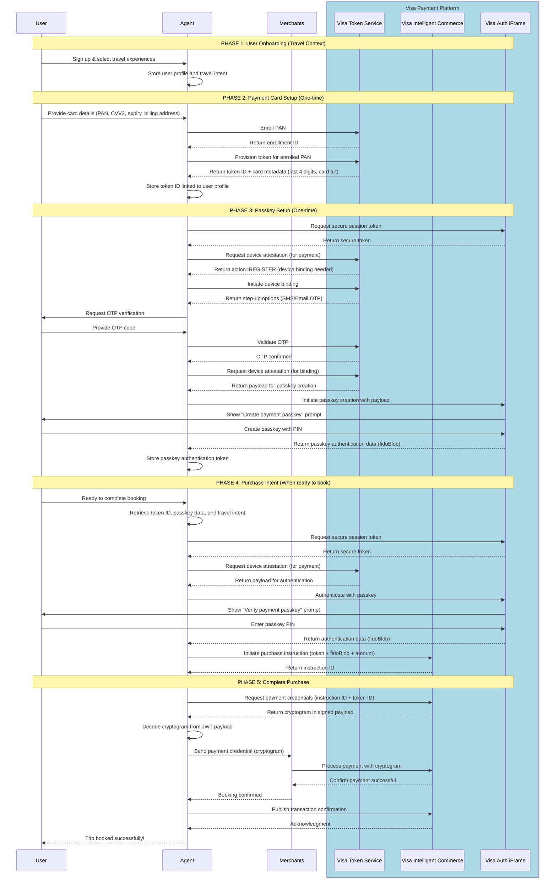

# Visa Travel Agent Integration - Sequence Diagram

This diagram shows the complete flow of how a travel agent integrates with Visa's payment system to enable secure, passkey-authenticated payments for travel bookings.

## Flow Overview

## Key Points

### Focus: Visa Payment Integration
This diagram showcases Visa's secure payment flow using tokenization and passkey authentication. The travel booking context is just one example - **the payment pattern (Phases 2-5) works for any agent-based commerce**.

### One-Time Setup (Phases 2-3) - The Core Innovation
- **Phase 2**: Card tokenization via VTS (Visa Token Service)
  - Real PAN is enrolled and replaced with a secure token
  - Agent stores token ID, never the actual card number
- **Phase 3**: Passkey authentication setup
  - FIDO2-based passkey creation with device binding
  - OTP verification for additional security
  - Passkey data stored for future authentication

### Per-Transaction Flow (Phases 4-5) - Secure Payment Execution
- **Phase 4**: Passkey authentication + purchase intent
  - User verifies with passkey PIN (no card details needed)
  - VIC generates instruction ID for the transaction
- **Phase 5**: Cryptogram generation + payment processing
  - Fresh cryptogram generated for each transaction
  - Merchants process payment without seeing card details

### Security Benefits

- **Tokenization**: Real card number is replaced with a token via VTS
- **Passkey Authentication**: FIDO2-based authentication via Visa Auth iFrame
- **Cryptogram**: Payment credential generated by VIC for each transaction
- **No Card Storage**: Merchants receive cryptogram, not card details
